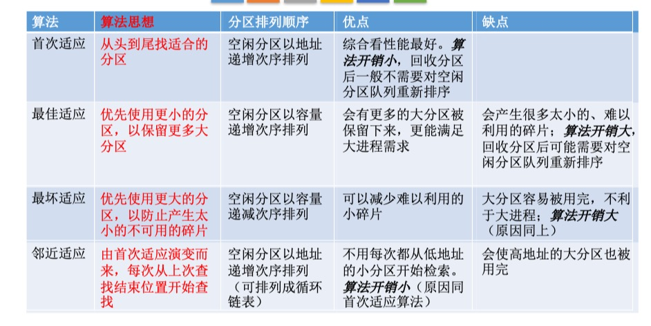
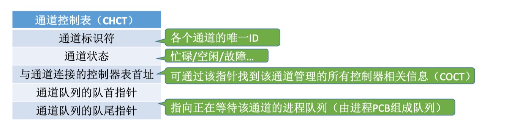
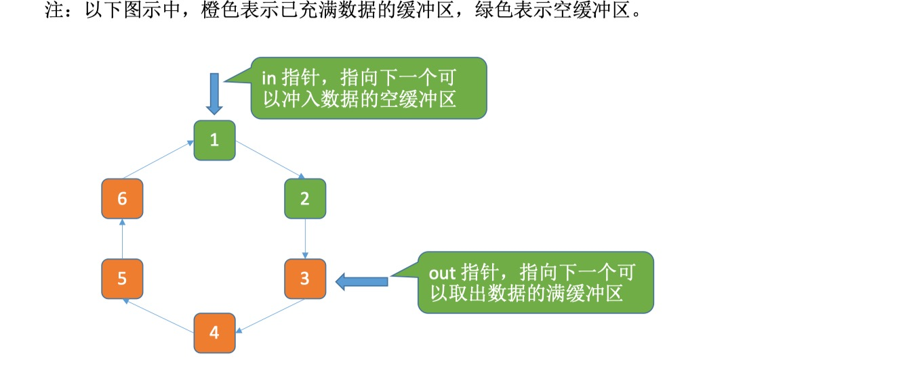
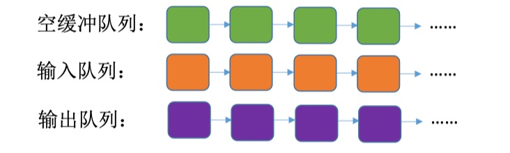

# 操作系统基础

## 操作系统的基本概念

### 操作系统的概念

- 控制和管理整个计算机系统的硬件和软件资源（`OS`是系统资源的管理者）
- 合理地组织、调度计算的工作与资源（是最接近硬件的一层软件）
- 为用户和其他软件提供方便接口与环境的程序集合（向上层提供方便易用的服务）
- 是计算机系统中最基本的系统软件


### 操作系统的特征

#### 基本特征

- 并发、共享、虚拟、异步

##### 并发

- 两个或者多个事件在同一时间间隔内发生
- 使得系统具有处理和调度多个程序同时执行的能力
- 操作系统的并发是通过分时实现的

> 并发是指在一个时间段
>
> 并行是指在同一个时刻，是指系统具有同时执行或操作（硬件支持：多流水线或者处理机）
>
> 对于单处理机来说，宏观上程序是并发的，微观上程序是交替执行的

- **单核CPU同一时刻只能执行一个程序，各个程序只能并发地执行**
- **多核CPU同一时刻可以同时执行多个程序，多个程序可以并行地运行**

> 并发性是操作系统一个最基本的特性

##### 共享

- 共享即资源共享，是指系统中的资源可供内存中多个并发执行的进程共同使用

###### 互斥共享方式

- 例如：打印机、磁带，同一时刻只能供一个进程对资源进行访问
- 这种资源称作：临界资源或者独占资源

###### 同时访问方式

- 一段时间内允许多个进程对资源进行访问
- 典型代表：
  - 磁盘设备
  - 重入码编写的文件

> 往往是宏观上的，而在微观上，这些进程可能是交替地对该资源进行访问

> 如果失去并发性，则系统中只有一个程序正在运行，则共享性失去存在的意义
>
> 如果失去共享行，则不能同时访问硬盘资源，就无法实现同时发送文件，也就无法并发
>
> 并发性和共享性互为存在条件，是`OS`最基本的特性

##### 虚拟

- 一个物理上的实体变为若干逻辑上的对应物，这种技术也被称为虚拟技术
- 也可以将一台`I/O`设备虚拟为多台逻辑上的`I/O`设备，并允许每个用户占用一台逻辑上的`I/O`设备

###### 虚拟处理器

- 采用多道程序并发的方式，让每个终端用户感觉到有多个处理器
- 时分复用技术

###### 虚拟存储器技术

- 将物理存储变为虚拟存储器，逻辑上扩充存储器用量
- 空分复用技术

##### 异步

- 由于并发运行的程序会争抢着使用系统资源，而系统中的资源有限，因此进程的执行不是一贯到底的，而是走走停停的，以不可预知的速度向前推进
- 多道程序走走停停，进程以不可预知的速度前进


### 操作系统的目标和功能

#### 管理功能

##### 处理机管理

- 管理处理机的分配与运行，解决冲突问题，可以理解为对进程的管理
- 进程管理
  - 进程控制
  - 进程同步
  - 进程通信
  - 死锁处理
  - 处理机调度

##### 存储器管理

- 为了提高多道程序运行效率，方便用户使用
- 内存分配、地址映射、内存保护、共享和内存扩充

##### 文件管理

- 操作系统负责管理文件的系统称为文件系统
- 文件存储空间的管理
- 目录管理
- 文件读写管理和保护

##### 设备管理

- 完成用户的`I/O`请求，方便用户使用设备，提高设备的利用率
- 缓冲管理
- 设备分配
- 设备处理
- 虚拟设备

### 接口功能

#### 命令接口

##### 联机控制方式

- 交互式命令接口，适用于分时或者实时系统
- 用户说一句，系统跟着做一句

##### 脱机控制方式

- 又称批处理系统，提交一组作业，系统进行处理，用户不能干预作业的运行
- 用户说一堆，系统跟着做一堆

#### 程序接口

- 由一组系统调用命令组成（也称作系统调用或者广义指令）
- 普通用户不能直接使用程序接口，只能通过程序代码间接使用

### 操作系统用作扩充机器

- 操作系统提供了资源管理功能和方便用户使用的各种服务功能，将机器改造为功能更强的机器
- 覆盖了软件的机器称为扩充机器，又称为虚拟机

### 封装思想

- 操作系统把一些丑陋的硬件功能封装成简单易用的服务，使用户能更方便地使用计算机，用户无需关心底层硬件的原理，只需要对操作系统发出命令即可


## 操作系统的发展分类

### 手工操作阶段

- 程序的装入，运行，结果的输出都需要人为的干预
- 缺点
  - 资源利用率低
  - `CPU`利用不充分

### 批处理阶段

- 为了解决人机矛盾以及`CPU`和`I/O`设备之间速度不匹配的矛盾
- 引入脱机输入/输出技术，并由监督程序负责控制作业的输入、输出

#### 单道批处理系统

- 内存中始终保存一道作业，作业成批进入

##### 特点

- ###### 自动性

  - 一批作业自动执行不需要人工干预

- ###### 顺序性

  - 各道作业依次执行

- ###### 单道性

  - 仅有一道程序执行

##### 优点

- 缓解了一定程度的人机速度矛盾，资源利用率有所提升

##### 缺点

- 高速`CPU`等待`I/O`设备的完成
- 内存中仅能有一道程序运行，只有该程序运行结束之后才能调入下一道程序

#### 多道批处理系统

- 允许多个程序在`CPU`中交替运行，程序共享各种硬件和软件资源

##### 特点

- ###### 多道

  - 计算机中同时存放多道相互独立的程序

- ###### 宏观上并行

  - 多道程序都会开始运行，但都没有运行完毕

- ###### 微观上串行

  - 多道程序轮流占有`CPU`，交替执行

##### 优点

- 资源利用率高
- 多道程序并发执行，共享计算机资源
- `CPU`和其他资源更能保持“忙碌”状态，系统吞吐量增大

##### 缺点

- 设计复杂，要考虑各种资源调度问题
- 响应时间过长，没有人机交互功能

### 分时操作系统

- 将处理器运行时间划分为时间片，将时间片分配给不同作业/用户从而占有处理机

#### 特点

- ##### 同时性

  - 允许多个终端用户使用同一个计算机

- ##### 交互性

  - 方便进行人机对话，用户采用人机对话方式控制程序运行
  - 解决人机交互问题

- ##### 独立性

  - 多个用户彼此之间独立的操作，互不干扰

- ##### 及时性

  - 用户请求能在很短时间内获得响应

#### 缺点

- 不能优先处理一些紧急任务
- 操作系统对各个用户/作业都是完全公平的，循环地为每个用户/作业服务一个时间片，不区分任务的紧急性

### 实时操作系统

- 保证在规定时间内完成某项任务

#### 特点

- ##### 及时性

  - 规定时间内完成规定任务
  - 能够优先响应一些紧急任务，某些紧急任务不需时间片排队

- ##### 可靠性

  - 输出的结果正确，系统运行时确保稳定

#### 分类

##### 硬实时OS

- 必须在绝对严格的规定时间内完成处理

##### 软实时OS

- 能接受偶尔违反时间规定	

### 分布式计算机系统

- 网络操作系统将多个计算机有机的结合在一起
- 任意两台计算机之间没有主从之分，互相交换信息，并行工作、协同完成
- 分布性和并行性

### 个人计算机操作系统

- 广泛应用于文字处理，电子表格，游戏


## 操作系统的运行环境

### 程序运行

- 程序运行的过程其实就是`CPU`执行一条一条的机器指令的过程

### 操作系统的运行机制

- `CPU`执行的两种性质程序
  - 操作系统内核程序
  - 用户自编程序

#### 内核

- 内核是计算机上配置的底层软件，是操作系统最基本、最核心的部分
- 实现操作系统内核功‘能的那些程序就是内核程序

- ##### 时钟管理

  - 操作系统对用户提供标准时间，根据时钟对进程进行管理，实现进程切换

- ##### 中断机制

  - 初衷是为了提高多道程序运行环境中的`CPU`利用率
  - 保护和恢复中断现场的信息，转移控制权到相关程序

- ##### 原语

  - 处于系统的最底层，最接近硬件

  - 运行具有原子性，即只能一气呵成，不可中断

  - 系统控制的数据结构及处理

  - 运行时间较短，调用频繁

- ##### 对系统资源进行管理的功能

  - ###### 进程管理

    - 进程状态控制、进程调度和分派、创建和撤销进程控制

  - ###### 存储器管理

    - 存储器的空间分配和回收、内存信息保护程度、代码对换程序

  - ###### 设备管理

    - 缓冲区管理
    - 设备分配和回收


### 中断与异常

- 为了进行核心态和用户态两种状态的切换，引入了中断机制
- 核心态可以执行用户态无法执行的特权指令
- 访管指令是在用户态使用，将用户态转换为核心态，所以访管指令不是特权指令
- “中断”是让操作系统内核夺回`CPU`使用权的唯一途径

> 如果没有“中断机制”，那么一旦应用程序上`CPU`运行，`CPU`就会一直运行这个应用程序	

#### 中断（外中断）

- 来自于`CPU`指令以外的事件发生

- 每个指令周期末尾，`CPU`都会检查是否有外中断信号需要处理

- 与当前指令无关，中断信号来源于`CPU`外部

- ##### I/O中断

  - 输入输出已经完成

- ##### 时钟中断

  - 固定时间片已到，让处理机处理

#### 异常（内中断）

- 源自于`CPU`执行指令内部的事件
- 异常不能被屏蔽
- `CPU`在执行指令时会检查是否有异常发生

- ##### 陷入、陷阱（Trap）（访管指令）

  - 用户自行设置，执行陷入后，用户态转换为核心态

  > 应用程序主动地将`CPU`控制权还给操作系统内核
  >
  > 系统调用就是通过陷入指令完成的

- ##### 故障（Fault）

  - 由错误条件引起的，可能被内核程序修复。内核程序修复故障后会把`CPU`使用权还给应用程序，让它继续执行下去
  - 例如：缺页中断

- ##### 终止（abort）

  - 由致命错误引起的、内核程序无法修复该错误，因此一般不再将`CPU`使用权还给引发终止程序的应用程序，而是直接终止该应用程序

  - 例如：非法操作码，除零，地址越界，算术溢出


#### 中断机制的基本原理

- 不同的中断信号，需要用不同的中断处理程序来处理。当`CPU`检测到中断信号后，会根据中断的类型去查询“中断向量表”，以此来找到相应的中断处理程序在内存中的存放位置

> 显然中断处理程序一定是内核程序，需要运行在“内核态”
>
> 没有中断机制，就不可能实现操作系统，不可能实现程序并发


### 系统调用

- 用户在程序中调用操作系统提供的一些子功能

- 应用程序可以通过系统调用来请求获得操作系统内核的服务

- 凡是与共享资源有关的操作（如存储分配、`I/O`操作、文件管理等），都必须通过系统调用的方式向操作系统内核提出请求，由`OS`内核代为完成，这样可以保证系统的稳定性和安全性

- #### 设备功能

  - 完成设备的请求或者释放，设备启动等功能

- #### 文件管理

  - 完成文件的读、写、创建以及删除功能

- #### 进程控制

  - 完成进程的创建、撤销、阻塞以及唤醒功能

- #### 进程通信

  - 完成进程之间的消息传递和信号传递功能

- #### 内存管理

  - 完成内存的分配、回收以及获取作业内存区大小及初始地址等功能

> 发出系统调用请求是在用户态，而对系统调用的相应处理在核心态下进行


### 用户态与内核态

- 处于内核态时，说明此时正在运行的是内核程序，此时可以执行特权指令

> 操作系统的内核程序是系统的管理者，既可以执行特权指令，也可以执行非特权指令，运行在核心态

- 处于用户态时，说明此时正在运行的是应用程序，此时只能执行非特权指令

>  内核态 = 核心态 = 管态
>
> 用户态 = 目态

> `CPU`中有一个寄存器叫程序状态字寄存器（`PSW`），其中有个二进制位，1表示“内核态”，0表示“用户态”

> 在`CPU`设计和生产的时候就划分了特权指令和非特权指令，因此`CPU`执行一条指令前就能判断出其类型

### 内核态、用户态的切换

- 内核态 ——> 用户态
  - 执行一条特权指令——修改`PSW`的标识位为“用户态”，这个动作意味着操作系统将主动让出`CPU`使用权
- 用户态 ——> 内核态
  - 由“中断”引发，硬件自动完成变态过程，触发中断信号意味着操作系统将强行夺回`CPU`的使用权
  - 但凡需要操作系统介入的地方，都会触发中断信号


## 操作系统结构

### 大内核（宏内核）

- 将操作系统的主要功能模块进行集中，从而用以提供高性能的系统服务

#### 优点

- 各个管理模块之间共享信息，能够有效利用相互之间的有效特性，所有着巨大的性能优势

#### 缺点

- 层次交互关系复杂，层次接口难以定义，层次之间界限模糊
- 内核庞大，功能复杂，难以维护
- 大内核中某个功能模块出错，就可能导致整个系统崩溃

### 微内核

- 将内核中最基本的功能（如：进程管理）保留在内核，将不需要在核心态执行的功能转移到用户态执行，降低内核设计的复杂性

#### 背景

- 随着计算机体系结构的不断发展，操作系统提供的服务越来越多，接口形式越来越复杂

#### 优点

- 有效的分离内核与服务、服务与服务、使得他们之间的接口更加的清晰，维护的代价大大降低
- 各个部分可以独立的优化和演进
- 内核小，功能少，易于维护，内核可靠性高
- 内核外的某个功能模块出错不会导致整个系统崩溃

#### 缺点

- 性能问题，需要频繁的在核心态和用户态之间进行切换
- 用户态下的各功能模块不可以直接相互调用，只能通过内核的“消息传递”来间接通信


### 外核

- 内核负责进程调度、进程通信等功能，外核负责为用户进程分配未经抽象的硬件资源，且由外核负责保证资源使用安全

#### 优点

- 外核可直接给用户进程分配“不虚拟、不抽象”的硬件资源，使用户进程可以更灵活的使用硬件资源
- 减少了虚拟硬件资源的“映射层”，提高效率

#### 缺点

- 降低了系统的一致性
- 是系统变得更复杂

### 分层结构

- 内核分多层，每层可单向调用更低一层提供的接口

#### 优点

- 便于调试和验证，自底向上逐层调试验证
- 易于扩充和易维护，各层之间调用接口清晰固定

#### 缺点

- 仅可调用相邻底层，难以合理定义各层的边界
- 效率低，不可跨层调用，系统调用执行时间长

### 模块化

- 将内核分为多个模块，各模块之间相互协作

- 内核 = 主模块 + 可加载内核模块

- #### 主模块

  - 只负责核心功能，如进程调度、内存管理

- #### 可加载内核模块

  - 可以动态加载新模块到内核，而无需重新编译整个内核

#### 优点

- 模块间逻辑清晰易于维护，确定模块间接口后即可多模块同时开发
- 支持动态加载新的内核模块（如：安装设备驱动程序、安装新的文件系统模块到内核），增强`OS`适应性
- 任何模块都可以直接调用其他模块，无需采用消息传递进行通信，效率高

#### 缺点

- 模块间的接口定义未必合理、实用
- 模块间相互依赖，更难调试和验证


# 进程

## 进程的概念和特征

### 进程的概念

- 为了更好地描述和控制程序的并发执行，实现操作系统的并发性和共享性

> 程序是静态的，就是存放在磁盘里的可执行文件，就是一系列的指令集合

> 进程是动态的，是程序的一次执行过程，同一个程序多次执行会对应多个进程

#### 进程控制快（PCB）

- 为了更好的描述进程的基本情况和运行状态，进而控制和管理进程
- `PCB`是进程存在的唯一标志，当进程被创建时，操作系统为其创建`PCB`，当进程结束时，会回收其`PCB`

##### 保存的信息

- 基本的进程描述信息，可以让操作系统区分各个进程
  - 进程标识符`PID`
  - 用户标识符`UID`
- 可用于实现操作系统对资源的管理
- 可用于实现操作系统对进程的控制、调度

> 操作系统需要对各个并发运行的进程进行管理，但凡管理时需要的信息，都会被放在`PCB`中	

#### 进程的一些典型定义

- 进程是程序一次执行过程
- 进程是一次程序及其数据在处理机上顺序执行时所发生的活动
- 进程是具有独立功能的程序在一个数据集合上运行的过程，是资源分配和调度的独立单位（没有引入线程）

#### 进程的组成

- 进程是一个独立运行单位，也是操作系统进行资源分配和调度的基本单位

##### 进程控制块（PCB）

###### 进程描述信息

- 进程标识符
  - 标志进程
- 用户标识符
  - 进程归属的用户，主要为共享和保护服务

###### 进程控制和管理信息

- 进程当前状态
  - 描述进程状态信息
- 进程优先级
  - 描述进程抢占处理机的优先级
- 代码运行入口地址
- 程序的外存地址
- 进入内存时间
- 处理机占用时间
- 信号量使用

###### 资源分配清单

- 用以说明有关内存地址空间或者虚拟地址空间状况，所打开的文件的列表和所使用的输入/输出设备信息
- 代码段指针、数据段指针、堆栈段指针、文件描述符、键盘、鼠标

###### 处理机相关信息

- 处理机中各寄存器的值
- 通用寄存器值、地址寄存器值、控制寄存器值、标志寄存器值、状态字

##### 程序段

- 能被进程调度程序调度到`CPU`执行的程序代码段

##### 数据段

- 进程对应的程序加工处理的原始数据或者程序执行时产生的中间或者最终结果

> 程序段、数据段是给进程自己用的，与进程自身的运行逻辑有关


### 进程的特征

##### 动态性

- 动态性是进程最基本特性，进程有着创建、活动、暂停、终止等过程，具有生命周期

> 进程最基本的特性

##### 并发性

- 多个进程实体同时存在内存中，引入进程的目的就是为了程序与其他程序并发执行

##### 独立性

- 进程实体是一个能独立运行、独立获得资源和独立接受调度的基本单位
- 没有建立`PCB`的程序，都不能作为一个独立单位参与运行

##### 异步性

- 进程相互制约，进程以不可预知的速度向前推进
- 所以操作系统中一定要配置响应的进程同步机制

##### 结构性

- 每个进程都配置一个`PCB`对其进行描述

###### 进程实体

- 程序段
- 数据段
- 进程控制段（`PCB`）


## 进程的状态与转换

### 状态

#### 运行态

- 进程在处理机上运行

#### 就绪态

- 进程已处于准备运行状态，但是由于没有空闲`CPU`，而暂时不能运行

#### 阻塞态

- 又称等待态，进程正在等待某个事件而暂停运行

#### 创建态

- 进程正在被创建，尚未进入就绪态
- 操作系统会为进程分配资源、初始化`PCB`

#### 结束态（终止态）

- 进程正在从系统中消失（包括正常结束或者异常终止）
- 操作系统会回收进程拥有的资源、撤销`PCB`

### 相互转换

##### 就绪态 ——> 运行态

- 处于就绪态的进程获得处理机进入运行态

##### 运行态 ——> 就绪态

- 处于运行态的进程时间片用完后，让处理机进入就绪态

##### 运行态 ——> 阻塞态

- 进程请求除处理机外的其他资源，此时运行态进入阻塞态（系统调用请求操作系统提供服务，这是一种特殊的、由运行用户态进程调用操作系统内核过程的形式）

##### 阻塞态 ——> 就绪态

- 进程等待其他资源的获得，如`I/O`资源、或者中断结束


### 进程的挂起状态与七状态模型

- 暂时调到外存等待的进程状态为挂起状态（挂起态）
  - 就绪挂起
  - 阻塞挂起
- “挂起” 和“阻塞”的区别
  - 两种状态都是暂时不能获得`CPU`的服务，但挂起态是将进程映像调到外存去了，而阻塞态下进程映像还在内存中


> 不能由阻塞态直接转换为运行态，也不能由就绪态直接转换为阻塞态（因为进入阻塞态是进程主动请求的，必然需要进程在运行时才能发出这种请求）

> 阻塞态到就绪态不是进程自身能控制的，是一种被动行为

> 单核处理机环境下，每个时刻最多只有一个进程处于运行态


## 进程与线程

### 进程控制

#### 进程的创建

- 分配进程标识号，申请`PCB`（`PCB`是有限的）
- 为进程分配资源，为程序和数据以及用户栈分配必要的内存空间
- 初始化`PCB`，包括初始化标志信息、初始化处理机状态信息、初始化处理机控制信息、设置进程的优先级
- 若进程就绪队列可以接纳新进程，进程就进入就绪态

#### 引起进程创建的事件

- 用户登录
  - 分时系统中，用户登录成功，系统会为其建立一个新的进程
- 作业调度
  - 多道批处理系统中，有新的作业放入内存时，会为其建立一个新的进程
- 提供服务
  - 用户向操作系统提出某些请求时，会新建立一个进程处理该请求
- 应用请求
  - 由用户进程主动请求创建一个子进程

#### 进程的终止

##### 结束分类

###### 正常结束

- 进程的任务已经完成并且准备退出运行

###### 异常结束

- 进程正在运行，出现某些异常事件，导致程序无法继续运行
- 例如
  - 存储区越界
  - 保护错
  - 非法指令
  - 特权指令
  - `I/O`故障

###### 外界干预

- 进程应外界请求终止运行

##### 结束过程

- 根据被终止进程的标识符，检索`PCB`，读取进程状态
- 若进程处于运行态，终止进程，剥夺处理机
- 终止进程之下的子进程
- 该进程拥有的全部资源还给父进程或者操作系统
- 将`PCB`从队列中删除

#### 进程的阻塞和唤醒

##### 阻塞原语执行过程

- 找到要被阻塞进程标识号对应的`PCB`
- 若该进程处于运行态，**保护现场**，将其状态转换为阻塞态，停止运行
- 将`PCB`插入就绪队列，等待调度程序调度

> 阻塞是一种自主行为，自我阻塞

##### 引起进程阻塞的事件

- 需要等待系统分配某种资源
- 需要等待相互合作的其他进程完成工作


##### 唤醒原语的执行过程

- 找到等待队列中进程相应的`PCB`
- 将其从等待队列中移出，置其状态为就绪态
- 将`PCB`插入就绪队列，等待调度程序调度

> 唤醒是被相互有联系的其他进程进行唤醒

> 原语的执行具有原子性，即执行过程中只能一气呵成，期间不允许被中断，可以用“关中断指令”和“开中断指令”这两个特权指令实现原子性
>
> 中断处理结束之后也不一定会直接回到原进程执行


#### 进程切换

- 进程切换是在内核态下完成的

- ##### 过程

  - 保存处理机上下文，包括程序计数器和其他寄存器
  - 更新`PCB`信息
  - 把进程的`PCB`移入相应队列，如就绪、在某时间阻塞等队列
  - 选择另一个进程执行，更新其`PCB`
  - 更新内存管理的数据结构
  - 恢复处理机上下文

##### 引起进程切换的事件

- 当前进程时间片到
- 有更高优先级的进程到达
- 当前进程主动阻塞
- 当前进程终止


### 进程的组织

#### 进程的组织方式

- ##### 连接方式

  - 按照进程状态将`PCB`分为多个队列
  - 操作系统持有指向各个队列的指针

- ##### 索引方式

  - 根据进程状态的不同，建立几张索引表
  - 操作系统持有指向各个索引表的指针


### 进程的通信

- 进程通信就是指进程之间的信息交换
- 进程是分配资源的单位（包括内存地址空间），因此各进程拥有的内存地址空间相互独立
- 为了保证安全，一个进程不能直接访问另一个进程的地址空间

#### 共享存储

- 通信进程之间存在一块可以被直接访问的共享空间

- 两个进程对共享空间的访问必须是互斥的（互斥访问通过操作系统提供的工具实现）

- ##### 低级方式

  - 基于数据结构共享

- ##### 高级方式

  - 基于存储区共享

> 操作系统只负责为通信进程提供可共享使用的存储空间和同步互斥工具，数据交换则由用户自己安排读/写指令完成

#### 消息传递

- 进程间的数据交换是以格式化的消息为单位的，进程通过系统提供的**发送消息**和**接收消息**两个原语进行数据交换

- ##### 直接通信方式

  - 发送进程直接发送消息给接收进程，并将它挂在接收进程的消息缓冲队列上，接收进程从消息缓冲队列中取得消息

- ##### 间接通信方式

  - 发送进程把信息发送给某个中间实体，接收进程从中间实体中获得消息
  - 例如：电子邮件系统

#### 管道通信

- 发送进程以字符流形式将大量数据写入写管道，接收进程从管道中接收数据
  - 当管道写满时，写进程的write()系统调用将被阻塞，等待读进程将数据取走
  - 当读进程将数据全部取走后，管道变空，此时读进程的read()系统调用被阻塞

- 如果没写满，就不允许读。如果没读空，就不允许写

- **数据一旦被读出，就从管道中被抛弃**，这就意味着读进程最多只能有一个，否则可能会有读错数据的情况

- 功能

  - 互斥、同步、确定对方存在
  - 半双工通信，不可以同时读和写
  - 限制管道的大小
  - 管道变空的时候阻塞读进程


### 线程概念和多线程模型

#### 线程基本概念

- 减少程序在并发执行时所付出的时空开销，提高操作系统的并发性能
- 引入线程后，进程只作为系统资源的分配单元，线程作为处理机的分配单元

> 线程成为了程序执行流的最小单位，是一个基本的`CPU`执行单位

#### 线程与进程的比较

- ##### 调度

  - 传统中进程是资源和独立调度的基本单位
  - 引入线程后，线程是独立调度的基本单位，进程是资源分配的基本单位
  - 不同进程的线程切换会引起进程切换

- ##### 拥有资源

  - 进程是资源分配的基本单位

- ##### 并发性

  - 引入线程后，不仅是进程之间可以并发，进程内的各线程之间也可以并发，从而进一步提升了系统的并发度，使得一个进程内也可并发处理各种任务，提高了系统的吞吐量

- ##### 系统开销

  - 线程间并发，如果是同一进程内的线程切换，则不需要切换进程环境，系统开销小

- ##### 地址空间和其他资源

  -  进程的地址空间之间相互独立，统一进程的各线程之间共享进程的资源，某进程的线程对其他进程不可见

- ##### 通信方面

  - 进程间通信需要进程同步和互斥手段的辅助，保证数据的一致性
  - 线程间可以直接读/写进程程序段来进行通信

#### 线程属性

- **不拥有系统资源**，拥有唯一标识符和线程控制块
- 不同的线程可以执行相同的程序，同一个服务程序被不同用户调用，操作系统将其创建为不同线程
- 同一进程的线程共享该进程拥有的全部资源
- 线程是处理机的独立调度单位
- 线程也有生命周期，阻塞，就绪，运行等状态
- 多`CPU`计算机中，各个线程可占用不同的`CPU`
- 每个线程都有一个线程`ID`，线程控制块（`TCB`）
- 切换同进程内的线程，系统开销很小
- 切换进程，系统开销很大
- 由于共享内存地址空间，同一进程中的线程间通信甚至无需系统干预


### 线程的实现方式

#### 用户级线程（ULT）

- 有关线程管理的所有工作都由**应用程序**完成，内核意识不到线程的存在

##### 优点

- 用户级线程的切换在用户空间即可完成，不需要切换核心态，线程管理的系统开销小，效率高

##### 缺点

- 当一个用户级线程被阻塞后，整个进程都会被阻塞，并发度不高。多个线程不可在多核处理机上并行运行

#### 内核级线程（KST）

- 线程的管理工作全部由**操作系统内核**完成
- 内核级线程的切换必然需要在核心态下才能完成

##### 优点

- 当一个线程被阻塞后，别的线程还可以继续执行，并发能力强。多线程可在多核处理机上并行执行

##### 缺点

- 一个用户进程会占用多个内核级线程，线程切换由操作系统内核完成，需要切换到核心态，因此线程管理的成本高，开销大


### 多线程模型

#### 多对一

- 多个用户级线程映射到一个内核级线程，线程管理在用户空间完成，用户级线程对操作系统不可见，一个进程只被分配一个内核级线程

##### 优点

- 用户级线程的切换在用户空间即可完成，不需要切换核心态，线程管理的系统开销小，线程管理是在用户空间进行的，效率高

##### 缺点

- 当一个用户级线程被阻塞后，整个进程都会被阻塞，并发度不高。多个线程不可在多核处理机上并行运行

#### 一对一

- 每个用户级线程映射到一个内核级线程上

##### 优点

- 当一个线程被阻塞后，别的线程还可以继续执行，并发能力强。多线程可在多核处理机上并行执行

##### 缺点

- 一个用户进程会占用多个内核级线程，线程切换由操作系统内核完成，需要切换到核心态，因此线程管理的成本高，创建线程开销大，影响应用程序的性能

#### 多对多

- `n`个用户级线程映射到`m`个内核级线程（`n >= m`）。每个用户进程对应`m`个内核级线程
- 结合上述两种，既可以提高并发性，又适当的降低了开销

> 内核级线程才是处理机分配的单位


## 处理机调度

### 调度的概念

#### 调度的基本概念

- 合理的对进程进行处理机分配

#### 调度的层次

##### 作业调度（高级调度）

- 从外存中选择作业送入内存，每个作业只调入一次，调出一次
- 作业调入时会建立`PCB`，调出时才撤销`PCB `

> 作业：一个具体的任务

##### 中级调度（内存调度）

- 提高内存利用率和系统吞吐量，将暂时不能运行的进程调至外存，使其进入挂起状态
- 将已经具备运行条件的进程调入内存，修改其状态为就绪态
- 暂时调到外存等待的进程状态为挂起态。被挂起的进程`PCB`会被组织成挂起队列

> 一个进程可能会被多次调出、调入内存

##### 进程调度（低级调度）

- 按照某种策略或者方法从就绪队列中选择一个进程，将处理机分配给它
- 最基本的调度，频率很高

#### 三级调度的联系

- 作业调度为进程活动做准备，进程调度是进程正常活动起来，中级调度将暂时不能运行的进程挂起，中级调度处于作业调度和进程调度之间
- 作业调度次数少，中级调度次数略多，进程调度频率最高
- 进程调度是最基本的，不可或缺的


### 调度的时机、切换与过程

#### 不能切换的情况

- 处理中断过程。中断处理过程复杂，与硬件密切相关，很难做到在中断处理过程中进行进程切换
- 进程在**操作系统内核程序临界区**的时候

> 进程处于临界区时能进行处理机调度

> 临界区：访问临界资源的那段代码

- 其他需要完全屏蔽中断的原子操作过程

#### 可以切换的情况

- 当前运行的进程主动放弃处理机
  - 进程正常终止
  - 运行过程中发生异常而终止
  - 进程主动请求阻塞（如等待`I/O`）

- 当前运行的进程被动放弃处理机
  - 分给进程的时间片用完
  - 有更紧急的事需要处理（如`I/O`中断）
  - 有更高优先级的进程进入就绪队列


### 进程调度方式

#### 非剥夺调度方式

- 如果想将处理机分配一个更高优先级的进程，必须要等待当前占用处理机的进程释放处理机后才能将处理机分配更高优先级进程
- 实现简单，开销小，适合大多数批处理系统
- 不适用于分时系统，和大多数实时系统
- 无法处理紧急任务
- 只允许进程主动放弃处理机


#### 剥夺调度方式

- 如果有更高级进程请求处理机，暂停正在执行的进程，将处理机分配给更高级进程
- 提高系统吞吐率和响应效率
- 可以优先处理更紧急的进程，也可以实现让各进程按时间片轮流执行的功能（通过时钟中断）
- 适合于分时操作系统、实时操作系统

> 进程切换是有代价的，因此如果过于频繁的进行进程调度、切换，必然会使整个系统的效率降低，使系统大部分时间都花在了进程切换上，而真正用于执行进程的时间减少
>


### 调度的基本准则

- #### `CPU`利用率

  - 尽可能保持`CPU`处于忙碌状态

  - $$
    利用率 = 忙碌时间 /总时间
    $$

    

- #### 系统吞吐量

  - 单位时间内`CPU`完成作业的数量，调度算法和方式会对吞吐量造成较大影响

  - $$
    系统吞吐量 = 总共完成了多少道作业/总共花了多少时间
    $$

    

- #### 周转时间

  - 作业提交到作业完成的时间
    - $$
      周转时间 = 作业完成时间 - 作业提交时间
      $$
    
    - $$
      平均周转时间 = 总周转时间 / N个作业
      $$
    
    - $$
      带权周转时间 = 作业周转时间 / 作业实际运行时间
      $$
    
    - $$
      平均带权周转时间 = 总带权周转时间 / N个作业
      $$

> 带权周转时间和周转时间都是越小越好
>
> 带权周转时间必然 ≥ 1

- #### 等待时间

  - 作业等待处理机的时间，衡量一个算法优劣，只需要简简单单的考察等待时间
  - 对于进程来说，等待时间就是指进程建立后等待被服务的时间之和，在等待`I/O`完成的期间其实进程也是被服务的，所以不计入等待时间
  - 对于作业来说，不仅要考虑建立进程后的等待时间，还要加上作业在外存后备队列中等待的时间

- #### 响应时间

  - 从用户提交请求到系统首次产生响应所用的时间


## 典型的调度算法

### 先来先服务（FCFS）算法

- `FCFS`调度算法是一种最简单的调度算法，它既可作用于作业调度，又可作用于进程调度
- 不会导致饥饿
- 非抢占式的算法

#### 算法思想

- 在作业调度中，`FCFS`调度算法每次从后备作业队列中选择最先进入该队列的一个或几个作业，将它们调入内存，分配必要的资源，创建进程并放入就绪队列
- 在进程调度中，`FCFS`调度算法每次从就绪队列中选择最先进入该队列的进程，将`CPU`分配给它，使之投之运行，直到运行完成或因某种原因而阻塞时才释放`CPU`

#### 例题

- 假设系统中有`4`个作业，它们的提交时间分别是`8，8.4，8.8，9`，运行时间依次是`2，1，0.5，0.2`，系统采用`FCFS`调度算法，这组作业的平均等待时间、平均周转时间和平均带权周转时间

| 作业号 | 提交时间 | 运行时间 | 开始时间 | 等待时间 | 完成时间 | 周转时间 | 带权周转时间 |
| ------ | -------- | -------- | -------- | -------- | -------- | -------- | ------------ |
| 1      | 8        | 2        | 8        | 0        | 10       | 2        | 1            |
| 2      | 8.4      | 1        | 10       | 1.6      | 11       | 2.6      | 2.6          |
| 3      | 8.8      | 0.5      | 11       | 2.2      | 11.5     | 2.7      | 5.4          |
| 4      | 9        | 0.2      | 11.5     | 2.5      | 11.7     | 2.7      | 13.5         |

| 时间                                                    |
| ------------------------------------------------------- |
| 平均等待时间 t = (0 + 1.6 + 2.2 + 2.5) / 4 = 1.575      |
| 平均周转时间 T = (2 + 2.6 + 2.7 + 2.7) / 4 = 2.5        |
| 平均带权周转时间 W = (1 + 2.6 + 5.4 + 13.5) / 4 = 5.625 |

#### FCFS算法优劣

- `FCFS`调度算法属于不可剥夺算法。从表面上看，它对所有作业都是公平的，但若一个长作业先到达系统，就会使后面的许多短作业等待很长时间，因此它不能作为分时系统和实时系统的主要调度策略。但它常被结合在其他调度策略中使用。例如：在使用优先级作为调度策略的系统中，往往对多个具有相同优先级的进程按照`FCFS`原则处理
- `FCFS`调度算法的特点是算法简单，但效率低；对长作业比较有利，但对短作业不利（相对`SJF`和高响应比）；有利于`CPU`繁忙型作业，而不利于 `I / O`繁忙型作业


### 短作业优先调度算法

- 进程调度（`SPF`）或作业调度（`SJF`）
- 短作业（进程）优先调度算法是指对短作业（进程）优先调度的算法。短作业优先（`SJF`）调度算法从后备队列中选择一个或几个估计运行时间最短的进程，将它们调入内存运行；短进程优先（`SPF`）调度算法从就绪队列中选择一个估计运行时间最短的进程，将`CPU`分配给它，使之立即执行，直到完成或发生某事件而阻塞时才释放`CPU`

#### 例题

| 作业号 | 提交时间 | 运行时间 | 开始时间 | 等待时间 | 完成时间 | 周转时间 | 带权周转时间 |
| ------ | -------- | -------- | -------- | -------- | -------- | -------- | ------------ |
| 1      | 8        | 2        | 8        | 0        | 10       | 2        | 1            |
| 2      | 8.4      | 1        | 10.7     | 2.3      | 11.7     | 3.3      | 3.3          |
| 3      | 8.8      | 0.5      | 10.2     | 1.4      | 10.7     | 1.9      | 3.8          |
| 4      | 9        | 0.2      | 10       | 1        | 10.2     | 1.2      | 6            |

| 时间                                                 |
| ---------------------------------------------------- |
| 平均等待时间 t = (0 + 2.3 + 1.4 + 1) / 4 = 1.175     |
| 平均周转时间 T = (2 + 3.3 + 1.9 + 1.2) / 4 = 2.1     |
| 平均带权周转时间 W = (1 + 3.3 + 3.8 + 6) / 4 = 3.525 |

#### SJF调度算法的缺点

- 该算法对长作业不利，`SJF`调度算法中长作业的周转时间会增加。更严重的是，若有一长作业进入系统的后备队列，由于调度程序总是优先调度那些（即使是后来进来的）短作业，将导致长作业长期不被调度，产生“饥饿现象”，如果一直得不到服务，则称为“饿死”
- 该算法完全未考虑作业的紧迫程度，因而不能保证紧迫性作业会被即使处理
- 由于作业的长短是根据用户所提供的估计执行时间而定的，而用户又可能会有意或无意地缩短其作业的估计运行时间，致使该算法不一定能真正做到短作业优先调度

> 短作业（`SJF`）调度算法的平均等待时间、平均周转时间是“最优”的
>
> 并不是真正“最优的”，只有在所有进程都几乎同时到达时才是最优的

> 题目中未特别说明，所提到的SJF默认是非抢占式的
>


### 最短剩余时间优先算法（SRTN）

- 抢占式的短作业优先算法又称最短剩余时间优先算法（`SRTN`）
- 每当有进程加入就绪队列改变时就需要调度，如果新到达的进程剩余时间比当前运行的进程剩余时间更短，则由新进程抢占处理机，当前运行进程重新回到就绪队列。另外，当一个进程完成时也需要调度

#### 例题

| 进程 | 到达时间 | 运行时间 |
| ---- | -------- | -------- |
| p1   | 0        | 7        |
| p2   | 2        | 4        |
| p3   | 4        | 1        |
| P4   | 5        | 4        |

| 运行顺序                                     |
| -------------------------------------------- |
| 0时刻（p1到达）：p1(7)                       |
| 2时刻（p2到达）：p1(5)、p2(4)                |
| 4时刻（p3到达）：p1(5)、p2(2)、p3(1)         |
| 5时刻（p3完成且p4到达）：p1(5)、p2(2)、p4(4) |
| 7时刻（p2完成）：p1(5)、p4(4)                |
| 11时刻（p4完成）：p1(5)、                    |


### 高响应比优先调度算法

- 高响应比优先调度算法主要用于作业调度，是对`FCFS`调度算法和`SJF`调度算法的一种综合平衡，同时考虑了每个作业的等待时间和估计的时间。在每次进行作业调度时，先计算后备作业队列中每个作业的响应比，从中选取响应比最高的作业投入运行

-  
  $$
  响应比R~p~ = \frac{等待时间 + 要求服务时间}{要求服务时间} = \frac{响应时间}{要求服务时间}
  $$
  
- 作业的等待时间相同时，要求服务时间越短，响应比越高，有利于短作业，因而类似于`SJF`

- 要求服务时间相同时，作业的响应比由其等待时间决定，等待时间越长，其响应比越高，因而类似于`FCFS`

- 对于长作业，作业的响应比可以随等待时间的增加而提高，当其等待时间足够长时，也可获得`CPU`，克服“饥饿”现象

- 不会导致饥饿

- 非抢占式

  

  


### 优先级调度算法

- 优先级调度算法既可用于作业调度，又可用于进程调度。该算法中的优先级用于描述作业的紧迫程度。在作业调度中，优先级调度算法每次从后备作业队列中选择优先级最高的一个或几个作业，将它们调入内存，分配必要的资源，创建进程并放入就绪队列。在进程调度中，优先级调度算法每次从就绪队列中选择优先级最高的进程，将`CPU`分配给它，使之投入运行

#### 非抢占式优先级调度算法

- 当一个进程正在`CPU`上运行时，即使有某个优先级更高的进程进入就绪队列，仍让正在运行的进程继续运行，直到由于其自身的原因而让出`CPU`时（任务完成或等待事件），才将`CPU`分配给就绪队列中优先级最高的进程

#### 抢占式优先级调度算法

- 当一个进程正在`CPU`上运行时，若有某个优先级更高的进程进入就绪队列，则立即暂停正在运行的进程，将`CPU`分配给优先级更高的进城进而根据地进程创建后其优先级是否改变，可将进程优先级分为以下两种
  - 静态优先级
    - 优先级是在创建进程时确定的，且在进程的整个运行期间保持不变。确定进程优先级的主要依据有进程类型、进程对资源的要求、用户要求。优点是简单易行，系统开销小；缺点是不够精确，可能出现优先级低的进程长期得不到调度的情况

  - 动态优先级
    - 创建进程时先赋予进程一个优先级，但优先级会随进程的推进或等待时间的增加而改变，以便获得更好的调度性能。例如，规定优先级随等待时间的增加而提高，于是，对于优先级初值较低的进程，等待足够长的时间后也可获得`CPU`
    - 优先级设置参考以下原则
      - 系统进程  > 用户进程
        - 系统进程作为系统的管理者，理应拥有更高的优先级

      - 前台进程  > 后台进程
      - 交互性进程 > 非交互性进程（或前台进程  > 后台进程）
      - `I/O`型 进程 > 计算型进程
        - 所谓`I/O`型进程，是指那些会频繁使用`I/O`设备的进程，而计算型进程是那些频繁使用`CPU`的进程（很少使用`I/O`设备）
        - `I/O`设备（如打印机）的处理速度要比`CPU`慢得多，因此若将`I/O`型进程的优先级设置得更高，就更有可能让`I/O`设备今早开始工作，进而提高系统的整体效率

#### 优点

- 用优先级区分紧急程度、重要程度，适用于实时操作系统。可以灵活地调整对各种作业/进程的偏好程度

#### 缺点

- 若源源不断地有高优先级进程到来，则可能导致饥饿


### 时间片轮转（RR）调度算法

- 抢占式进程切换
- 不会产生饥饿现象
- 用于进程调度（只有作业放入内存建立了相应的进程后，才能被分配处理机时间片）
- 公平地轮流地为各个进程服务让每个进程在一定时间间隔内可以响应

- 主要适用于分时系统。在这种算法中，系统将所有的就绪进程按`FCFS`策略排成一个就绪队列。系统可设置每隔一定的时间（如`30ms`）便产生一次时钟中断，激活调度程序进行调度，将`CPU`分配给就绪队列的队首进程，并令其执行一个时间片。在执行完一个时间片后，即使进程并未运行完成，它也必须释放出（被剥夺）`CPU`给就绪队列的新队首进程，而被剥夺的进程返回到就绪队列的末尾重新排队，等候再次运行
- 在`RR`算法中，若一个时间片尚未用完而当前进程已运行完成，则调度程序会被立即激活；若一个时间片用完，则产生一个时钟中断，由**时钟中断**处理程序来激活程序调度程序

> 一般来说，设计时间片时要让切换进程开销占比不超过**1%**

#### 特点

- 在`RR`调度算法中，时间片的大小对系统性能的影响很大。若时间片足够大以至于所有进程都能在一个时间片内执行完毕，则时间片轮转调度算法就退化为先来先服务调度算法。若时间片很小，则`CPU`将在进程间过于频繁地切换，使`CPU`的开销增大，而真正用于运行用户进程的时间将减少。因此时间片的大小应选择适当，时间片的长短通常有以下因素确定
  - 系统的响应时间、就绪队列中的进程数目和系统处理能力

#### 优点

- 公平；响应快，适用于分时操作系统

#### 缺点

- 由于高频率的进程切换，因此有一定开销；不区分任务的紧急程度


### 多级队列调度算法

- 前述的各种调度算法，由于系统中仅设置一个进程的就绪队列，即调度算法是固定且单一的，无法满足系统中不同用户对进程调度策略的不同要求。在多`CPU`系统中，这种单一调度策略实现机制的缺点更为突出，多级队列调度算法能在一定程度上弥补这一缺点
- 该算法在系统中设置多个就绪队列，将不同类型或性质的进程固定分配到不同的就绪队列。每个队列可实施不同的调度算法，因此，系统针对不同用户进程的需求，很容易提供多种调度策略。同一队列中的进程可以设置不同的优先级，不同的队列本身也可以设置不同的优先级。在多`CPU`系统中，可以很方便为每个`CPU`设置一个单独的就绪队列，每个`CPU`可实施各自不同的调度策略，这样就能根据用户需求将多个线程分配到一个或多个`CPU`上运行


### 多级反馈队列调度算法

- 多级反馈队列调度算法是时间片轮转调度算法和优先级调度算法的综合与发展，通过动态调整进程优先级和时间片大小，多级反馈队列调度算法可以兼顾多方面的系统目标。例如，为提高系统吞吐量和缩短平均周转时间而照顾短进程；为获得较好的`I/O`设备利用率和缩短响应时间而照顾`I/O`型进程；同时，也不必事先估计进程的执行时间
- **产生饥饿，抢占式**


#### 算法思想

- 设置多个就绪队列，并为每个队列赋予不同的优先级。第1级队列的优先级最高，第2优先级队列的优先级次之，其余队列的优先级逐个降低
- 赋予各个队列的进程运行时间片的大小各不相同。在优先级越高的队列中，每个进程的时间片就越小。例如，第$i + 1$级队列的时间片要比第$i$级队列的时间片长1倍
- 每个队列都采用`FCFS`算法。新进程进入内存后，首先将它放入第1级队列的末尾，按`FCFS`原则等待调度。当轮到该进程执行时，如它能在该时间片内完成，便可撤离系统。若它在一个时间片结束时尚未完成，调度程序将其转入第2级队列的末尾等待调度；若它在第2级队列中运行一个时间片后仍未完成，再将它放入第3级队列，以此类推。当程序最后被降到第n级队列后，在第n级队列中便采用时间片轮转方式运行
- 按队列优先级调度。仅当第1级队列为空时，才调度第2级队列中的进程运行；仅当第$1～i - 1$级队列均为空时，才会调度第$i$级队列中的进程运行。若`CPU`正在执行第$i$级队列中的某个进程时，又有新进程进入任何一个优先级较高的队列，此时须立即将正在运行的进程放回到第$i$级队列的末尾，而将`CPU`分配给新到的高优先级进程


#### 优势

- 终端型作业用户：短作业优先
- 短批处理作业用户：周转时间较短
- 长批处理作业用户：经过前面几个队列得到部分执行，不会长期得不到处理


#### 优点

- 对各类进程相对公平（`FCFS`的优点）；
- 每个新到达的进程都可以很快就得到响应（`RR`的优点）；
- 短进程只用较少的时间就可完成（`SPF`的优点）；
- 不必实现估计进程的运行时间（避免用户作假）；
- 可灵活地调整对各类进程的偏好程度，比如`CPU`密集型进程、`I/O`密集型进程（拓展：可以将因`I/O`而阻塞的进程重新放回到原队列，这样`I/O`型进程就可以保持较高优先级）


## 进程同步

### 基本概念

#### 临界资源

- 一次只允许一个进程使用的资源（打印机，特殊变量，数据）
- 对临界资源的访问，必须互斥地进程。

#### 临界资源的访问过程

- ##### 进入区

  - 负责检查是否可进入临界区，若可进入，则应设置正在访问临界资源的标志（可理解为“上锁”），以阻止其他进程同时进入临界区

- ##### 临界区

  - 可以访问临界资源的代码

- ##### 退出区

  - 将正在访问临界区的标志解除（可理解为“解锁”）

- ##### 剩余区

  - 代码中的其余部分

> 临界区是进程访问临界资源的代码段
>
> 进入区和退出去是实现互斥的代码段，临界区也可称为“临界段”

#### 同步

- 同步亦称直接制约关系，它是指为完成某种任务而建立的两个或多个进程，这些进程因为需要在某些位置上协调他们的工作次序而产生的制约关系。进程间的直接制约关系就是源于它们之间的相互合作，所以要相互进行通信同步

- ##### 遵循的原则

  - ###### 空闲让进

    - 临界区空闲时，可以允许一个请求进入临界区的进程立即进入临界区

  - ###### 忙则等待

    - 已有进程进入临界区后，其他试图进入临界区的进程则必须等待

  - ###### 有限等待

    - 对于请求访问临界区的进程，在有限时间内进入临界区

  - ###### 让权等待

    - 进程不能进入临界区的时候，应当立即释放处理机

#### 互斥

- 间接制约关系，当一个进程访问临界资源的时候，其他进程不能访问，必须等待
- 当前访问临界资源的进程访问结束，释放该资源后，另一个进程才能去访问临界资源

##### 进程互斥

- 为了实现对临界资源的互斥访问，同时保证系统整体性能，需要遵循以下原则
  - 空闲让进
    - 临界区空闲时，可以允许一个请求进入临界区的进程立即进入临界区
  - 忙则等待
    - 当已有进程进入临界区时，其他试图进入临界区的进程必须等待
  - 有限等待
    - 对请求访问的进程，应保证能在有限时间内进入临界区（不会饥饿）
  - 让权等待
    - 当进程不能进入临界区时，应立即释放处理机，防止进程忙等待


### 实现临界区互斥的基本方法

#### 软件方法

##### 单标志法

- ###### 算法思想

  - 两个进程在访问完临界区后会把使用临界区的权限转交给另一个进程。也就是说每个进程进入临界区的权限只能被另一个进程赋予


- ###### 优点

  - 实现简单
- ###### 缺点

  - 可能会违背**空闲让进**，造成资源无法充分利用


##### 双标志法先检查

- ###### 算法思想

  - 设置一个布尔型数组 `flag[]`，数组中各个元素用来标记各进程想进入临界区的意愿，比如 “`flag[0] = ture`”意味着 0 号进程 P0 现在想要进入临界区。每个进程在进入临界区之前先检查当前有 没有别的进程想进入临界区，如果没有，则把自身对应的标志 `flag[i] `设为 `true`，之后开始访问临界区


- ###### 优点

  - 不能交替进入可以连续使用
- ###### 缺点

  - 两个进程可能同时进入临界区，违背**忙则等待**

  > 进入区的“检查”和“上锁” 两个处理不是一气呵成的。“检查”后，“上锁”前可能发生进程切换


##### 双标志法后检查

- ###### 算法思想

  - 双标志先检查法的改版。前一个算法的问题是先“检查”后“上锁”，但是这两个操作又无法一气呵成，因此导致了两个进程同时进入临界区的问题。因此，人们又想到先“上锁”后“检查” 的方法，来避免上述问题


- ###### 优点

  - 不会导致两个进程都进入临界区
- ###### 缺点

  - 双方可能会相互谦让，导致饥饿现象
  - 违背了“**空闲让进**”和“**有限等待**”

  > 两个进程都争着想进入临界区，但是谁也不让谁，最后谁都无法进入临界区


##### 皮特森算法（Peterson）

- ###### 算法思想

  - 防止两个进程无限期等待，在算法的基础上增加一个标识位，从而防止饥饿


- ###### 优点

  - 解决了饥饿现象
- ###### 缺点

  - 算法复杂，违背了**让权等待**


#### 硬件方法

##### 中断屏蔽法

- ###### 思想

  - 利用“开/关中断指令”实现（与原语的实现思想相同，即在某进程开始访问临界区到结束访问为止都不允许被中断，也就不能发生进程切换，因此也不可能发生两个同时访问临界区的情况）


- ###### 优点

  - 关中断非常方便
- ###### 缺点

  - 限制了处理机交替执行程序的能力
  - 不适用于多处理机；只适用于操作系统内核进程，不适用于用户进程（因为开/关中断指令只能运行在内核态，这组指令如果能让用户随意使用会很危险）

##### 硬件指令法

- 读出指定标志后，将该标志置为真

##### 优点

- 适用于任意数目的进程
- 简单且容易验证正确性
- 支持进程内有多个临界区

##### 缺点

- 不能实现让权等待
- 可能会导致饥饿现象

###### TestAndSet指令

- 简称 `TS` 指令，也有地方称为 `TestAndSetLock `指令，或 `TSL` 指令 
- `TSL` 指令是用硬件实现的，执行的过程不允许被中断，只能一气呵成


###### Swap指令

- 有的地方也叫 `Exchange` 指令，或简称 `XCHG `指令
- `Swap` 指令是用硬件实现的，执行的过程不允许被中断，只能一气呵成


### 信号量机制

- 用户进程可以通过使用操作系统提供的一对原语来对信号量进行操作，从而很方便的实现了进程互斥、进程同步
- 信号量其实就是一个变量 （可以是一个整数，也可以是更复杂的记录型变量） ，可以用一个信号量来表示系统中某种资源的数量，比如：系统中只有一台打印机，就可以设置一个初值为 1 的信号量
- 一个信号量对应一种资源
- 信号量的值 = 这种资源的剩余数量（信号量的值如果小于0，说明此时有进程在等待这种资源）

#### 整形信号量

- 用一个整数型的变量作为信号量，用来表示系统中某种资源的数量

> 与普通变量的区别：对信号量的操作只有三种，即初始化、P操作、V操作

- `wait`: 资源 -1（P）， `signal`:资源 +1（V）
- P( S ) —— 申请一个资源S，如果资源不够就阻塞等待
- V( S ) —— 释放一个资源S，如果有进程在等待该资源，则唤醒一个进程
- 没有遵循**让权等待**机制，会导致进程处于“忙等”状态


#### 记录型信号量

- 记录型信号量不存在“忙等”现象，除了需要一个用于代表资源数目的整型变量`Value`外，在增加一个进程链表`L`，用于链接所有等待该资源的进程


- 在考研题目中 `wait(S)`、`signal(S)` 也可以记为 `P(S)`、`V(S)`， 这对原语可用于实现系统资源的“申请”和“释放”
- `S.value` 的初值表示系统中某种资源的数目
- 对信号量 `S` 的一次` P `操作意味着进程请求一个单位的该类资源，因此需要执行 `S.value--`，表示资源数减1，当 `S.value < 0` 时表示该类资源已分配完毕，因此进程应调 用 `block` 原语进行自我阻塞（当前运行的进程从运行态 —>阻塞态），主动放弃处理机，并插入该类资源的等待队列 `S.L `中。可见，该机制遵循了“**让权等待**”原则， 不会出现“忙等”现象
- 对信号量 `S` 的一次 `V `操作意味着进程释放一个单位的该类资源，因此需要执行 `S.value++`，表示资源数加1， 若加1后仍是 `S.value <= 0`，表示依然有进程在等待该类资源，因此应调用 `wakeup` 原语唤醒等待队列中的第一个进程（被唤醒进程从阻塞态—>就绪态）

#### 利用信号量实现同步

- 设`S`为进程`p1` 和 `p2` 同步的公共信号量，初值为`0`，通过设置`s`的值可以使得`p1` 与` p2` 按照一定顺序执行


#### 利用信号量实现互斥

- 通过设置`s`的值，可以实现进程对临界资源的互斥访问


#### 利用信号量实现前驱关系

- 通过设置不同的进程运行结束后，产生不同的信号量，从而可以使得目标进程运行，从而实现前驱关系
- 每一对前驱关系都是一个进程同步问题（需要保证一前一后的操作）
  - 要为每一对前驱关系各设置一个同步信号量
  - 在“前操作”之后对相应的同步信号量执行` V `操作
  - 在“后操作”之前对相应的同步信号量执行 `P` 操作


### 管程

#### 定义

- 一组数据以及定义在这组数据之上的对这组数据的操作组成的软件模块，这组操作能初始化并改变管程中的数据和同步

#### 组成

- 局部于管程的共享结构数据说明
- 对该数据进行操作的一组过程
- 对局部于管程的共享数据设置初始化的语句
- 管程有一个名字

#### 基本特性

- 局部于管程的数据只能被管程内的过程所访问
- 一个进程只有通过调用管程内的过程才能进入管程访问共享数据
- 每次仅允许一个进程在管程内执行某个内部过程


## 进程同步相关算法

### 生产者消费者问题

#### 问题描述

- 系统中有一组生产者进程和一组消费者进程，生产者进程每次生产一个产品放入缓冲区，消费者进程每次从缓冲区中取出一个产品并使用。（注：这里的“产品”理解为某种数据）
- 生产者、消费者共享一个初始为空、大小为n的缓冲区。
- 只有缓冲区没满时，生产者才能把产品放入缓冲区，否则必须等待。
- 只有缓冲区不空时，消费者才能从中取出产品，否则必须等待。
- 缓冲区是临界资源，各进程必须互斥地访问。

> 刚开始空闲缓冲区的数量为n，非空闲缓冲区的数量为0
>
> 同步关系，缓冲区满时，生产者要等待消费者取走产品
>
> 同步关系，缓冲区空时，消费者要等待生产者放入产品


#### 代码实现

```c
semaphore mutes = 1;
// 互斥信号量，实现对缓冲区的互斥访问
semaphore empty = n;
// 同步信号量，表示空闲缓冲区的数量
semaphore full = 0;
//同步信号量，表示产品的数量，也即非空缓冲区的数量
```

```c
Producer(){
    while (1){
        生产一个产品;
        p(empty);
        // 消耗一个空闲缓冲区
        p(mutex);
        把产品放入缓冲区；
        v(mutex);
        v(full);
        // 增加一个产品
    }
}
```

```c
Consumer(){
    while(1){
        p(full);
        // 消耗一个产品（非空缓冲区）
        p(mutex);
        从缓冲区取出一个产品（非空缓冲区）;
        v(mutex);
        v(empty);
        // 增加一个空闲缓冲区
        使用产品;
    }
}
```

> 实现互斥是在同一进程中进行一对`pv`操作
>
> 实现两个进程的同步关系，是在其中一个进程中执行`p`，另一个进程中执行`v`


> 设置初值为1的互斥信号量实现互斥
>
> 设置初值为0的同步信号量实现“一前一后”实现同步
>
> 设置一个信号量，初始值即为资源的数量（本质也属于“同步问题”，若无空闲资源，则申请资源的进程需要等待别的进程释放资源后才能继续往下执行）


### 多生产者——多消费者

#### 问题描述

- 桌子上有一只盘子，每次只能向其中放入一个水果
- 爸爸专向盘子中放苹果，妈妈专向盘子中放橘子，儿子专等着吃盘子中的橘子，女儿专等着吃盘子中的苹果
- 只有盘子空时，爸爸或妈妈才可向盘子中放一个水果
- 仅当盘子中有自己需要的水果时，儿子或女儿可以从盘子中取出水果


#### 代码实现

```c
semaphore mutex = 1;
// 实现互斥访问盘子
semphore apple = 0;
// 盘子中有几个苹果
semaphore orange = 0;
// 盘子中有几个橘子
semphore plate = 1;
// 盘子中还可以放多少水果
```

```c
dad(){
    while(1){
        准备一个苹果;
        p(plate);
        p(mutex);
        把苹果放入盘子;
        v(mutex);
        v(apple);
    }
}
```

```c
mom(){
    while(1){
        准备一个橘子;
        p(plate);
        p(mutex);
        把橘子放入盘子;
        v(mutex);
        v(orange);
    }
}
```

```c
daughter(){
    while(1){
        p(apple);
        p(mutex);
        从盘子中取出苹果;
        v(mutex);
        v(plate);
        吃掉苹果;
    }
}
```

```c
son(){
    while(1){
        p(organe);
        p(mutex);
        从盘子中取出橘子;
        v(mutex);
        v(plate);
        吃掉橘子;
    }
}
```

> 本题的缓冲区大小为`1`，在任何时刻`apple,organe,plate`三个同步信号量中最多只有一个是`1`。因此在任何时刻最多只有一个进程的`p`操作不会被阻塞，并顺利进入临界区

> 实现互斥的信号量一定在实现同步信号量之前


### 吸烟者问题

#### 问题描述

- 假设一个系统有三个抽烟者进程和一个供应者进程
- 每个抽烟者不停地卷烟并抽掉它，但是要卷起并抽掉一支烟，抽烟者需要有三种材料：烟草、纸和胶水
- 三个抽烟者中，第一个拥有烟草、 第二个拥有纸、第三个拥有胶水
- 供应者进程无限地提供三种材料，供应者每次将两种材料放桌子上，拥有剩下那种材料的抽烟者卷一根烟并抽掉它，并给供应者进程一个信号告诉完成了，供 应者就会放另外两种材料再桌上，这个过程一直重复（让三个抽烟者轮流地抽烟）


#### 代码实现

```c
semaphore offer1 = 0;
// 桌子上组合一的数量
semaphore offer2 = 0;
// 桌子上组合二的数量
semaphore offer3 = 0;
// 桌子上组合三的数量
semaphore finish = 0;
// 抽烟是否完成
int i = 0;
// 用于实现“三个抽烟者轮流抽烟”
```

```c
Provider(){
    while(1){
        if(i == 0){
            将组合一放桌上；
            v(offer1);
        }else if(i == 2){
            将组合二放桌上；
            v(offer2);
        }else if(i == 3){
            将组合三放桌上；
            v(offer3);
        }
        i = (i + 1) % 3;
        p(finish);
    }
}
```

```c
Smoker1(){
    while(1){
        p(offer1);
        从桌子上拿走组合一;
        卷烟;
        抽掉;
        v(finish);
    }
}
```

```c
Smoker2(){
    while(1){
        p(offer2);
        从桌子上拿走组合二;
        卷烟;
        抽掉;
        v(finish);
    }
}
```

```c
Smoker3(){
    while(1){
        p(offer3);
        从桌子上拿走组合三;
        卷烟;
        抽掉;
        v(finish);
    }
}
```


### 读者——写者问题

#### 问题描述

- 有读者和写者两组并发进程，共享一个文件，当两个或两个以上的读进程同时访问共享数据时不会产生副作用，但若某个写进程和其他进程（读进程或写进程）同时访问共享数据时则可能导致数据不一致的错误

##### 因此要求：

- 允许多个读者可以同时对文件执行读操作
- 只允许一个写者往文件中写信息
- 任一写者在完成写操作之前不允许其他读者或写者工作
- 写者执行写操作前，应让已有的读者和写者全部退出


#### 代码实现

```c
semaphore rw = 1;
// 用于实现对共享文件的互斥访问
int count = 0;
// 记录当前有几个读进程在访问文件
semaphore mutex = 1;
// 用于保证对count变量的互斥访问
```

```c
Writer(){
    while(1){
        p(rw);
        // 写之前加锁
        写文件
        v(rw);
        // 写完了解锁
    }
}
```

```c
Reader(){
    while(1){
        p(mutex);
        // 各读进程互斥访问count
        if(count == 0)
        // 由第一个读进程负责
            p(rw);
        // 读之前加锁
        count++;
        // 访问文件的读进程数+1
        v(mutex);
        读文件
        p(mutex);
        // 各读进程互斥访问count
        count--;
        // 访问文件的读进程数-1
        if(count == 0)
        // 由最后一个读进程负责
            v(rw);
        // 读完了解锁
        v(mutex);
    }
}
```

> 潜在问题：只要有读进程还在读，写进程就要一直阻塞等待，可能“饿死”。因此这种算法中，读进程是优先的

##### 改进

```c
semaphore rw = 1;
// 用于实现对共享文件的互斥访问
int count = 0;
// 记录当前有几个读进程在访问文件
semaphore mutex = 1;
// 用于保证对count变量的互斥访问
semaphore w = 1;
// 用于实现写优先
```

```c
Writer(){
    while(1){
        p(w);
        p(rw);
        写文件
        v(rw);
        v(w);
    }
}
```

```c
Reader(){
    while(1){
        p(w);
        p(mutex);
        if(count == 0)
            p(rw);
        count++;
        v(mutex);
        v(w);
        读文件
        p(mutex);
        count--;
        if(count == 0)
            v(rw);
        v(mutex);
    }
}
```

> 其核心思想在于设置了一个计数器 `count `用来记录当前正在访问共享文件的读进程数。我们可以用 `count `的值来判断当前进入的进程是否是第一个/最后一个读进程，从而做出不同的处理

> 对 `count `变量的检查和赋值不能一气呵成导致了一些错误，如果需要实现“一气呵成”，自然应该想到用互斥信号量


### 哲学家进餐问题

### 问题描述

- 一张圆桌上坐着`5`名哲学家，每两个哲学家之间的桌上摆一根筷子，桌子的中间是一碗米饭
- 哲学家们倾注毕生的精力用于思考和进餐，哲学家在思考时，并不影响他人
- 只有当哲学家饥饿时， 才试图拿起左、右两根筷子（一根一根地拿起）
- 如果筷子已在他人手上，则需等待。饥饿的哲学家只有同时拿起两根筷子才可以开始进餐，当进餐完毕后，放下筷子继续思考


#### 如何实现

- 可以对哲学家进程施加一些限制条件，比如最多允许四个哲学家同时进餐。这样可以保证至少有一个哲学家是可以拿到左右两只筷子的
- 要求奇数号哲学家先拿左边的筷子，然后再拿右边的筷子，而偶数号哲学家刚好相反。用这种方法可以保证如果相邻的两个奇偶号哲学家都想吃饭，那么只会有其中一个可以拿起第一只筷子，另一个会直接阻塞。这就 避免了占有一支后再等待另一只的情况
- 仅当一个哲学家左右两支筷子都可用时才允许他抓起筷子


#### 代码实现

```c
semaphore chopstick[5] = {1, 1, 1, 1, 1};
semaphore mutex = 1;
// 互斥地取筷子
pi(){
// i号哲学家的进程
    while(1){
        p(mutex);
        p(chopstick[i]); // 拿左
        p(chopstick[(i + 1) % 5]); // 拿右
        v(mutex);
        吃饭
        v(chopstick[i]); // 放左
        v(chopstick[(i + 1) % 5]); // 放右
        思考
    }
}
```

> 这种方法并不能保证只有两边的筷子都可用时，才允许哲学家拿起筷子

> 各哲学家拿筷子这件事必须互斥的执行。这就保证了即使一个哲学家在拿筷子拿到一半时被阻塞，也不会有别的哲学家会继续尝试拿筷子。这样的话，当前正在吃放的哲学家放下筷子后，被阻塞的哲学家就可以获得等待的筷子了


## 死锁

### 死锁的概念

#### 死锁的定义

- 在并发环境下，各进程因竞争资源而造成的一种 互相等待对方手里的资源，导致各进程都阻塞，都无法向前推进的现象，就是“死锁”
- 发生死锁后若无外力干涉， 这些进程都将无法向前推进

#### 死锁产生的原因

- 对系统资源的竞争。各进程对不可剥夺的资源（如打印机）的竞争可能引起死锁，对可剥夺的资源（`CPU`）的竞争是不会引起死锁的

- 进程推进顺序非法。请求和释放资源的顺序不当，也同样会导致死锁。例如，并发执行的进程`P1`、 `P2` 分别申请并占有了资源 `R1`、`R2`，之后进程`P1`又紧接着申请资源`R2`，而进程`P2`又申请资源`R1`， 两者会因为申请的资源被对方占有而阻塞，从而发生死锁

- 信号量的使用不当也会造成死锁。如生产者-消费者问题中，如果实现互斥的`P`操作在实现同步的 `P`操作之前，就有可能导致死锁。（可以把互斥信号量、同步信号量也看做是一种抽象的系统资源）

- ##### 死锁产生的必要条件

  - ###### 互斥条件

    - 只有对必须互斥使用的资源的争抢才会导致死锁

  - ###### 不可剥夺条件

    - 进程获得资源在未使用完之前，不能被其他进程强行夺走，只能主动释放
  
  - ###### 请求并保持条件
  
    - 进程已经保持了至少一个资源，但又提出了新的资源请求，而该资源又被其他进程占有，此时请求进程被阻塞，但又对自己已有的资源保持不放
  
  - ###### 循环等待条件
  
    - 存在一种进程资源的循环等待链，链中的每一个进程已获得的资源同时被下一个进程所请求
  

> 发生死锁一定有循环等待，但是发生了循环等待时未必死锁

#### 死锁、饥饿、死循环的区别

##### 死锁

- 各进程互相等待对方手里的资源，导致各进程都阻塞，无法向前推进的现象
- 死锁一定是“循环等待对方手里的资源”导致的，因此如果有死锁现象，那至少有两个或两个以上的进程同时发生死锁
- 另外，发生死锁的进程一定处于阻塞态

##### 饥饿

- 由于长期得不到想要的资源，某进程无法向前推进的现象
- 可能只有一个进程发生饥饿
- 发生饥饿的进程既可能是阻塞态(如长期得不到需要的`I/O`设备)，也可能是就绪态(长期得不到处理机)

##### 死循环

- 某进程执行过程中一直跳不出某个循环的现象。有时是因为程序逻辑 bug 导致的，有时是程序员故意设计的
- 可能只有一个进程发生死循环
- 死循环的进程可以上处理机运行（可以是运行态），只不过无法像期待的那样顺利推进
- 死锁和饥饿问题是由于操作系统分配资源的策略不合理导致的，而死循环是由代码逻辑的错误导致的


### 死锁的处理策略

#### 死锁预防

##### 破坏互斥条件

- 如果把只能互斥使用的资源改造为允许共享使用，则系统不会进入死锁状态。比如: `SPOOLing`技术。 操作系统可以采用 `SPOOLing `技术把独占设备在逻辑上改造成共享设备。比如，用``SPOOLing`技术将打印机改造为共享设备

###### 缺点

- 并不是所有的资源都可以改造成可共享使用的资源。并且为了系统安全，很多地方还必须保护这种互斥性。因此，很多时候都无法破坏互斥条件

##### 破坏不可剥夺条件

###### 方案一

- 当某个进程请求新的资源得不到满足时，它必须立即释放保持的所有资源，待以后需要时再重新申请。也就是说，即使某些资源尚未使用完，也需要主动释放，从而破坏了不可剥夺条件

###### 方案二

- 当某个进程需要的资源被其他进程所占有的时候，可以由操作系统协助，将想要的资源强行剥夺。这种方式一般需要考虑各进程的优先级（比如：剥夺调度方式，就是将处理机资源强行剥夺给优先级更高的进程使用）

###### 缺点

- 实现起来比较复杂
- 释放已获得的资源可能造成前一阶段工作的失效。因此这种方法一般只适用于易保存和恢复状态的资源，如`CPU`
- 反复地申请和释放资源会增加系统开销，降低系统吞吐量
- 若采用方案一，意味着只要暂时得不到某个资源，之前获得的那些资源就都需要放弃，以后再重新申请。如果一直发生这样的情况，就会导致进程饥饿

##### 破坏请求和保持条件

- 采用静态分配方法，即进程在运行前一次申请完它所需要的全部资源，在它的资源未满足前， 不让它投入运行。一旦投入运行后，这些资源就一直归它所有，该进程就不会再请求别的任何资源了

###### 缺点

- 有些资源可能只需要用很短的时间，因此如果进程的整个运行期间都一直保持着所有资源，就会造成严重的资源浪费，资源利用率极低
- 另外，该策略也有可能导致某些进程饥饿

##### 破坏循环等待条件

- 采用顺序资源分配法。首先给系统中的资源编号，规定每个进程必须按编号递增的顺序请求资源， 同类资源（即编号相同的资源）一次申请完

###### 原理分析

- 一个进程只有已占有小编号的资源时，才有资格申请更大编号的资源。按此规则，已持有大编号资源的进程不可能逆向地回来申请小编号的资源，从而就不会产生循环等待的现象

> 在任何一个时刻，总有一个进程拥有的资源编号是最大的，那这个进程申请之后的资源必然畅通无阻。 因此，不可能出现所有进程都阻塞的死锁 现象

###### 缺点

- 不方便增加新的设备，因为可能需要重新分配所有的编号
- 进程实际使用资源的顺序可能和编号递增顺序不一致，会导致资源浪费
- 必须按规定次序申请资源，用户编程麻烦


#### 避免死锁

- 在资源的动态分配中，用某种方式防止系统进入不安全状态，避免死锁

- 运行过程中预测分配资源是否会死锁

- 寻找可能的安全序列

##### 安全序列

- 如果系统按照这种序列分配资源，则每个进程都能顺利完成。只要能找出一个安全序列，系统就是安全状态。当然，安全序列可能有多个
- 如果分配了资源之后，系统中找不出任何一个安全序列，系统就进入了不安全状态。这就意味着之后可能所有进程都无法顺利的执行下去。当然，如果有进程提前归还了一些资源，那系统也有可能重新回到安全状态，不过我们在分配资源之前总是要考虑到最坏的情况
- 如果系统处于安全状态，就一定不会发生死锁。如果系统进入不安全状态，就可能发生死锁（处于不安全状态未必就是发生了死锁，但发生死锁时一定是在不安全状态）
- 因此可以在资源分配之前预先判断这次分配是否会导致系统进入不安全状态，以此决定是否答应资源分配请求

##### 银行家算法

-  假设系统中有 `n `个进程，`m `种资源每个进程在运行前先声明对各种资源的最大需求数， 则可用一个 `n*m` 的矩阵（可用二维数组实现）表示所有进程对各种资源的最大需求数
- 不妨称为最大需求矩阵` Max`，`Max[i, j]=K `表示进程 `Pi `最多需要 `K `个资源` Rj`
- 同理，系统可以用一个 `n*m `的 分配矩阵 `Allocation` 表示对所有进程的资源分配情况
- `Max – Allocation = Need` 矩阵 ，表示各进程最多还需要多少各类资源 
- 另外，还要用一个长度为 `m` 的一维数组 `Available` 表示当前系统中还有多少可用资源
- 某进程`Pi`向系统申请资源，可用一个长度为`m`的一维数组 `Request i `表示本次申请的各种资源量

###### 核心思想

- 在进程提出资源申请时，先预判此次分配是否会导致系统进入不安全状态。如果会进入不安全状态，就暂时不答应这次请求，让该进程先阻塞等待

###### 步骤

- ①如果 `Requesti[j] ≤ Need[i, j] (0≤j≤m)`便转向②;否则认为出错
- ②如果 `Requesti [j] ≤ Available[j] (0≤j≤m)`，便转向③ ；否则表示尚无足够资源，`Pi`必须等待。
- ③系统试探着把资源分配给进程`Pi`，并修改相应的数据（并非真的分配，修改数值只是为了做预判）：
  - `Available = Available - Requesti;`
  - `Allocation[i, j] = Allocation[i, j] + Requesti[j];`
  - `Need[i, j] = Need[i, j] – Requesti[j]`
- ④操作系统执行安全性算法，检查此次资源分配后，系统是否处于安全状态。若安全，才正式分配；否则，恢复相应数据，让进程阻塞等待

###### 数据结构

- 长度为 `m `的一维数组 `Available `表示还有多少可用资源 
- `n*m` 矩阵 `Max `表示各进程对资源的最大需求数
-  `n*m `矩阵 `Allocation` 表示已经给各进程分配了多少资源
-  `Max – Allocation = Need` 矩阵表示各进程最多还需要多少资源 
- 用长度为 `m` 的一位数组 `Request `表示进程此次申请的各种资源数


#### 死锁的检测及解除

##### 死锁的检测

- 用某种数据结构来保存资源的请求和分配信息
- 提供一种算法，利用上述信息来检测系统是否已进入死锁状态


- 如果系统中剩余的可用资源数足够满足进程的需求，那 么这个进程暂时是不会阻塞的，可以顺利地执行下去。 
- 如果这个进程执行结束了把资源归还系统，就可能使某 些正在等待资源的进程被激活，并顺利地执行下去。
-  相应的，这些被激活的进程执行完了之后又会归还一些资源，这样可能又会激活另外一些阻塞的进程…
- 如果按上述过程分析，最终能消除所有边，就称这个图是可完全简化的 。此时一定没有发生死锁（相当于能找到一个安全序列）
- 如果最终不能消除所有边，那么此时就是发生了死锁
- 最终还连着边的那些进程就是处于死锁状态的进程

##### 检测死锁的算法

- 1）在资源分配图中，找出既不阻塞又不是孤点的进程 `Pi`（即找出一条有向边与它相连，且该有向边对应资源的申请数量小于等于系统中已有空闲资源数量。
- 如下图中，`R1`没有空闲资源，`R2`有 一个空闲资源
- 若所有的连接该进程的边均满足上述条件，则这个进程能继续运行直至完成，然后释放它所占有的所有资源）
- 消去它所有的请求边和分配变，使之称为孤立的结点
- 在下图中，` P1 `是满足这一条件的进程结点，于是将P1的所有边消去
- 2）进程 `Pi `所释放的资源，可以唤醒某些因等待这些资源而阻塞的进程，原来的阻塞进程可能变为非阻塞进程
- 在下图中，`P2 `就满足这样的条件。根据 1）中的方法进行一系列简化后，若能消去途中所有的边，则称该图是可完全简化的

##### 死锁的解除

###### 资源剥夺法

- 挂起（暂时放到外存上）某些死锁进程，并抢占它的资源，将这些资源分配给其他的死锁进程。但是应防止被挂起的进程长时间得不到资源而饥饿

###### 撤销进程法（或称终止进程法）

- 强制撤销部分、甚至全部死锁进程，并剥夺这些进程的资源。
- 这种方式的优点是实现简单，但所付出的代价可能会很大
- 因为有些进程可能已经运行了很长时间，已经接近结束了，一旦被终止可谓功亏一篑，以后还得从头再来

###### 进程回退法

- 让一个或多个死锁进程回退到足以避免死锁的地步。这就要求系统要记录进程的历史信息，设置还原点

> 进程优先级
>
> 已执行多长时间
>
> 还要多久能完成
>
> 进程已经使用了多少资源
>
> 进程是交互式的还是批处理式的


# 内存

## 内存的基础知识

- 程序执行前需要先放到内存中才能被`CPU`处理——缓和`CPU`与硬盘之间的速度矛盾

### 内存管理功能

#### 内存空间的分配与回收

- 操作系统完成主存储器空间的分配和管理

#### 地址转换

- 逻辑地址转换为物理地址

#### 内存空间的扩充

- 利用虚拟存储技术或者自动覆盖技术，从逻辑上扩充内存

#### 存储保护

- 保护各道作业在各自存储空间运行，互不干扰


### 程序的装入和链接

#### 创建步骤

##### 编译

- 由编译程序将用户源代码编译成若干个目标模块（编译就是把高级语言翻译为机器语言）

##### 链接

- 由链接程序将编译后的形成的一组目标模块及所需要的库函数链接在一起，形成一个完整的装入模块

> 程序经过编译、链接后生成的指令中指明的是逻辑地址（相对地址），即：相对于进程的起始地址而言的地址

##### 装入

- 由装入程序将模块装入内存运行


#### 链接的类型

##### 静态链接

- 在程序运行之前， 先将各目标模块及它们所需的库函数连接成一个完整的可执行文件（装入模块）， 之后不再拆开


##### 装入时动态链接

- 将用户源程序编译后得到目标模块，装入内存时，采用边装入边连接的方式


##### 运行时动态链接

- 对于某些目标模块的连接，程序需要时才会对其连接
- 便于修改和更新，便于实现对目标模块的共享


#### 装入模式

##### 绝对装入

- 在编译时，如果知道程序将放到内存中的哪个位置，编译程序将产生绝对地址的目标代码。 装入程序按照装入模块中的地址，将程序和数据装入内存

###### 优点

- 不需要对程序和数据的地址进行修改

###### 缺点

- 只适用于单道程序环境

##### 可重定位装入（静态重定位）

- 编译、链接后的装入模块的地址都是从0开始的，指令中使用的地址、数据存放的地址都是相对于起始地址而言的逻辑地址
- 可根据内存的当前情况，将装入模块装入到内存的适当位置
- 装入时对地址进行“重定位”，将逻辑地址变换为物理地址（地址变换是在装入时一次完成的）

###### 特点

- 静态重定位的特点是在一个作业装入内存时，必须分配其要求的全部内存空间，如果没有足够的内存，就不能装入该作业
- 作业一旦进入内存后，在运行期间就不能再移动，也不能再申请内存空间

##### 动态运行时装入（动态重定位）

- 编译、链接后的装入模块的地址都是从0开始的。装入程序把装入模块装入内存后，并不会立即把逻辑地址转换为物理地址，而是把地址转换推迟到程序真正要执行时才进行

- 因此装入内存后所有的地址依然是逻辑地址。这种方式需要一个重定位寄存器的支持

###### 特点

- 需要重定位寄存器
- 在程序运行前只需装入它的部分代码即可投入运行，然后在程序运行期间，根据需要动态申请分配内存
- 可以将程序分配到不连续的存储区中
- 便于程序段的共享
- 可以向用户提供更大的地址空间（地址空间大于存储空间）

> 采用动态重定位时允许程序在内存中发生移动


### 逻辑地址空间与物理地址空间

#### 逻辑地址空间

- 即相对地址，链接程序依次按照各个模块的相对地址构成统一的从0号单位开始编址的逻辑地址空间

#### 物理地址空间

- 内存中物理单位的集合，是地址转换的最终地址，进程在运行时执行指令和访问数据，最后都要通过物理地址从主存中存取

##### 地址重定位

- 逻辑地址转换成物理地址的过程


### 内存保护

#### 方法一

- `CPU`中设置上、下寄存器，存放用户作业在主存中的下限和上限地址，每当`CPU`要访问一个地址时，分别和两个寄存器的数据比较，判断是否越界

#### 方法二

- 采用重定位寄存器（又称基址寄存器）和界地址寄存器（又称限长寄存器）进行越界检查。重定位寄存器中存放的是进程的起始物理地址。界地址寄存器中存放的是进程的最大逻辑地址

#### 地址转换过程

- 逻辑地址——>界地址寄存器——>重定位寄存器——>物理地址


## 覆盖与交换

#### 覆盖技术

##### 思想

- 将程序分为多个段（多个模块）。 常用的段常驻内存，不常用的段在需要时调入内存
- 内存中分为一个“固定区”和若干个“覆盖区”
- 需要常驻内存的段放在“固定区”中，调入后就不再调出（除非运行结束）
- 不常用的段放在“覆盖区”，需要用到时调入内存， 用不到时调出内存


> 必须由程序员声明覆盖结构，操作系统完成自动覆盖

##### 缺点

- 对用户不透明，增加了用户编程负担。 覆盖技术只用于早期的操作系统中，现在已成为历史

#### 交换技术

- 具有对换功能的操作系统中，通常把磁盘空间分为文件区和对换区两部分。文件区主要用于存放文件，主要追求存储空间的利用率，因此对文件区空间的管理采用离散分配方式；对换区空间只占磁盘空间的小部分，被换出的进程数据就存放在对换区。由于对换的速度直接影响到系统的整体速度，因此对换区空间的管理主要追求换入换出速度，因此通常对换区采用连续分配方式（学过文件管理章节后即可理解）。总之，对换区的`I/O`速度比文件区的更快
- 交换通常在许多进程运行且内存吃紧时进行，而系统负荷降低就暂停。例如：在发现许多进程运行时经常发生缺页，就说明内存紧张，此时可以换出一些进程； 如果缺页率明显下降，就可以暂停换出
- 可优先换出阻塞进程；可换出优先级低的进程；为了防止优先级低的进程在被调入内存后很快又被换出，有的系统还会考虑进程在内存的驻留时间

> `PCB` 会常驻内存，不会被换出外存


##### 思想

- 内存空间紧张时，系统将内存中某些进程暂时换出外存，把外存中某些已具备运行条件的进程换入内存（进程在内存与磁盘间动态调度）
- 中级调度（内存调度），就是要决定将哪个处于挂起状态的进程重新调入内存


## 内存空间的分配与回收

### 连续分配方式

#### 单一分配方式

- 在单一连续分配方式中，内存被分为系统区和用户区
- 系统区通常位于内存的低地址部分，用于存放操作系统相关数据
- 用户区用于存放用户进程相关数据
- 内存中只能有一道用户程序，用户程序独占整个用户区空间

##### 优点

- 实现简单；无外部碎片
- 可以采用覆盖技术扩充内存
- 不一定需要采取内存保护（`eg`：早期的 `PC `操作系统 `MS-DOS`）

##### 缺点

- 只能用于单用户、单任务的操作系统中
- 有内部碎片

> 分配给某进程的内存区域中，如果有些部分没有用上，就是“内部碎片”

- 存储器利用率极低


#### 固定分区分配

- 操作系统需要建立一个数据结构——分区说明表，来实现各个分区的分配与回收。每个表项对应一个分区，通常按分区大小排列
- 每个表项包括对应分区的大小、起始地址、状态（是否已分配）


- 当某用户程序要装入内存时，由操作系统内核程序根据用户程序大小检索该表， 从中找到一个能满足大小的、未分配的分区，将之分配给该程序，然后修改状态为“已分配”

##### 分区大小相等

- 将整个用户空间划分为若干个固定大小的分区，在每个分区中只装入一道作业，这样就形成了最早的、最简单的一种可运行多道程序的内存管理方式
- 分区大小相等：缺乏灵活性，但是很适合用于用一台计算机控制多个相同对象的场合（比如：钢铁厂有`n`个相同的炼钢炉，就可把内存分为`n`个大小相等的区域存放 `n`个炼钢炉控制程序）

##### 分区大小不等

- 分区大小不等：增加了灵活性，可以满足不同大小的进程需求
- 根据常在系统中运行的作业大小情况进行划分 （比如：划分多个小分区、适量中等分区、少量大分区）


##### 优点

- 实现简单，无外部碎片

##### 缺点

- 当用户程序太大时，可能所有的分区都不能满足需求，此时不得不采用覆盖技术来解决，但这又会降低性能
- 会产生内部碎片，内存利用率低


#### 动态分区分配

- 动态分区分配又称为可变分区分配
- 这种分配方式不会预先划分内存分区，而是在进程装入内存时， 根据进程的大小动态地建立分区，并使分区的大小正好适合进程的需要
- 因此系统分区的大小和数目是可变的


- 动态分区分配没有内部碎片，但是有外部碎片

> 外部碎片，是指内存中的某些空闲分区由于太小而难以利用

> 内部碎片，分配给某进程的内存区域中，如果有些部分没有用上


### 动态分区分配算法

#### 首次适应算法

##### 算法思想

- 每次都从低地址开始查找，找到第一个能满足大小的空闲分区

##### 如何实现

- 空闲分区以地址递增的次序排列
- 每次分配内存时顺序查找空闲分区链（或空闲分区表），找到大小能满足要求的第一个空闲分区


#### 最佳适应算法

##### 算法思想

- 由于动态分区分配是一种连续分配方式，为各进程分配的空间必须是连续的一整片区域
- 因此为了保证当“大进程”到来时能有连续的大片空间，可以尽可能多地留下大片的空闲区， 即，优先使用更小的空闲区

##### 如何实现

- 空闲分区按容量递增次序链接。每次分配内存时顺序查找空闲分区链（或空闲分区表），找到大小能满足要求的第一个空闲分区

##### 缺点

- 每次都选最小的分区进行分配，会留下越来越多的、很小的、难以利用的内存块
- 因此这种方法会产生很多的外部碎片


#### 最坏适应算法（最大适应算法）

##### 算法思想

- 为了解决最佳适应算法的问题——即留下太多难以利用的小碎片，可以在每次分配时优先使用最大的连续空闲区，这样分配后剩余的空闲区就不会太小，更方便使用

##### 如何实现

- 空闲分区按容量递减次序链接。每次分配内存时顺序查找空闲分区链（或空闲分区表），找到大小能满足要求的第一个空闲分区

##### 缺点

- 每次都选最大的分区进行分配，虽然可以让分配后留下的空闲区更大，更可用，但是这种方式会导致较大的连续空闲区被迅速用完。如果之后有“大进程”到达，就没有内存分区可用了


#### 邻近适应算法

##### 算法思想

- 首次适应算法每次都从链头开始查找的
- 这可能会导致低地址部分出现很多小的空闲分区，而每次分配查找时，都要经过这些分区，因此也增加了查找的开销
- 如果每次都从上次查找结束的位置开始检索，就能解决上述问题

##### 如何实现

- 空闲分区以地址递增的顺序排列（可排成一个循环链表）
- 每次分配内存时从上次查找结束的位置开始查找空闲分区链（或空闲分区表），找到大小能满足要求的第一个空闲分区


##### 算法比较

- 首次适应算法每次都要从头查找，每次都需要检索低地址的小分区
- 但是这种规则也决定了当低地址部分有更小的分区可以满足需求时， 会更有可能用到低地址部分的小分区，也会更有可能把高地址部分的大分区保留下来（最佳适应算法的优点） 
- 邻近适应算法的规则可能会导致无论低地址、高地址部分的空闲分区都有相同的概率被使用，也就导致了高地址部分的大分区更可能被使用，划分为小分区，最后导致无大分区可用（最大适应算法的缺点） 
- 综合来看，四种算法中，首次适应算法的效果反而更好




### 非连续分配方式

#### 基本分页存储管理的基本概念

##### 分页存储

- 将内存空间分为一个个大小相等的分区（比如：每个分区` 4`KB），每个分区就是一个“页框”（**页框 = 页帧 = 内存块 = 物理块 = 物理页面**）。每个页框有一个编号，即“页框号”（**页框号 = 页帧号 = 内存块号 = 物理块号 = 物理页号**），页框号 从` 0 `开始
- 将进程的逻辑地址空间也分为与页框大小相等 的一个个部分， 每个部分称为一个**“页”或“页面”** 。每个页面也有一个编号， 即**“页号”**，页号也是 从 0 开始 
- 操作系统以页框为单位为各个进程分配内存空间
- 进程的每个页面分别放入一个页框中。也就是说，进程的页面与内存的页框有一一对应的关系
- 各个页面不必连续存放，可以放到不相邻的各个页框中
- 进程的最后一个页面可能没有一个页框那么大。也就是说，分页存储有可能产生内部碎片，因此页框不能太大，否则可能产生过大的内部碎片造成浪费

##### 页表

- 为了能知道进程的每个页面在内存中存放的位置，操作系统要为每个进程建立一张页表
- 页表通常存在`PCB`（进程控制块）中
- 页表项连续存放，因此页号可以是隐含的，不占存储空间（类比数组）


###### 例题

```例题
假设某系统物理内存大小为 4GB，页面大小为 4KB，则每个页表项至少应该为多少字节？
```

- **内存块大小=页面大小**=`4`KB= $2^{12}$B
- `4`GB 的内存总共会被分为 $2^{32}/ 2^{12}= 2^{20}$个内存块
- 内存块号的范围应该是0 ~ $2^{20}-1$
-  内存块号至少要用 `20` bit 来表示
- 至少要用`3`B来表示块号（`3 * 8 = 24bit`）

- i号页表项的存放地址 =` X + 3 * i`
- 因此，页表中的页号可以是隐含的，即页号不占用存储空间

> 页表记录的只是内存块号，而不是内存的起始地址
>
> j 号内存块的起始地址 = j * 内存块大小

$$
页号 = 逻辑地址 / 页面长度 （取除法的整数部分）
$$

$$
页内偏移量 = 逻辑地址 \% 页面长度（取除法的余数部分）
$$

$$
页面在内存中的起始地址+页内偏移量 = 实际的物理地址
$$

###### 例题


#### 基本地址变换机构

- 基本地址变换机构可以借助进程的页表将逻辑地址转换为物理地址
- 通常会在系统中设置一个页表寄存器（`PTR`），存放页表在内存中的起始地址`F `和页表长度`M`
- 进程未执行时，页表的始址和页表长度放在进程控制块（`PCB`）中，当进程被调度时，操作系统内核会把它们放到页表寄存器中


##### 例题


> 理论上，页表项长度为`3B`即可表示内存块号的范围，但是，为了方便页表的查询，常常会让一个页表项占更多的字节，使得每个页面恰好可以装下整数个页表项


#### 具有块表的地址变换机构

- 快表，又称联想寄存器（`TLB`， translation lookaside buffer ），是一种访问速度比内存快很多的高速缓存（**`TLB`不是内存！**），用来存放最近访问的页表项的副本，可以加速地址变换的速度。 与此对应，内存中的页表常称为慢表


##### 引入快表后，地址的变换过程

①CPU给出逻辑地址，由某个硬件算得页号、页内偏移量，将页号与快表中的所有页号进行比较

② 如果找到匹配的页号，说明要访问的页表项在快表中有副本，则直接从中取出该页对应的内存块号，再将内存块号与页内偏移量拼接形成物理地址，最后，访问该物理地址对应的内存单元。因此， 若快表命中，则访问某个逻辑地址仅需一次访存即可

 ③ 如果没有找到匹配的页号，则需要访问内存中的页表，找到对应页表项，得到页面存放的内存块号，再将内存块号与页内偏移量拼接形成物理地址，最后，访问该物理地址对应的内存单元。因此，若快表未命中，则访问某个逻辑地址需要两次访存（注意：在找到页表项后，应同时将其存入快表， 以便后面可能的再次访问。但若快表已满，则必须按照一定的算法对旧的页表项进行替换）

> 由于查询快表的速度比查询页表的速度快很多，因此只要快表命中，就可以节省很多时间。 因为局部性原理，一般来说快表的命中率可以达到 90% 以上

##### 例题

```
某系统使用基本分页存储管理，并采用了具有快表的地址变换机构。访问一次快表耗时 1us，访 问一次内存耗时 100us。若快表的命中率为 90%，那么访问一个逻辑地址的平均耗时是多少？
```

```
(1+100) * 0.9 + (1+100+100) * 0.1 = 111 us
有的系统支持快表和慢表同时查找，如果是这样，平均耗时应该是 
(1+100) * 0.9 + (100+100) * 0.1 = 110.9 us
若未采用快表机制，则访问一个逻辑地址需要 100+100 = 200us
显然，引入快表机制后，访问一个逻辑地址的速度快多了
```


#### 局部性原理

##### 时间局部性

- 如果执行了程序中的某条指令，那么不久后这条指令很 有可能再次执行；如果某个数据被访问过，不久之后该数据很可能再次被访问。（因为程序中存在大量的循环）

##### 空间局部性

- 一旦程序访问了某个存储单元，在不久之后，其附近的存储单元也很有可能被访问。（因为很多数据在内存中都是连续存放的）


#### 两级页表

- 把页表再分页并离散存储，然后再建立一张页表记录页表各个部分的存放位置，称为页目录表，或称外层页表，或称顶层页表

##### 单级页表的问题

- 页表必须连续存放，因此当页表很大时，需要占用很多个连续的页框
- 没有必要让整个页表常驻内存，因为进程在一段时间内可能只需要访问某几个特定的页面

> 可以在需要访问页面时才把页面调入内存（虚拟存储技术）。可以在页表项中增加一个标志位，用于表示该页面是否已经调入内存


##### 两级页表的原理、地址转换


#### 基本分段式存储管理方式

- 进程的地址空间：按照程序自身的逻辑关系划分为若干个段，每个段都有一个段名（在低级语言中，程序员使用段名来编程），每段从0开始编址
- 内存分配规则：以段为单位进行分配，每个段在内存中占据连续空间，但各段之间可以不相邻


- **段号的位数决定了每个进程最多可以分几个段**
- **段内地址位数决定了每个段的最大长度是多少**

##### 段表

- 程序分多个段，各段离散地装入内存，为了保证程序能正常运行，就必须能从物理内存中找到各个逻辑段的存放位置。为此，需为每个进程建立一张段映射表，简称“段表”
- 每个段对应一个段表项，其中记录了该段在内存中的起始位置（又称 “基址”）和段的长度
- 各个段表项的长度是相同的
  - 例如：某系统按字节寻址，采用分段存储管理，逻辑地址结构为（段号`16位`, 段内地址`16位`），因此用`16位` 即可表示最大段长。物理内存大小为`4GB`（可用`32位`表示整个物理内存地址空间）。因此，可以让每个段表项占 `16+32 = 48位`，即`6B`。由于段表项长度相同，因此段号可以是隐含的，不占存储空间。若段表存放的起始地址为` M`，则 `K号`段对应的段表项存放的地址为` M + K * 6`


#### 分段、分页管理的对比

- 页是信息的物理单位。分页的主要目的是为了实现离散分配，提高内存利用率。分页仅仅是系统管理上的需要，完全是系统行为，对用户是不可见的
- 段是信息的逻辑单位。分段的主要目的是更好地满足用户需求。一个段通常包含着一组属于一个逻辑模块的信息。分段对用户是可见的，用户编程时需要显式地给出段名
- 页的大小固定且由系统决定。段的长度却不固定，决定于用户编写的程序
- 分页的用户进程地址空间是一维的，程序员只需给出一个记忆符即可表示一个地址
- 分段的用户进程地址空间是二维的，程序员在标识一个地址时，既要给出段名，也要给出段内地址
- 分段比分页更容易实现信息的共享和保护
- 不能被修改的代码称为纯代码或可重入代码（不属于临界资源），这样的代码是可以共享的。可修改的代码是不能共享的（比如，有一个代码段中有很多变量，各进程并发地同时访问可能造成数据不一致）


## 虚拟内存的基本概念

### 传统存储管理的特征、缺点

- 很多暂时用不到的数据也会长期占用内存， 导致内存利用率不高

#### 一次性

- 很多暂时用不到的数据也会长期占用内存， 导致内存利用率不高
- 作业很大时，不能全部装入内存，导致大作业无法运行
- 当大量作业要求运行时，由于内存无法容纳所有作业，因此只有少量作业能运行，导致多道程序并发度下降

#### 驻留性

- 一旦作业被装入内存，就会一直驻留在内存中，直至作业运行结束
- 事实上，在一个时间段内，只需要访问作业的一小部分数据即可正常运行，这就导致了内存中会驻留大量的、暂时用不到的数据，浪费了宝贵的内存资源

### 虚拟内存的定义和特征

- 基于局部性原理，在程序装入时，可以将程序中很快会用到的部分装入内存，暂时用不到的部分留在外存， 就可以让程序开始执行
- 在程序执行过程中，当所访问的信息不在内存时，由操作系统负责将所需信息从外存调入内存，然后继续执行程序
- 若内存空间不够，由操作系统负责将内存中暂时用不到的信息换出到外存

> 操作系统虚拟性的一个体现，实际的物理内存大小没有变，只是在逻辑上进行了 扩充

- **虚拟内存的最大容量是由计算机的地址结构（CPU寻址范围）确定的** 
- **虚拟内存的实际容量 = min（内存和外存容量之和，CPU寻址范围）**

> 某计算机地址结构为32 位，按字节编址，内存大小为 512 MB，外存大小为2 GB。 
> 则虚拟内存的最大容量为 $2^{32}$B  =  4GB 
> 虚拟内存的实际容量  =  min ( $ 2^{32} $B, 512MB + 2GB ) = 2GB +5 12MB


#### 特征

##### 多次性

- 无需在作业运行时一次性全部装入内存，而是允许被分成多次调入内存

##### 对换性

- 在作业运行时无需一直常驻内存，而是允许在作业运行过程中，将作业换入、换出

##### 虚拟性

- 从逻辑上扩充了内存的容量，使用户看到的内存容量，远大于实际的容量


### 虚拟内存技术实现

- 虚拟内存的实现需要建立在离散分配的内存管理方式基础上

#### 与传统非连续分配存储的区别

- 在程序执行过程中，当所访问的信息不在内存时，由操作系统负责将所需信息从外存调入内存，然后继续执行程序

> 操作系统要提供请求调页（或请求调段）功能

- 若内存空间不够，由操作系统负责将内存中暂时用不到的信息换出到外存

> 操作系统要提供页面置换（或段置换）的功能


### 请求分页管理方式

#### 页表机制

- 与基本分页管理相比，请求分页管理中，为了实现“请求调页”，操作系统需要知道每个页面是否已经调入内存；如果还没调入，那么也需要知道该页面在外存中存放的位置
- 当内存空间不够时，要实现“页面置换”，操作系统需要通过某些指标来决定到底换出哪个页面；有的页面没有被修改过，就不用再浪费时间写回外存。有的页面修改过，就需要将外存中的旧数据覆盖，因此，操作系统也需要记录各个页面是否被修改的信息


#### 缺页中断机构

- 假设此时要访问逻辑地址 = （页号， 页内偏移量）= （0， 1024）
- 在请求分页系统中，每当要访问的页面不在内存时，便产生一个缺页中断，然后由操作系统的缺页中断处理程序处理中断。 此时缺页的进程阻塞，放入阻塞队列，调页完成后再将其唤醒，放回就绪队列
- 如果内存中有空闲块，则为进程分配一个空闲块，将所缺页面装入该块，并修改页表中相应的页表项
- 如果内存中没有空闲块，则由页面置换算法选择一个页面淘汰，若该页面在内存期间被修改过，则要将其写回外存。未修改过的页面不用写回外存


#### 地址变换机构


- 只有“写指令”才需要修改 “修改位”。并且，一般来说只需修改快表中的数据，只有要将快表项删除时才需要写回内存中的慢表。这样可以减少访存次数
- 和普通的中断处理一样，缺页中断处理依然需要保留`CPU`现场
- 换入/换出页面都需要启动慢速的`I/O`操作，可见，如果换入/ 换出太频繁，会有很大的开销
- 页面调入内存后，需要修改慢表，同时也需要将表项复制到快表中

> 在具有快表机构的请求分页系统中，访问一个逻辑地址时，若发生缺页，则地址变换步骤是： 
>
> 查快表(未命中)——查慢表(发现未调入内存)——调页(调入的页面对应的表项会直接加入快表)——查快表(命中)——访问目标内存单元


### 页面置换算法

- 页面的换入、换出需要磁盘 `I/O`，会有较大的开销，因此好的页面置换算法应该追求更少的缺页率


#### 最佳置换算法（ OPT ）

- 每次选择淘汰的页面将是以后永不使用，或者在最长时间内不再被访问的页面，这样可以保证最低的缺页率


- 最佳置换算法可以保证最低的缺页率，但实际上，只有在进程执行的过程中才能知道接下来会访问到的是哪个页面
- 操作系统无法提前预判页面访问序列
- 因此，最佳置换算法是无法实现的


#### 先进先出置换算法（FIFO）

- 每次选择淘汰的页面是最早进入内存的页面

##### 实现方法

- 把调入内存的页面根据调入的先后顺序排成一个队列，需要换出页面时选择队头页面即可。 队列的最大长度取决于系统为进程分配了多少个内存块


- 只有` FIFO `算法会产生 `Belady` 异常
- `FIFO`算法虽然实现简单，但是该算法与进程实际运行时的规律不适应，因为先进入的页面也有可能最经常被访问。因此，算法性能差


#### 最近最久未使用置换算法（ LRU ）

- 每次淘汰的页面是最近最久未使用的页面 

##### 实现方法

- 赋予每个页面对应的页表项中，用访问字段记录该页面自上次被访问以来所经历的时间`t`。 当需要淘汰一个页面时，选择现有页面中 `t `值最大的，即最近最久未使用的页面

> 该算法的实现需要专门的硬件支持，虽然算法性能好，但是实现困难，开销大


#### 时钟置换算法（ CLOCK ）

- 时钟置换算法是一种性能和开销较均衡的算法，又称`CLOCK`算法，或最近未用算法（`NRU`，`Not Recently Used`）

##### 简单的CLOCK 算法实现方法

- 为每个页面设置一个访问位，再将内存中的页面都通过链接指针链接成一个循环队列
- 当某页被访问时，其访问位置为1
- 当需要淘汰一个页面时，只需检查页的访问位
-  如果是0，就选择该页换出；
- 如果是1，则将它置为0，暂不换出，继续检查下一个页面，
- 若第一轮扫描中所有页面都是1，则将这些页面的访问位依次置为0后，再进行第二轮扫描（第二轮扫描中一定会有访问位为0的页面，因此简单的`CLOCK` 算法选择一个淘汰页面最多会经过两轮扫描）


#### 改进型的时钟置换算法

- 简单的时钟置换算法仅考虑到一个页面最近是否被访问过。事实上，如果被淘汰的页面没有被修改过， 就不需要执行`I/O`操作写回外存。只有被淘汰的页面被修改过时，才需要写回外存
- 除了考虑一个页面最近有没有被访问过之外，操作系统还应考虑页面有没有被修改过。在其他条件都相同时，应优先淘汰没有修改过的页面，避免`I/O`操作。这就是改进型的时钟置换算法的思想
- 修改位 = 0，表示页面没有被修改过
- 修改位 = 1，表示页面被修改过

##### 算法规则

- 将所有可能被置换的页面排成一个循环队列

- 第一轮

  - 从当前位置开始扫描到第一个（0, 0）的帧用于替换。本轮扫描不修改任何标志位

  > 第一优先级：最近没访问， 且没修改的页面

- 第二轮

  - 若第一轮扫描失败，则重新扫描，查找第一个（0, 1）的帧用于替换。本轮将所有扫描过的帧访问位设为0

  > 第二优先级：最近没访问， 但修改过的页面

- 第三轮

  - 若第二轮扫描失败，则重新扫描，查找第一个（0, 0）的帧用于替换。本轮扫描不修改任何标志位

  > 第三优先级：最近访问过， 但没修改的页面

- 第四轮

  - 若第三轮扫描失败，则重新扫描，查找第一个（0, 1）的帧用于替换

  > 第四优先级：最近访问过， 且修改过的页面


### 页面分配策略

#### 驻留集

- 指请求分页存储管理中给进程分配的物理块的集合
- 在采用了虚拟存储技术的系统中，驻留集大小一般小于进程的总大小
- 若驻留集太小，会导致缺页频繁，系统要花大量的时间来处理缺页， 实际用于进程推进的时间很少
- 驻留集太大，又会导致多道程序并发度下降，资源利用率降低

#### 固定分配

- 操作系统为每个进程分配一组固定数目的物理块，在进程运行期间不再改变。即，驻留集大小不变

#### 可变分配

- 先为每个进程分配一定数目的物理块，在进程运行期间，可根据情况做适当的增加或减少。 即，驻留集大小可变

#### 局部置换

- 发生缺页时只能选进程自己的物理块进行置换

#### 全局置换

- 可以将操作系统保留的空闲物理块分配给缺页进程，也可以将别的进程持有的物理块置换到外存，再分配给缺页进程


#### 固定分配局部置换

- 系统为每个进程分配一定数量的物理块，在整个运行期间都不改变
- 若进程在运行中发生缺页，则只能从该进程在内存中的页面中选出一页换出，然后再调入需要的页面
- 这种策略的缺点是：很难在刚开始就确定应为每个进程分配多少个物理块才算合理。（采用这种策略的系统可以根据进程大小、优先级、或是根据程序员给出的参数来确定为一个进程分配的内存块数）

#### 可变分配全局置换

- 刚开始会为每个进程分配一定数量的物理块。操作系统会保持一个空闲物理块队列
- 当某进程发生缺页时，从空闲物理块中取出一块分配给该进程
- 若已无空闲物理块，则可选择一个未锁定的页面换出外存，再将该物理块分配给缺页的进程
- 采用这种策略时，只要某进程发生缺页， 都将获得新的物理块，仅当空闲物理块用完时，系统才选择一个未锁定的页面调出
- 被选择调出的页可能是系统中任何一个进程中的页，因此这个被选中的进程拥有的物理块会减少，缺页率会增加

> 系统会锁定一些页面，这些页面中的内容不能置换出外存（如：重要的内核数据可以设定为“锁定”）

#### 可变分配局部置换

- 刚开始会为每个进程分配一定数量的物理块。  当某进程发生缺页时，只允许从该进程自己的物理块中选出一个进行换出外存
- 如果进程在运行中频繁地缺页，系统会为该进程多分配几个物理块，直至该进程缺页率趋势适当程度
- 反之，如果进程在运行中缺页率特别低，则可适当减少分配给该进程的物理块

#### 何时调入页面

##### 预调页策略

- 根据局部性原理，一次调入若干个相邻的页面可能比一次调入一个页面更高效
- 但如果提前调入的页面中大多数都没被访问过，则又是低效的
- 因此可以预测不久之后可能访问到的页面，将它们预先调入内存，但目前预测成功率只有50%左右
- 故这种策略主要用于进程的首次调入， 由程序员指出应该先调入哪些部分

> 主要指空间局部性，即：如果当前访问了某个内存单元， 在之后很有可能会接着访问与其相邻的那些内存单元

> 运行前调入

##### 请求调页策略

- 进程在运行期间发现缺页时才将所缺页面调入内存
- 由这种策略调入的页面一定会被访问到，但由于每次只能调入一页，而每次调页都要磁盘`I/O`操作，因此`I/O`开销较大

> 运行时调入


#### 从何处调入页面

- 系统拥有足够的对换区空间：页面的调入、调出都是在内存与对换区之间进行，这样可以保证页面的调入、调出速度很快。在进程运行前， 需将进程相关的数据从文件区复制到对换区
- 系统缺少足够的对换区空间：凡是不会被修改的数据都直接从文件区调入，由于这些页面不会被修改，因此换出时不必写回磁盘，下次需要时再从文件区调入即可。对于可能被修改的部分，换出时需写回磁盘对换区，下次需要时再从对换区调入


#### 抖动（颠簸）现象

- 刚刚换出的页面马上又要换入内存，刚刚换入的页面马上又要换出外存，这种频繁的页面调度行为称为抖动，或颠簸
- 产生抖动的主要原因是进程频繁访问的页面数目高于可用的物理块数（分配给进程的物理块不够）

> 为进程分配的物理块太少，会使进程发生抖动现象
>
> 为进程分配的物理块太多，又会降低系统整体的并发度，降低某些资源的利用率


#### 工作集

- 指在某段时间间隔里，进程实际访问页面的集合


- 工作集大小可能小于窗口尺寸，实际应用中，操作系统可以统计进程的工作集大小，根据工作集大小给进程分配若干内存块。如：窗口尺寸为`5`，经过一段时间的监测发现某进程的工作集最大为`3`，那么说明该进程有很好的局部性，可以给这个进程分配`3`个以上的内存块即可满足进程的运行需要
-  一般来说，驻留集大小不能小于工作集大小，否则进程运行过程中将频繁缺页


# 文件

## 文件基本概念

- 文件就是一组有意义的信息/数据集合
- 文件是以计算机硬盘为载体的存储在计算机上的信息集合，文件可以是文本文档、图片、程序等
- 在用户输入输出时，以文件为基本单位
- 操作系统的文件系统就是用于实现文件的权限访问，修改，查询和保存等功能

### 文件的属性

#### 文件名

- 由创建文件的用户决定文件名，主要是为了方便用户找到文 件，同一目录下不允许有重名文件

#### 标识符

- 一个系统内的各文件标识符唯一，对用户来说毫无可读性， 因此标识符只是操作系统用于区分各个文件的一种内部名称

#### 类型

- 指明文件的类型

#### 位置

- 文件存放的路径（让用户使用）、在外存中的地址（操作系统 使用，对用户不可见）

#### 大小

- 指明文件大小

#### 创建时间、上次修改时间

#### 文件所有者信息

#### 保护信息

- 对文件进行保护的访问控制信息


### 文件内部数据组织形式

#### 无结构文件

- 无结构文件（如文本文 件）——由一些二进制或字符流组成，又称“流式文件”

#### 有结构文件

- 有结构文件（如数据库表）——由 一组相似的记录组成，又称“记录式文件”
- 数据项是文件系统中最基本的数据单位
- 记录是一组相关数据项的集合


### 操作系统向上提供的功能

#### 创建文件（create系统调用）


#### 删除文件（delete系统调用）


#### 读文件（read系统调用）

- 将文件数据读入内存，才能让`CPU`处理

#### 写文件（write系统调用）

- 将更改过的文件数据写回外存

#### 打开文件（open系统调用）

- 读/写文件之前，需要“打开文件”

#### 关闭文件（close系统调用）

- 读/写文件结束之后，需要“关闭文件”


### 文件在外存的存储

- 操作系统以“块”为单位为文件分配存储空间，因此即使一个文件大小只有`10B`，但它依然需要占用 `1KB `的磁盘块。外存中的数据读入内存时同样以块为单位
- 类似于内存分为一个个“**内存块”**，外存会分为一个个“**块/磁盘块/物理块”**。每个磁盘块的大小是相等的，每块一般包含`2`的整数幂个地址（如本例中，一块包含 $2 ^{10}$ 个地址，即 `1KB`）。同样类似的是，文件的逻辑地址也可以分为（逻辑块号，块内地址），操作系统同样需要将逻辑地址转换为外存的物理地址（物理块号，块内地址）的形式。块内地址的位数取决于磁盘块的大小
- 与内存一样，外存也是由一个个存储单元组成的，每个存储单元可以 存储一定量的数据（如 `1B`）。每个存储单元对应一个物理地址


## 文件的逻辑结构

### 无结构文件

- 文件内部的数据就是一系列二进制流或字符流组成。又称“流式文件”。如： `Windows `操作系统中的 `.txt` 文件。

### 有结构文件

- 由一组相似的记录组成，又称“记录式文件”。每条记录又若干个数据项组成。如： 数据库表文件。一般来说，每条记录有一个数据项可作为关键字（作为识别不同记录的ID）
- 根据各条记录的长度（占用的存储空间）是否相等，又可分为定长记录和可变长记录两种。

#### 顺序文件

- 文件中的记录一个接一个地顺序排列（逻辑上），记录可以是定长的或可变长的。各个记录在物理上可以顺序存储或链式存储

##### 链式存储

- 无论是定长/可变长记录，都无法实现随机存取，每次只能从第一个记录开始依次往后查找


##### 顺序存储


###### 可变长记录

- 无法实现随机存取。每次只能从第一个记录开始依次往后查找


###### 定长记录

- 可实现随机存取。记录长度为`L`，则第i个记录员存放的相对位置是 `i * L`
- 若采用串结构，无法快速找到某关键字对应的记录
  - 串结构
    - 记录之间的顺序与关键字无关
    - 通常按照记录存入的时间决定记录的顺序
- 若采用顺序结构，可以快速找到某关键字对应的记录（如折半查找）
  - 顺序结构
    - 记录之间的顺序按关键字顺序排列


> 定长记录的顺序文件，若物理上采用顺序存储，则可实现随机存取；若能再保证记录的顺序结构，则可实现快速检索（即根据关键字快速找到对应记录）

> 考试中“顺序文件”指的是物理上顺序存储的顺序文件


#### 索引文件

- 索引表本身是定长记录的顺序文件。因此可以快速找到第 i 个记录对应的索引项
- 可将关键字作为索引号内容，若按关键字顺序排列，则还可以支持按照关键字折半查找。 每当要增加/删除一个记录时，需要对索引表进行修改。由于索引文件有很快的检索速度，因此主要用于对信息处理的及时性要求比较高的场合
- 另外，可以用不同的数据项建立多个索引表。如： 学生信息表中，可用关键字“学号”建立一张索引表。也可用“姓名”建立一张索引表。这样就可以根据“姓名”快速地检索文件了


#### 索引顺序文件

- 索引顺序文件是索引文件和顺序文件思想的结合。索引顺序文件中，同样会为文件建立 一张索引表，但不同的是：并不是每个记录对应一个索引表项，而是一组记录对应一个索引表项


##### 多级索引顺序结构


- 要为N个记录的文件建立K级索引，则最优的分组是每组$N ^ {1 / (K + 1)}$个记录
- 检索一个记录的平均查找次数是$((N ^ {1 / (K + 1)}) / 2) * (K + 1)$


## 文件的目录

### 文件控制块

- 目录本身就是一种有结构文件，由一条条记录组成。每条记录对应一个在该目录下的文件
- 目录文件中的一条记录就是一个“文件控制块（`FCB`）”
- `FCB` 的有序集合称为“文件目录”，一个`FCB`就是一个文件目录项
- `FCB`中包含了文件的基本信息（**文件名**、**物理地址**、逻辑结构、物理结构等），存取控制信息（是否可读/可写、禁止访问的用户名单等），使用信息（如文件的建立时间、修改时间等）


#### 对目录的操作

##### 搜索

- 当用户要使用一个文件时，系统要根据文件名搜索目录，找到该文件对应的目录项

##### 创建文件

- 创建一个新文件时，需要在其所属的目录中增加一个目录项

##### 删除文件

- 当删除一个文件时，需要在目录中删除相应的目录项

##### 显示目录

- 用户可以请求显示目录的内容，如显示该目录中的所有文件及相应属性

##### 修改目录

- 某些文件属性保存在目录中，因此这些属性变化时需要修改相应的目录项（如：文件重命名）


### 目录结构

#### 单级目录结构

- 早期操作系统并不支持多级目录，整个系统中只建立一张目录表，每个文件占一个目录项
- 单级目录实现了“按名存取”，但是不允许文件重名
- 在创建一个文件时，需要先检查目录表中有没有重名文件，确定不重名后才能允许建立文件，并将新文件对应的目录项插入目录表中
- 单级目录结构不适用于多用户操作系统


#### 两级目录结构

- 早期的多用户操作系统，采用两级目录结构。分为主文件目录（`MFD，Master File Directory`）和用户文件目录（`UFD，User Flie Directory`）


#### 多级目录结构

- 用户（或用户进程）要访问某个文件时要用文件路径名标识文件，文件路径名是个字符串。各级目录之间 用`“/”`隔开。从根目录出发的路径称为绝对路径
- 每次都从根目录开始查找，是很低效的。因此可以设置一个“当前目录”。例如，此时已经打开了“照片” 的目录文件，也就是说，这张目录表已调入内存，那么可以把它设置为“当前目录”。当用户想要访问某 个文件时，可以使用从当前目录出发的“相对路径” 
- 树形目录结构可以很方便地对文件进行分类，层次结构清晰，也能够更有效地进行文件的管理和保护。但是，树形结构不便于实现文件的共享。为此，提出了“无环图目录结构”


​	


#### 无环图目录结构

- 可以用不同的文件名指向同一个文件，甚至可以指向同一个目录（共享同一目录下的所有内容）。 需要为每个共享结点设置一个共享计数器，用于记录此时有多少个地方在共享该结点。用户提出删除结点的请求时，只是删除该用户的`FCB`、并使共享计数器减1，并不会直接删除共享结点。 只有共享计数器减为0时，才删除结点
- 共享文件不同于复制文件。在共享文件中，由于各用户指向的是同一个文件，因此只要其中一个用户修改了文件数据，那么所有用户都可以看到文件数据的变化


### 索引结点

- 其实在查找各级目录的过程中只需要用到“文件名”这个信息，只有文件名匹配时，才需要读出文件的其他信息
- 当找到文件名对应的目录项时，才需要将索引结点调入内存，索引结点中记录了文件的各种信息，包括文件在外存中的存放位置，根据“存放位置”即可找到文件
- 存放在外存中的索引结点称为“磁盘索引结点”，当索引结点放入内存后称为“内存索引结点”。 相比之下内存索引结点中需要增加一些信息，比如：文件是否被修改、此时有几个进程正在访问该文件等


## 文件的物理结构

### 文件块、磁盘块

- 类似于内存分页，磁盘中的存储单元也会被分为一个个“块/磁盘块/物理块”。很多操作系统中，磁盘块的大小与内存块、页面的大小相同
- 内存与磁盘之间的数据交换（即读/写操作、磁盘`I/O`）都是以 “块”为单位进行的。即每次读入一块，或每次写出一块


- 在外存管理中，为了方便对文件数据的管理，文件的逻辑地址空间被分为了一个一个的文件“块”。 于是文件的逻辑地址也可以表示为（逻辑块号，块内地址）的形式


### 连续分配

- 连续分配方式要求每个文件在磁盘上占有一组连续的块
- 用户给出要访问的逻辑块号，操作系统找到该文件对应的目录项（`FCB`）
- **物理块号 = 起始块号 + 逻辑块号**
- 连续分配支持顺序访问和直接访问（即随机访问)


- 连续分配的文件在顺序读/写时速度最快

> 取某个磁盘块时，需要移动磁头。访问的两个磁盘块相隔越远，移动磁头所需时间就越长


- 若此时文件A要拓展，需要再增加一个磁盘块（总共需要连续的4个磁盘块）。 由于采用连续结构，因此文件A占用的磁盘块必须是连续的。 因此只能将文件A全部“迁移”到绿色区域
- 物理上采用连续分配的文件不方便拓展


- 物理上采用连续分配， 存储空间利用率低，会产生难以利用的磁盘碎片 
- 可以用紧凑来处理碎片，但是需要耗费很大的时间代价


#### 优点

- 支持顺序访问和直接访问（即随机访问）
- 连续分配的文件在顺序访问时速度最快

#### 缺点

- 不方便文件拓展
- 存储空间利用率低，会产生磁盘碎片


#### 链接分配

- 链接分配采取离散分配的方式，可以为文件分配离散的磁盘块。分为隐式链接和显式链接两种

#### 隐式链接

- 除文件的最后一个盘块之外，每个盘块中都存有指向下一个盘块的指针。文件目录包括文件第一块的指针和最后一块的指针

- 从目录项中找到起始块号（即0号块），将0 号逻辑块读入内存，由此知道1号逻辑块存 放的物理块号，于是读入1号逻辑块，再找 到2号逻辑块的存放位置……以此类推。 因此，读入i号逻辑块，总共需要` i+1` 次磁盘` I/O`

- 采用链式分配（隐式链接）方式的文件，只支持顺序访问，不支持随机访问，查找效率低
- 指向下一个盘块的指针也需要耗费少量的存储空间
- 采用隐式链接的链接分配方式，很方便文件拓展
- 所有的空闲磁盘块都可以被利用，不会有碎片问题， 外存利用率高


#### 显示链接

- 把用于链接文件各物理块的指针显 式地存放在一张表中。即文件分配 表（`FAT，File Allocation Table`）
- 从目录项中找到起始块号，若`i>0`，则查询内存中的文件分配表`FAT`， 往后找到` i` 号逻辑块对应的物理块号。逻辑块号转换成物理块号的过程不需要读磁盘操作
- 采用链式分配（显式链接）方式的文件，**支持顺序访问，也支持随机访问**（想访问` i `号逻辑块时，并不需要依次访问之前的 `0 ~ i - 1` 号逻辑块），由于块号转换的过程不需要访问磁盘，因此相比于隐式链接来说，访问速度快很多
- 显式链接也不会产生外部碎片，也可以很方便地对文件进行拓展


- 一个磁盘仅设置一张`FAT`。 开机时，将`FAT`读入内存，并常驻内存。 `FAT `的各个表项在物理上连续存储，且每一个表项长度相同，因此“物理块号”字段可以是隐含的

> 考试题目中遇到未指明隐式/显式的“链接 分配”，默认指的是隐式链接的链接分配


### 索引分配

- 索引分配允许文件离散地分配在各个磁盘块中，系统会为每个文件建立一张索引表，索引表中记录了文件的各个逻辑块对应的物理块（索引表的功能类似于内存管理中的页表——建立逻辑页面到物理页之间的映射关系）。索引表存放的磁盘块称为索引块。文件数据存放的磁盘块称为数据块

> 在显式链接的链式分配方式中，文件分配表FAT 是一个磁盘对应一张。而索引分配方式中，索引表是一个文件对应一张


- 从目录项中可知索引表存放位置，将索引表 从外存读入内存，并查找索引表即可知 `i `号 逻辑块在外存中的存放位置
- 索引分配方式可以支持随机访问。 文件拓展也很容易实现（只需要给文件分配 一个空闲块，并增加一个索引表项即可） 
- 但是索引表需要占用一定的存储空间


#### 链接方案

- 如果索引表太大，一个索引块装不下，那么可以将多个索引块链接起来存放
- 若想要访问文件的最后一个逻辑块， 就必须找到最后一个索引块（第`256` 个索引块），而各个索引块之间是用 指针链接起来的，因此必须先顺序地读入前 `255 `个索引块


#### 多层索引

- 建立多层索引（原理类似于多级页表）。使第一层索引块指向第二层的索引块。还可根据文件大小的要求再建立第三层、第四层索引块
- 采用K层索引结构，且顶级索引表未调入内存，则访问一个数据块只需要`K + 1`次读磁盘操作


#### 混合索引

- 多种索引分配方式的结合。例如，一个文件的顶级索引表中，既包含直接地址索引（直接指向数据块），又包含一级间接索引（指向单层索引表）、还包含两级间接索引（指向两层索引表）


## 文件的基本操作

### 创建文件

- 分配外存空间，创建目录项

### 删除文件

- 回收外存空间，删除目录项

### 打开文件

- 将目录项中的信息复制到内存中的打开文件表中，并将打开文件表的索引号返回给用户

> 打开文件时并不会把文件数据直接读入内存。“索引号”也称文件描述符

- 打开文件之后，对文件的操作不再需要每次都查询目录，可以根据内存中的打开文件表进行操作
- 每个进程有自己的打开文件表，系统也有一张总的打开文件表
- 进程打开文件表中特有的属性：读写指针、访问权限（只读？读写）
- 系统打开文件表中特有的属性：打开计数器（有多少个进程打开了文件）

### 关闭文件

- 将系统打开文件表中的相应表项删除
- 系统打开文件表的打开计数器减1，若打开计数器为0，则删除系统表的表项

### 读文件

- 根据读指针、读入数据量、内存位置，将文件数据从外存读入内存

> 读/写文件用文件描述符，即可指明文件，不再需要用到文件名

### 写文件

- 根据写指针、写出数据量、内存位置，将文件数据从内存写入外存


## 文件存储空间管理

### 存储空间的划分与初始化

- 目录区包含文件目录、空闲表、位示图、超级块等用于文件管理的数据


### 存储空间管理

#### 空闲表法

- 适用于连续分配


#### 空闲链表法

##### 空闲盘块法

- 以盘块为单位组成一条空闲链
- 操作系统保存着链头、链尾指针
- 适用于离散分配的物理结构，为文件分配多个盘块时可能要重复多次操作

##### 空闲盘区链

- 以盘区为单位组成一条空闲链
- 离散分配、连续分配都适用，为一个文件分配多个盘块时效率更高


#### 位示图法


#### 成组链接法

- 空闲表法、空闲链表法不适用于大型文件系统，因为空闲表或空闲链表可能过大
- `UNIX`系统中采用了成组链接法对磁盘空闲块进行管理
- 文件卷的目录区中专门用一个磁盘块作为“超级块”，当系统启动时需要将超级块读入内存。并且要保证内存与外存中的“超级块”数据一致


## 文件共享

- 操作系统为用户提供文件共享功能，可以让多个用户共享地使用同一 个文件

> 多个用户共享同一个文件，意味着系统中只有“一份”文件数据
>
> 并且只要某个用户修改了该文件的数据，其他用户也可以看到文件数据的变化
>
> 如果是多个用户都“复制”了同一个文件，那么系统中会有“好几份”文件数据。其中一个用 户修改了自己的那份文件数据，对其他用户的文件数据并没有影响。

### 基于索引结点的共享方式（硬链接）

- 索引结点中设置一个链接计数变量 `count`，用于表示链接到本索引结点上的用户目录项数
- 若 `count > 0`，说明还有别的用户要使用该文件，暂时不能把文件数据删除，否则会导致指针悬空
- 当 `count = 0` 时系统负责删除文件

### 基于符号链的共享方式


- 文件1已删除，但是文件2依然存在，只是这个路径已经找不到文件1了
- 由于用软链接的方式访问共享文件时要查询多级目录，会有多次磁盘`I/O`，因此用软链接访问共享文件的速度要比硬链接更慢


## 文件保护

### 口令保护

- 为文件设置一个“口令”（如：`abc112233`），用户请求访问该文件时必须提供“口令”
- 口令一般存放在文件对应的` FCB `或索引结点中。
- 用户访问文件前需要先输入“口令”，操作系统会将用户提 的口令与`FCB`中存储的口令进行对比， 如果正确，则允许该用户访问文件

#### 优点

- 保存口令的空间开销不多，验证口令的时间开销也很小

#### 缺点

- 正确的“口令”存放在系统内部，不够安全

### 加密保护

- 使用某个“密码”对文件进行加密，在访问文件时需要提供正确的“密码”才能对文件进行正确的解密


#### 优点

- 保密性强，不需要在系统中存储密码
- 编码/译码，或者说加密/解密需要花费一定时间

### 访问控制

- 在每个文件的`FCB`（或索引结点）中增加一个访问控制列表（`Access-Control List, ACL`），该表中记录了各个用户可以对该文件执行哪些操作
- 如果对某个目录进行了访问权限的控制，那也要对目录下的所有文件进行相同的访问权限控制


# 磁盘

## 磁盘的结构

- 需要把“磁头”移动到想要读/写的扇区所在的磁道。 磁盘会转起来，让目标扇区从磁头下面划过，才能完成对扇区的读/写操作


- 盘片可以更换的称为可换盘磁盘
- 盘片不可更换的称为固定盘磁盘


## 磁盘调度算法

### 一次磁盘读/写操作需要的时间

- 寻找时间（寻道时间）`TS` ：在读/写数据前，将磁头移动到指定磁道所花的时间
  - 启动磁头臂是需要时间的。假设耗时为` s`
  - 移动磁头也是需要时间的。假设磁头匀速移动，每跨越一个磁道耗时为` m`，总共需要跨越 `n `条磁道。则： 寻道时间` TS = s + m * n`

- 延迟时间`TR` ：通过旋转磁盘，使磁头定位到目标扇区所需要的时间
  - 设磁盘转速为 `r `（单位：转/秒，或 转/分），则平均所需的延迟时间 `TR = (1/2) * (1/r) = 1/(2r)`
- 传输时间`Tt` ：从磁盘读出或向磁盘写入数据所经历的时间，假设磁盘转速为 `r`，此次读/写的字节数为 `b`，每个磁道上的字节数为 `N`
  - 传输时间`Tt= (1/r) * (b/N) = b/(rN)`
- 总的平均存取时间` Ta = TS + 1/2r + b/(rN)`

### 先来先服务算法（FCFS）


### 最短寻找时间优先（SSTF）

- `SSTF` 算法会优先处理的磁道是与当前磁头最近的磁道
- 可以保证每次的寻道时间最短，但是并不能保证总的寻道时间最短。（其实就是贪心算法的思想，只是选择眼前最优，但是总体未必最优）


### 扫描算法（SCAN）

- `SSTF` 算法会产生饥饿的原因在于：磁头有可能在一个小区域内来回来去地移动
- 为了防止这个问题， 可以规定，只有磁头移动到最外侧磁道的时候才能往内移动，移动到最内侧磁道的时候才能往外移动
- 这就是扫描算法（SCAN）的思想。由于磁头移动的方式很像电梯，因此也叫电梯算法


### LOOK调度算法

- 扫描算法（`SCAN`）中，只有到达最边上的磁道时才能改变磁头移动方向，事实上，处理了184号磁道的访问请求之后就不需要再往右移动磁头了
- `LOOK `调度算法就是为了解决这个问题，如果在磁头移动方向上已经没有别的请求，就可以立即改变磁头移动方向。（边移动边观察，因此叫 `LOOK`）


### 循环扫描算法（C—SCAN）

- `SCAN`算法对于各个位置磁道的响应频率不平均，而 `C-SCAN` 算法就是为了解决这个问题
- 规定只有磁头朝某个特定方向移动时才处理磁道访问请求，而返回时直接快速移动至起始端而不处理任何请求


### C—LOOK调度算法

- `C-SCAN` 算法的主要缺点是只有到达最边上的磁道时才能改变磁头移动方向，并且磁头返回时不一定需要返回到最边缘的磁道上
- `C-LOOK` 算法就是为了解决这个问题。如果磁头移动的方向上已经没有磁道访问请求了，就可以立即让磁头返回，并且磁头只需要返回到有磁道访问请求的位置即可


## 减少延迟时间的方法

- 磁头读入一个扇区数据后需要一小段时间处理， 如果逻辑上相邻的扇区在物理上也相邻，则读入几个连续的逻辑扇区，可能需要很长的“延迟时间”

### 交替编号

- 若采用交替编号的策略，即让逻辑上相邻的扇区在物理上有一定 的间隔，可以使读取连续的逻辑扇区所需要的延迟时间更小


### 错位命名


### 为什么？ 磁盘的物理地址是（柱面号，盘面号，扇区号） 而不是（盘面号，柱面号，扇区号）


- 读取地址连续的磁盘块时，采用（柱面号， 盘面号，扇区号）的地址结构可以减少磁头移动消耗的时间


# I/O设备

- “`I/O`” 就是 “输入/输出”（Input/Output） `I/O` 设备就是可以将数据输入到计算机，或者可以接收计算机输出数据的外部设备，属于计算机中的硬件部件

## 按使用特性

### 人机交互类外部设备

- 数据传输速度慢

### 存储设备

- 数据传输速度快

### 网络通信设备

- 数据传输速度介于上述二者之间


## 按传输速率分类

### 低速设备

### 中速设备

### 高速设备


## 按信息交换的单位分类

### 块设备

- 传输速率较高，可寻址，即对它可随机地读/写任一块

### 字符设备

- 传输速率较慢，不可寻址，在输入/输出时常采用中断驱动方式


## I/O设备的电子部件（I/O控制器）

- `CPU`无法直接控制`I/O`设备的机械部件，因此`I/O`设备还要有一个电子部件作为`CPU`和`I/O`设备机械部件之间的“中介”，用于实现`CPU`对设备的控制
- 这个电子部件就是`I/O`控制器，又称设备控制器。`CPU`可控制`I/O`控制器，又由`I/O`控制器来控制设备的机械部件

### 功能

#### 接受和识别CPU发出的命令

- 如`CPU`发来的 `read/write` 命令，`I/O` 控制器中会有相应的控制寄存器来存放命令和参数

#### 向CPU报告设备的状态

- `I/O`控制器中会有相应的状态寄存器， 用于记录`I/O`设备的当前状态。如： 1表示空闲，0表示忙碌

#### 数据交换

- `I/O`控制器中会设置相应的数据寄存器。输出时， 数据寄存器用于暂存`CPU`发来的数据，之后再由控制器传送设备。输入时，数据寄存器用于暂存设备发来的数据，之后`CPU`从数据寄存器中取走数据

#### 地址识别

- 类似于内存的地址，为了区分设备控制器中的各个寄存器，也需要给各个寄存器设置一个特定的“地址”。`I/O`控制器通过`CPU`提供的“地址”来判断`CPU`要读/写的是哪个寄存器


### 组成

- 一个`I/O`控制器可能会对应多个设备
- 数据寄存器、控制寄存器、状态寄存器可能有多个（如：每个控制/状态寄存器对应一个具体的设备），且这些寄存器都要有相应的地址，才能方便`CPU`操作
- 有的计算机会让这些寄存器占用内存地址的一部分，称为内存映像`I/O`；另一些计算机则采用`I/O`专用地址，即寄存器独立编址


## I/O控制方式

### 程序直接控制方式


### 中断驱动方式

- 引入中断机制。由于`I/O`设备速度很慢，因此在CPU发出读/写命令后，可将等待`I/O`的进程阻塞，先切换到别的进程执行。当`I/O `完成后，控制器会向`CPU`发出一个中断信号，CPU检测到中断信号后，会保存当前进程的运行环境信息，转去执行中断处理程序处理该中断。处理中断的过程中，`CPU`从`I/O`控制器读一个字的数据传送到`CPU`寄存器，再写入主存。接着，`CPU`恢复等待`I/O`的进程（或其他进程）的运行环境，然后继续执行

- `CPU`会在每个指令周期的末尾检查中断
- 中断处理过程中需要保存、恢复进程的运行环境， 这个过程是需要一定时间开销的。可见，如果中断发生的频率太高，也会降低系统性能


### DMA 方式

- 与“中断驱动方式”相比，`DMA`方式（ `Direct Memory Access`，直接存储器存取。主要用于块设备的 `I/O`控制）有这样几个改进： 
  - 数据的传送单位是“块”。不再是一个字、一个字的传送 
  - 数据的流向是从设备直接放入内存，或者从内存直接到设备。不再需要`CPU`作为“快递小哥”
  - 仅在传送一个或多个数据块的开始和结束时，才需要`CPU`干预


### 通道控制方式

- 通道可以识别并执行一系列通道指令


## I/O软件层次结构


### 设备独立性软件

- 设备独立性软件，又称设备无关性软件。与设备的硬件特性无关的功能几乎都在这一层实现

#### 功能

- 向上层提供统一的调用接口（如` read/write` 系统调用）
- 设备保护
- 差错处理
- 设备的分配与回收
- 数据缓冲区管理

> 可以通过缓冲技术屏蔽设备之间数据交换单位大小和传输速度的差异

- 建立逻辑设备名到物理设备名的映射关系：根据设备类型选择调用相应饿驱动程序

> 设备独立性软件需要通过“逻辑设备表（LUT）”来确定逻辑设备对应的物理设备，并找到该设备对应的设备驱动程序

> 第一种方式：整个系统只设置一张LUT，这就意味着所有用户不能使用相同的逻辑设备名，因此这种方式只适用于单用户操作系统

> 第二种方式，为每个用户设置一张LUT，各个用户使用的逻辑设备名可以重复，适用于多用户操作系统。系统会在用户登录时为其建立一个用户管理进程，而LUT就存放在用户管理进程的PCB中


### 设备驱动程序

- 不同设备的内部硬件特性也不同，这些特性只有厂 家才知道，因此厂家须提供与设备相对应的驱动程序，`CPU`执行驱动程序的指令序列，来完成设置设备寄存器，检查设备状态等工作


- 主要负责对硬件设备的具体控制，将上层发出的一系列命令（如 `read/write`）转化成特定设备“能听得懂”的一系列操作。包括设置设备寄存器；检查设备状态等


### 中断处理程序

- 当`I/O`任务完成时，`I/O`控制器会发送一个中断信号，系统会根据中断信号类型找到相应的中断处理程序并执行


- 直接涉及到硬件具体细节、且与中断无关的操作肯定是在设备驱动程序层完成的
- 没有涉及硬件的、对各种设备都需要进行的管理工作都是在设备独立性软件层完成的


## 假脱机技术（SPOOLing技术）

- “假脱机技术”，又称“`SPOOLing` 技术”是用软件的方式模拟脱机技术
- 要实现`SPOOLin`g 技术，必须要有多道程序技术的支持。系统会建立 “输入进程”和 “输出进程”


- 在输入进程的控制下，“输入缓冲区”用于暂存从输入设备输入的数据，之后再转存到输入井中
- 在输出进程的控制下，“输出缓冲区”用于暂存从输出井送来的数据，之后再传送到输出设备上

> 输入缓冲区和输出缓冲区是在内存中的缓冲区

### 共享打印机原理分析

- 在磁盘输出井中为进程申请一个空闲缓冲区（也就是说，这个缓冲区是在磁盘上的），并将要打印的数据送入其中
- 为用户进程申请一张空白的打印请求表，并将用户的打印请求填入表中（其实就是用来说明用户的打印数据存放位置等信息的），再将该表挂到假脱机文件队列上
- 当打印机空闲时，输出进程会从文件队列的队头取出一张打印请求表，并根据表中的要求将要打印的数据从输出井传送到输出缓冲区，再输出到打印机进行打印。用这种方式可依次处理完全部的打印任务
- 虽然系统中只有一个台打印机，但每个进程提出打印请求时，系统都会为在输出井中为其分配一个存储区（相当于分配了一个逻辑设备），使每个用户进程都觉得自己在独占一台打印机，从而实现对打印机的共享
- `SPOOLing` 技术可以把一台物理设备虚拟成逻辑上的多台设备，可将独占式设备改造成共享设备


## 设备的分配与回收

### 设备的固有属性

#### 独占设备

- 一个时段只能分配给一个进程（如打印机）

#### 共享设备

- 可同时分配给多个进程使用（如磁盘），各进程往往是宏观上同时共享使用设备， 而微观上交替使用

#### 虚拟设备

- 采用 `SPOOLing` 技术将独占设备改造成虚拟的共享设备，可同时分配给多个进程使 用（如采用 `SPOOLing `技术实现的共享打印机）

### 分配方式

#### 安全分配方式

- 为进程分配一个设备后就将进程阻塞，本次`I/O`完成后才将进程唤醒。（eg：考虑进程请求打印机打印输出的例子）
- 一个时段内每个进程只能使用一个设备

##### 优点

- 破坏了“请求和保持”条件，不会死锁

##### 缺点

- 对于一个进程来说，`CPU`和`I/O`设备只能串行工作

#### 不安全分配方式

- 进程发出`I/O`请求后，系统为其分配`I/O`设备，进程可继续执行，之后还可以发出新的`I/O`请求。只有某个`I/O`请求得不到满足时才将进程阻塞

- 一个进程可以同时使用多个设备

##### 优点

- 进程的计算任务和`I/O`任务可以并行处理，使进程迅速推进

##### 缺点

- 有可能发生死锁（死锁避免、死锁的检测和解除）


#### 静态分配

- 进程运行前为其分配全部所需资源，运行结束后归还资源

- 破坏了“请求和保持”条件，不会发生死锁

#### 动态分配

- 进程运行过程中动态申请设备资源


### 设备分配管理中的数据结构


- 一个通道可控制多个设备控制器，每个设备控制器可控制多个设备

#### 设备控制表（DCT）

- 系统为每个设备配置一张DCT，用于记录设备情况


#### 控制器控制表（COCT）

- 每个设备控制器都会对应一张`COCT`。操作系统根据`COCT`的信息对控制器进行操作和管理


#### 通道控制表（CHCT）

- 每个通道都会对应一张`CHCT`。操作系统根据`CHCT`的信息对通道进行操作和管理



#### 系统设备表（SDT）

- 记录了系统中全部设备的情况，每个设备对应一个表目


### 设备分配的步骤

- 根据进程请求的物理设备名查找`SDT`（注：物理设备名是进程请求分配设备时提供的参数）
- 根据`SDT`找到`DCT`，若设备忙碌则将进程`PCB`挂到设备等待队列中，不忙碌则将设备分配给进程
- 根据`DCT`找到`COCT`，若控制器忙碌则将进程`PCB`挂到控制器等待队列中，不忙碌则将控制器分配给进程
- 根据`COCT`找到`CHCT`，若通道忙碌则将进程`PCB`挂到通道等待队列中，不忙碌则将通道分配给进程

> 只有设备、控制器、通道三者都分配成功时，这次设备分配才算成功，之后便可启动I/O设备 进行数据传送

#### 缺点

- 用户编程时必须使用“物理设备名”，底层细节对用户不透明，不方便编程
- 若换了一个物理设备，则程序无法运行
- 若进程请求的物理设备正在忙碌，则即使系统中还有同类型的设备，进程也必须阻塞等待

#### 改进

- 根据进程请求的逻辑设备名查找`SDT`（注：用户编程时提供的逻辑设备名其实就是“设备类型”)
- 查找`SDT`，找到用户进程指定类型的、并且空闲的设备，将其分配给该进程。操作系统在逻辑设备表（`LUT`）中新增一个表项
- 根据`DCT`找到`COCT`，若控制器忙碌则将进程`PCB`挂到控制器等待队列中，不忙碌则将控制器分配 给进程
- 根据`COCT`找到`CHCT`，若通道忙碌则将进程`PCB`挂到通道等待队列中，不忙碌则将通道分配给进程
- 逻辑设备表（`LUT`）建立了逻辑设备名与物理设备名之间的映射关系

> 整个系统只有一张LUT：各用户所用的逻辑设备名不允许重复，适用于单用户操作系统
>
>  每个用户一张LUT：不同用户的逻辑设备名可重复，适用于多用户操作系统


## 缓冲区管理

- 缓冲区是一个存储区域，可以由专门的硬件寄存器组成，也可利用内存作为缓冲区
-  使用硬件作为缓冲区的成本较高，容量也较小，一般仅用在对速度要求非常高的场合（如存储器管理中所用的联想寄存器，由于对页表的访问频率极高，因此使用速度很快的联想寄存器来存放页表项的副本） 
- 一般情况下，更多的是利用内存作为缓冲区，“设备独立性软件”的缓冲区管理就是要组织管理好这些缓冲区

### 作用

- 缓和`CPU`与`I/O`设备之间速度不匹配的矛盾
- 减少对CPU的中断频率，放宽对`CPU`中断响应时间的限制
- 解决数据粒度不匹配的问题

> 如：输出进程每次可以生成一块数据，但I/O设备每次只能输出一个字符

- 提高`CPU`与`I/O`设备之间的并行性


### 单缓冲区

- 假设某用户进程请求某种块设备读入若干块的数据。若采用单缓冲的策略，操作系统会在主存中为其分配一个缓冲区（若题目中没有特别说明，一个缓冲区的大小就是一个块）
-  注意：当缓冲区数据非空时，不能往缓冲区冲入数据，只能从缓冲区把数据传出
- 当缓冲区为空时， 可以往缓冲区冲入数据，但必须把缓冲区充满以后，才能从缓冲区把数据传出


> 采用单缓冲策略，处理一块数据平均耗时 **Max(C, T)+M**

### 双缓冲区

- 假设某用户进程请求某种块设备读入若干块的数据。若采用双缓冲的策略，操作系统会在主存中为其分配两个缓冲区（若题目中没有特别说明，一个缓冲区的大小就是一个块）


> 采用双缓冲策略，处理一个数据块的平均耗时为 **Max (T, C+M)**


### 使用单/双缓冲在通信时的区别

- 两台机器之间通信时，可以配置缓冲区用于数据的发送和接受


- 若两个相互通信的机器只设置单缓冲区，在任一时刻只能实现数据的单向传输


- 若两个相互通信的机器设置双缓冲区，则同一时刻可以实现双向的数据传输

> 管道通信中的“管道”其实就是缓冲区。要实现数据的双向传输，必须设置两个管道


### 循环缓冲区

- 将多个大小相等的缓冲区链接成一个循环队列



### 缓冲池

- 缓冲池由系统中共用的缓冲区组成
- 这些缓冲区按使用状况可以分为：空缓冲队列、装满输入数据的缓冲队列（输入队列）、装满输出数据的缓冲队列（输出队列）
- 另外，根据一个缓冲区在实际运算中扮演的功能不同，又设置了四种工作缓冲区：用于收容输入数据的工作缓冲区（`hin`）、用于提取输入数据的工作缓冲区（`sin`）、用于收容输出数据的工作缓冲区（`hout`）、用于提取输出数据的工作缓冲区（`sout`）




# 习题

## 第一章

```例题
在计算机系统上配置os的目标是什么？作用主要表现在哪几个方面？
```

```答案
在计算机系统上配置OS，主要目标是实现：方便性、有效性、可扩充性和开放性。
OS的作用主要表现在以下3个方面：
①OS作为用户与计算机硬件系统之间的接口；
②OS作为计算机系统资源的管理者；
③OS实现对计算机资源的抽象。
```


```例题
什么是HRT任务和SRT任务？试举例说明。
```

```答案
①硬实时任务是指系统必须满足任务对截止时间的要求，否则可能出现难以预测的结果，如运载火箭的控制等。
②软实时任务对截止时间的要求并不严格，偶尔错过任务的截止时间，对系统产生的影响也不大，如网页内容的更新、火车售票系统剩余票数的更新等。
```


```例题
处理机管理有哪些主要功能? 它们的主要任务是什么?
```

```答案
处理机管理的主要功能有进程管理、进程同步、进程通信和处理机调度。
各部分的主要任务为：
①进程管理，为作业创建进程，撤销已结束进程，控制进程在运行过程中的状态转换；
②进程同步，协调多个进程（含线程）的运行；
③进程通信，实现在相互合作的进程之间进行信息交换；
④处理机调度，包括作业调度和进程调度。
作业调度是按照一定的算法从后备队列里选出若干个作业，为它们分配运行所需的资源；
进程调度是按照一定的算法从进程的就绪队列中选出一个进程，把处理机分配给它，并设置运行现场，使进程投入执行。
```


```例题
内存管理有哪些主要功能? 他们的主要任务是什么?
```

```答案
内存管理的主要功能有内存分配、内存保护、地址映射和内存扩充。
各部分的主要任务为：
①内存分配，为每道程序分配内存；
②内存保护，确保每道程序仅在自己的内存空间运行，彼此互不干扰；
③地址映射，将地址空间的逻辑地址转换为内存空间对应的物理地址；
④内存扩充，即从逻辑上扩充内存，实现请求调入功能和置换功能等。
```


```例题
设备管理有哪些主要功能? 其主要任务是什么?
```

```答案
设备管理的主要功能包括缓冲管理、设备分配、设备处理以及设备虚拟等。 
各部分的主要任务为：
①完成用户提出的I/O请求，为用户进程分配所需的I/O设备，并完成指定的I/O操作；
②提高CPU和I/O设备的利用率，提高I/O速度，方便用户使用I/O设备。
```


```例题
文件管理有哪些主要功能? 其主要任务是什么?
```

```答案
文件管理的主要功能有：文件存储空间的管理、目录管理、文件的读/写管理和保护。
其主要任务是对用户文件和系统文件进行管理以方便用户使用，并保证文件安全。
```


```例题
试描述什么是微内核OS。微内核操作系统具有哪些优点? 它为何能有这些优点?
```

```答案
微内核OS具有如下4个特征：
①足够小的内核；
②基于客户/服务器模式；
③应用策略与机制分离原则；
④采用面向对象技术。 
微内核OS的主要优点包括：
①提高了系统的可扩展性；
②增强了系统的可靠性和可移植性；
③提供了对分布式系统的支持；
④融入了面向对象技术
```


```例题
外核 OS 的基本思想是什么？
```

```答案
外核OS的基本思想是：内核不提供传统OS中的进程、虚拟存储等抽象事物，而是专注于物理资源的隔离（保护）与复用。
具体来说，在基于外核结构的OS中，内核负责保护系统资源，而硬件资源的管理职责则委托给了应用程序，这样，OS就可以做到在保证资源安全的前提下，减少对应用程序的限制，充分满足应用程序对硬件资源的不同需求。
```


```例题
什么是系统调用？系统调用与一般用户程序和库函数有何区别？
```

```答案
系统调用是OS提供给程序员的唯一接口。程序员利用系统调用，在源程序层面动态请求和释放系统资源，并调用系统中已有的系统功能来完成那些与机器硬件部分相关的工作以及控制程序的执行速度等。因此，系统调用像一个“黑箱子”，对用户屏蔽了OS的具体动作而只提供有关的功能。
系统调用与一般用户程序、库函数的区别在于：
①系统调用（程序）在内核态执行，调用它们时需要一个类似于硬件中断处理机制的中断处理机制来提供系统服务；
②普通的用户程序是直接为用户完成某特定功能而设计的，它们一般在用户态执行；
③库函数是把函数放到库里供别人使用的一种方式，是面向应用开发、方便人们编程的。
```


```例题
一个多道批处理系统中仅有 P1和 P2两个作业，P2比 P1晚 5ms 到达， 它们的计算和 I/O 操作顺序如下。
P1 ：计算 60ms，I/O 操作 80ms，计算 20ms。
P2 ：计算 120ms，I/O 操作 40ms，计算 40ms。
```


```例题
OS 的概念、特征和功能是什么？
```

```答案
（1）OS是一组控制和管理计算机硬件和软件资源、合理地对各类作业进行调度以方便用户使用计算机的程序集合。
OS是配置在计算机硬件上的第一层系统软件，是对硬件系统的首次扩充；
是硬件系统和应用软件间的桥梁；
是用户与计算机硬件进行交互的接口；
是计算机系统资源的管理者。
（2）OS的4个特征：并发、 共享、 虚拟、 异步。 
①并发：一段时间间隔内多个进程（线程）并发执行，是宏观上的并行，微观上的串行。
②共享：系统中的资源可供内存中多个并发执行的进程或线程共同使用。
③虚拟：通过某种技术将物理实体变为若干个逻辑上的对应物。 
④异步：进程以人们不可预知的速度向前推进，每次运行只要环境相同，则结果必定一致。
（3）OS的5大功能：处理机管理、存储器管理、设备管理、文件管理、接口管理。
①处理机管理：进程（线程）是处理机调度的单位，因此对外理器的管理实际上是对进程（线程）的管理。
②存储器管理：内存的分配与回收、地址转换、虚拟内存的实现等。
③设备管理：设备的分配与回收、缓冲区管理、磁盘调度、设备虚拟等。
④文件管理：文件存储空间的管理、文件目录管理、文件共享与保护等。
⑤接口管理：用户接口、程序接口、命令接口和网络接口。
```


```答案
（1）处理机、输入机和打印机是按照输入→处理→打印的顺序依次执行的， 输入机为处理机提供数据，处理机得到数据后进行处理，处理结果通过打印机打印输入。输入机读取一批数据，花费时间为100；处理机对这批数据进行计算，花费时间为20；打印机打印计算结果，花费时间为40。
（2）处理机的利用率=［20/（100+20+40）］×100%=12.5%。
（3）当一道程序在运行中发出I/O请求后，处理机只能处于等待状态，即必须等I/O完成后 才能继续运行，因此处理机会长时间处于空闲状态，这会导致其利用率不高。
```


## 第二章

```例题
什么是前趋图？请画出下列 4 条语句的前趋图。
S1 ： a=x+y ；S2 ： b = z +1；S3 ： c = a - b ；S4 ： w = c +1；
```

```答案
（1）前趋图（precedence graph）是一个有向无环图，记为 DAG（directed acyclic graph），用于描述进程间执行的前后关系。
```


```例题
请给出 PCB 的主要内容。描述当进程状态发生转换（就绪→运行、运行→阻塞）时，OS 需要使用 / 修改 PCB 的哪些内容？
```

```答案
（1）PCB主要用于描述进程的基本情况以及进程的运行变化过程，是进程存在的唯一标志。
PCB的内容可以分成调度信息和现场信息两部分。
①调度信息供进程调度时使用，描述了进程当前所处的状况，包括进程名、进程号、存储信息、优先级、当前状态、资源清单、家族关系、消息队列指针、进程队列指针和当前打开文件的情况等。
②现场信息用于保留运行进程发生状态转换时所要保存的CPU现场信息，以保证当该进程重新恢复运行时能恢复CPU现场，从断点处继续运行。
常用的现场信息包括通用寄存器的内容、控制寄存器的内容、用户堆栈指针、系统堆栈指针等。
（2）OS需要使用/修改的PCB内容包括“就绪→运行”和“运行→就绪”。
①就绪→运行是将PCB当前的就绪态改为运行态，修改PCB的队列指针，将PCB从就绪队列中移出等；利用PCB中的CPU现场信息，布置CPU现场并投入运行。
②运行→就绪是将CPU的当前状态（各寄存器的内容）保存到PCB中，将进程状态由“运行”改为“就绪”，并修改PCB中相应的队列指针信息，然后将其放入PCB就绪队列中。
```


```例题
叙述组成进程的基本要素，并说明它们的作用。
```

```答案
每个进程均由PCB、程序块、数据块和堆栈这4个基本要素组成。它们的作用分别描述如下。 
（1）PCB：用来存储进程的标志信息、现场信息和控制信息。进程创建时建立PCB，进程撤销时回收PCB，其与进程一一对应。 
（2）程序块：即被执行的程序。它规定了进程一次运行应实现的功能，通常是纯代码，其作为一种系统资源可被多个进程共享。 
（3）数据块：即程序运行时须加工处理的对象，包括全局变量、局部变量和常量等的存放区以及开辟的工作区，常常为一个进程专用。 
（4）堆栈：每个进程都将捆绑一个堆栈，用来存储进程的标志信息、现场信息和控制信息。
```


```例题
（考研真题）在创建一个进程时，OS 需要完成的主要工作是什么？
```

```答案
OS发现请求创建新进程事件后，首先，调用进程创建原语；其次，申请一个空白PCB，并向该PCB中填写用于控制和管理进程的信息；再次，为该进程分配运行时所需的资源；最后，把该进程的PCB转入就绪状态并插入就绪队列中。
```


```例题
试说明引起进程创建的主要事件。
```

```答案
为使程序之间能并发运行，应先为它们分别创建进程。导致一个进程去创建另一个进程的典型事件有4类：用户登录、作业调度、提供服务、应用请求。
```


```例题
用户级线程和内核支持线程有何区别？
```

```答案
内核支持线程是在内核支持下实现的，即每个线程的TCB均设置在内核中，
所有对线程的操作（如创建、撤销和切换等）都是通过系统功能调用由内核中的相应处理程序完成的。
而用户级线程则仅存在于用户空间中，即每个线程的TCB均设置在用户空间中，所有对线程的操作也在用户空间中完成，而无须内核帮助。
具体可从以下几个方面比较内核支持线程和用户级线程。
①内核支持。用户级线程可在一个不支持线程的OS中实现，而内核支持线程 则需要得到OS内核的支持。
②处理机的分配。在多处理机环境下，对纯粹的用户级线程来说， 内核只为一个进程分配一个处理机，即进程无法享用多处理机带来的好处；而当设置有内核支持线程时，内核可调度一个应用中的多个线程同时在多个处理机上并行运行，从而提高程序的执行速度和效率。
③调度和线程执行时间。对设置有内核支持线程的系统，内核的调度方式和调度算法与进程的十分相似，但调度的单位是线程；而对仅设置了用户级线程的系统，内核调度的单位为进程，当进程获得CPU时，隶属于该进程的多个线程可通过用户态下的线程调度分享由内核分配给进程的CPU执行时间。因此，在相同条件下，内核支持线程通常会得到比用户级线程更多的CPU执行时间。
④切换速度。用户级线程的切换通常发生在一个应用程序的各线程之间，由于无须陷入内核，而且切换的规则也相当简单，因此切换速度比内核支持线程至少快一个数量级。
⑤系统调用。在典型的OS中，许多系统调用都会引起阻塞。当一个用户级线程执行这些系统调用时，被阻塞的是整个进程；而当一个内核支持线程执行这些系统调用时，则仅阻塞这一线程，但仍可调度其所属进程的其他线程执行。
```


```例题
（考研真题）现代 OS 一般都提供多进程（或称多任务）运行环境，回答以下问题。 
（1）为支持多进程的并发执行，系统必须建立哪些关于进程的数据结构？ 
（2）为支持进程状态的变迁，系统至少应提供哪些进程控制原语？ 
（3）在执行每一个进程控制原语时，进程状态会发生什么变化？相应的数据结构会发 生什么变化？
```

```答案
（1）为支持多进程的并发执行，系统必须建立关于进程的相关数据结构，包括PCB和队列结构（如就绪队列、等待队列、运行指针等）。
（2）为支持进程状态的变迁，系统应提供的进程控制原语包括：创建原语、阻塞原语、唤醒原语、撤销原语。
（3）在执行每一个进程控制原语时，进程状态及相应的数据结构有4种变化情况。
①创建原语：系统为进程创建PCB，并对它进行初始化。进程状态由无变为就绪状态，新创建的进程加入就绪队列中。
②阻塞原语：进程状态从运行状态变为阻塞状态，并将阻塞进程的PCB插入相应的阻塞队列中。
③唤醒原语：进程状态从阻塞状态变为就绪状态，从阻塞队列中删除该进程，并将其插入就绪队列中。
④撤销原语：进程状态从运行状态变为消亡状态，系统撤销该进程的PCB。
```


## 第三章

```例题
高级调度与低级调度的主要任务是什么？为什么要引入中级调度？
```

```答案
①高级调度的对象是作业
它的主要任务是根据某种算法，决定将外存上处于后备队列中的哪几个作业调入内存，为它们创建进程、分配必要的资源，并将它们放入就绪队列。
②低级调度的对象是进程（或内核级线程）。
它的主要任务是根据某种算法，决定就绪队列中的哪个进程获得处理机，并由分派程序将处理机分配给被选中的进程

引入中级调度的主要目的是提高内存利用率和系统吞吐量。为此，应把那些暂时不能运行的进程调至外存等待，把进程状态改为就绪驻外存状态或挂起状态。
当它们已具备运行条件且内存又有空间时，由中级调度来决定把外存上的那些已具备运行条件的就绪进程再重新调入内存，并修改它们的状态为就绪状态，挂在就绪队列上等待
```


```例题
何谓静态优先级和动态优先级？确定进程优先级的依据是什么？
```

```答案
①静态优先级是指在创建进程时确定的、在进程的整个运行期间保持不变的优先级
②动态优先级是指在创建进程之初，先赋予进程一个优先级，然后其值会随进程的推进或等待时间的增加而改变，如此而为的目的是获得更好的调度性能。此外，确定进程优先级的依据有进程类型、进程对资源的需求和用户要求等。
```


```例题
在基于时间片的 RR（round robin，轮转）调度算法中，应如何确定时间片的大小？
```

```答案
在RR调度算法中，时间片的大小对系统性能有很大的影响。通常，时间片应略大于一次典型的交互所需的时间，使大多数交互式进程能在一个时间片内完成，从而获得很小的响应时间。在确定时间片的大小时，一般应考虑3个因素：系统对相应时间的要求、就绪队列中进程的数目和系统的处理能力。
```


```例题
什么是死锁？产生死锁的原因和必要条件是什么？如何预防死锁？
```

```答案
死锁是指多个进程在运行过程中因争夺资源而造成的一种僵局，当进程处于这种僵持状态时，若无外力作用，它们都将无法向前推进。
产生死锁的原因有：
①竞争不可抢占性资源；
②竞争可消耗资源；
③进程间推进顺序不当。
产生死锁必须同时具备4个必要条件：
互斥条件、请求和保持条件、不可抢占条件、循环等待条件。 
预防死锁是通过破坏产生死锁的4个必要条件中的一个或几个来实现的。
其中互斥条件是设备固有属性，不能改变，因此主要破坏产生死锁的其他3个必要条件。
①破坏“请求和保持”条件。当一个进程在请求资源时，它不能持有不可抢占性资源。
②破坏“不可抢占”条件。当一个已经保持了某些不可抢占性资源的进程提出新的资源请求而不能得到满足时，它必须释放已经保持的所有资源，待以后需要时再重新申请。
③破坏“循环等待”条件。对系统所有资源类型进行线性排序，并赋予它们不同的序号，规定每个进程必须按序号递增的方式请求资源。
```


```例题
在解决死锁问题的几个方法中，哪个方法最易于实现？哪个方法可使资源利用率最高？
```

```答案
解决死锁的方法有预防死锁、避免死锁、检测和解除死锁，其中预防死锁这一方法最容易实现，但由于所施加的限制条件过于严格，资源利用率和系统吞吐量会降低；而检测和解除死锁这一方法可使系统获得较好的资源利用率和系统吞吐量。
```


```例题
由 5 个进程组成进程集合 P={P0，P1，P2，P3，P4}，系统中有 3 类资源 A，B，C， 假设在某时刻有表 1-3-4 所示的进程资源分配情况。
```


```例题
假设系统中有下述 3 种解决死锁的方法 ： 
（1）银行家算法； 
（2）检测死锁，终止处于死锁状态的进程，释放该进程所占有的资源； 
（3）资源预分配。
简述上述哪种方法允许最大的并发性？请按“并发性”从大到小对上述 3 种方法进行排序。
```

```答案
①题中给出的3种方法中，检测死锁能允许更多的进程无须等待地向前推进，并发性最大。因为该方法允许进程最大限度地申请并分配资源，直至出现死锁，再由系统解决死锁。
②银行家算法允许进程自由申请资源，只是在某个进程申请资源时会检查系统是否处于安全状态，若是，则可立即分配；若不是，则拒绝。其并发性的大小次于检测死锁这一方法。 
③最后是资源预分配，因为此方法要求进程在运行之前申请所需的全部资源，这会使许多进程因申请不到全部资源而无法开始，得到部分资源的进程也会因未得到全部资源而不释放已占用的资源，所以此方法会导致资源浪费。 因此，上述3种方法按并发性从大到小排序为：检测死锁、银行家算法、资源预分配。
```


```例题
某银行要实现一个电子转账系统，基本业务流程是 ：首先对转出方转入方的账户进行加锁，然后办理转账业务，最后对转出方和转入方的账户进行解锁。若不采取任何措施，则系统会不会发生死锁？为什么？请设计一个能够避免死锁的方法。
```

```答案
（1）系统会发生死锁。原因如下：假如两个账号A和B有两个转账业务，分别是从A转入B 和从B转入A。这两个业务在执行时可能会发生以下情况：一个业务锁定A账户，试图锁定B账户失败而等待；另一个业务锁定B账户，试图锁定A账户失败，也在等待，进而即会导致系统处于死锁状态。
（2）为了避免死锁，可采用两阶段加锁方法，即为每个账户设定一个唯一的账号，在业务执行前，必须按照账号的大小顺序依次获得所有账户的锁，业务完成后再依次按照锁定的先后次序将后锁定的账户先解锁。
```


```例题
设有进程 P 1和进程 P 2并发执行，它们都需要使用资源 R 1和 R2，使 用资源情况如表 1-3-5 所示。
```


## 第四章

```例题
何谓“忙等”？它有什么缺点？
```

```答案
①“忙等”是指“不让权”的等待，即进程因某事件的发生而无法继续执行时，它仍占用CPU，并通过不断地执行循环测试指令来等待该事件的完成。
②“忙等”的主要缺点是浪费CPU时间，另外，它还可能会引起预料不到的后果。例如，考虑某个采取高优先级优先调度原则的系统，目前有两个进程A和B共享某个临界资源，A的优先级较高，B的优先级较低，且B已处于临界区内，而A欲进入自己的临界区，则A、B都不可能继续向前推进，进而即会陷入“死等”状态。
```


```例题
（考研真题）如果用于进程同步的信号量的 P、V 操作不用原语实现，则会产生什么后果？举例说明。
```

```答案
semaphore S=1;
A( ){
	while(1){ 
        P(S); 
        临界区 ; 
        V(S); 
        剩余区 ;
    }
}

B( ){
	while(1){ 
        P(S); 
        临界区 ; 
        V(S); 
        剩余区 ;
    }
}
```

```答案
若P、V操作不被设计成原语，则执行P、V操作时进程可以被中断。A、B并发执行，初始状态下，临界资源空闲，故应允许第一个申请临界资源的进程（假设为A进程）进入临界区而使用临界资源。但如果A执行到P操作的语句S.value--后（此时S.value的值为0）被B中断，B进程执行P操作，则当B进程执行语句S.value--且S.value的值变为-1时，由于S.value＜0，B会被阻塞，A 进程再次获得CPU后，同样也会因为S.value＜0而被阻塞，这就出现了临界资源虽然空闲但进程申请不到的情况，即此时P、V操作无法满足同步机制中“空闲让进”的要求。同样，一个执行P操作的进程被中断后，另一个进程去执行V操作；或一个执行V操作的进程被中断后，另一个进程去执行P或V操作，都将发生混乱，难以实现进程同步。因此，P、V操作必须设计成原语的方式。
```


```例题
若信号量的初值为 2，当前值为 -1，则表示有多少个等待进程？请分析。
```

```答案
信号量的初值表示系统中资源的数目，每次的P操作表示进程请求一个单位的资源，信号量进行减1操作，当信号量小于0时，表示资源已分配完毕，进程自我阻塞。如果信号量小于0，那么信号量的绝对值表示当前阻塞队列中进程的个数。因此，当前值为-1，表示有 1个等待进程。
```


```例题
有 m 个进程共享同一临界资源，若使用信号量机制实现对某个临界资源的互斥访问，请求出信号量的变化范围。
```

```答案
某个临界资源的信号量初值为1，其是信号量的最大值。 m 个进程分别对临界资源发出1次请求，信号量均要执行减1操作，因此，最多可允许 m 个进程同时申请，此时信号的值是1- m ，为最小值。因此，信号量值的范围是1- m 至1。
```


```例题
若有 4 个进程共享同一程序段，而且每次最多允许 3 个进程进入该程序段，则信号量值的变化范围是什么？
```

```答案
程序段作为共享资源， 最多允许3个进程进入其中， 因此设置信号量初值为 3。当4个进程共享该程序段时，在每个进程申请进入时，信号量都会执行减1操作。当第1个进程申请进入时，信号量值变为2；第2个进程申请进入时，信号量值变为1；第3个进程申请进入时，信号量值变为0，第4个进程申请进入时，信号量值变为-1。因此，信号量的变化范围是3，2，1，0，-1。
```


```例题
（考研真题）3 个进程 P1、P2、P 3互斥地使用一个包含 N （ N ＞ 0）个单元的缓冲区。P 1 每次用 produce() 生成一个正整数，并用 put() 将其送入缓冲区的某一空单元中 ；P2 每次用 getodd() 从该缓冲区中取出一个奇数，并用 countodd() 统计奇数的个数 ；P 3 每次用 geteven() 从该缓冲区中取出一个偶数，并用 counteven() 统计偶数的个数。请用信号量机制实现这 3 个进程的同步与互斥活动，并说明所定义的信号量的含义。要求用伪代码描述。
```

```答案
定义资源信号量empty、odd、even，用于控制生产者与消费者之间的同步， 其中，empty表示空缓冲区的数目，odd表示缓冲区中奇数的个数，even表示缓冲区中偶数的个数；定义互斥信号量mutex，用于实现进程对缓冲区的互斥访问。伪代码描述如下：
```


```例题
（考研真题）某银行提供了 1 个服务窗口和 10 个供顾客等待时使用的座位。顾客到达银行时，若有空座位，则到取号机上领取一个号，等待叫号。取号机每次仅允许一位顾客使用。当营业员空闲时，通过叫号选取一位顾客，并为其服务。顾客和营业员的活动过程描述如下。
```

```答案
cobegin { 　 
        process 顾客 { 　　 
            从取号机上获得一个号码 ; 　　 
            等待叫号 ; 　　 
            获得服务 ; 　　
    } 　 
    process 营业员 { 　 
            while (TRUE) { 　　 
            叫号 ; 　　 
            为顾客服务 ; 　 
        } 　 
    } 
} coend
```

```例题
请添加必要的信号量和 P、V 操作或 wait()、signal() 操作，实现上述过程中的互斥与同步。要求写出完整的过程，说明信号量的含义并赋初值。
```


```例题
如图 1-4-1 所示，有 1 个计算进程和 1 个打印进程，它们共享一个单缓冲区，计算进程不断计算出一个整型结果，并将它放入单缓冲区中 ；打印进程则负责从单缓冲区中取出每个结果并进行打印。请用信号量机制来实现它们的同步关系。
```


```例题
有 3 个进程 P1、P2、P3协作解决文件打印问题。P 1将文件记录从磁盘读入内存的缓冲区 1，每执行一次读一个记录；P 2 将缓冲区 1 中的内容复制到缓冲区 2 中，每执行一次复制一个记录 ；P 3 将缓冲区 2 中的内容打印出来，每执行一次打印一个记录。缓冲区的大小与记录大小一样。请用信号量机制来保证文件的正确打印。
```


```例题
桌上有一个能盛得下 5 个水果的空盘子。爸爸不停地向盘中放苹果或橘子，儿子不停地从盘中取出橘子享用，女儿不停地从盘中取出苹果享用。规定 3 人不能同时向（从）盘子中放（取）水果。 试用信号量来实现爸爸、儿子和女儿这 3 个“循环进程”之间的同步。
```

```答案
分析：本题是生产者 - 消费者问题的变形， 相当于一个能生产两种产品的生产者（爸爸）向两个消费者（儿子和女儿）提供产品的同步问题， 因此，须设置两个不同的full信号量apple和orange，它们的初值均为0。为了描述上述同步问题，可定义如下信号量：
```

```答案
semaphore empty=5, orange=0, apple=0, mutex=1;
```


```例题
试用记录型信号量写出一个不会死锁的哲学家进餐问题的算法
```


## 第五章

```例题
（考研真题）请解释什么是重定位？为什么要重定位？
```

```答案
①将用户程序的相对地址（逻辑地址）转换为绝对地址（物理地址）的过程，称为重定位。
②由于在多道程序环境下，多个目标模块的起始地址通常是0，程序中的其他地址都是相对于0这一起始地址而言的。采用重定位，可根据内存的当前地址使用情况，将装入模块装入内存的适当位置，并确定装入的物理地址，以保证程序运行时存取指令或数据地址的正确。
```


```例题
可采用哪几种方式将程序装入内存？它们分别适用于何种场合？
```

```答案
将程序装入内存可采用的方式有：绝对装入方式、重定位装入方式、动态运行时装入方式。
绝对装入方式适用于单道程序环境中，重定位装入方式和动态运行时装入方式 适用于多道程序环境中。
```


```例题
（考研真题）编写程序时，源代码必须经过编译和链接生成目标代码，请问什么是链接？链接主要解决了什么问题？简述链接的主要类型及其优缺点。
```

```答案
链接是指由链接程序将编译后形成的一组目标模块以及所需库函数链接在一起，进而形成一个完整的装入模块。链接程序按各个模块的相对地址依次构成统一的从0号单元开始编址的逻辑地址空间。链接主要有3种类型。

（1）静态链接：在程序运行之前，先将各目标模块及它们所需的库函数链接成一个完整的可执行程序，以后不再拆开。
优点：
适用范围比较广，无须担心用户机器缺少某个库函数。 
缺点：
①修改或更新某个目标模块时需要重新打开装入模块，这不仅涉及效率问题，而且在很多时候甚至是不可能实现的；
②在静态链接中， 每个模块必含有目标模块的复制，无法实现共享。

（2）装入时动态链接：将用户程序编译后所得到的一组目标模块，采用边装入边链接的方式装入内存。
优点：
①便于修改和更新，针对动态链接方式，由于各目标模块是分开存放的，因此非常容易修改或更新各目标模块；
②便于实现对目标模块的共享，针对装入时链接方式，很容易将一个目标模块链接到几个应用模块上，实现多个应用模块对目标模块的共享。
缺点： 
由于应用程序事先无法确定本次要运行的模块，因此该程序的所有模块要全部装入内存，并在装入时链接在一起。有部分目标模块不会被运行，但也要装入，低效且浪费空间。

（3）运行时动态链接：将某些目标模块的链接推迟到程序执行时才进行。 
优点：在运行时动态链接过程中未用到的目标模块都不会被调入内存和链接，这样不仅能加快程序的装入过程，而且可以大大节省内存空间。
```


```例题
为什么说分段系统较分页系统更易实现信息共享与保护？
```

```答案
①对于分页系统，每个页面是分散存储的，为了实现信息共享与保护，页面之间需要一一对应起来， 为此需要建立大量的页表项。 
②对于分段系统， 每个段都从0开始编址，并采用一段连续的地址空间，这样在实现信息共享与保护时，只须为所要共享与保护的程序设置一个段表项，将其中的起始地址与内存一一对应起来即可。
```


```例题
（考研真题）假设一个分页存储系统具有快表，多数活动页表项都可以存在于其中。 若页表放在内存中，内存访问时间是 1ns，快表的命中率是 85%，快表的访问时间为 0.1ns， 则有效存取时间为多少？
```

```答案
当快表的命中率为85%时，执行一次访问内存操作（有效存取）需要的时间为 
T =0.1×85%+1×（1-85%）+1=1.235ns。
```


```例题
对一个将页表存放在内存中的分页系统 ： 
（1）如果访问内存需要 0.2 µs ，则有效访问时间为多少？ 
（2）如果加一快表，且假定在快表中找到页表项的概率高达 90%，则有效访问时间又是多少（假定查快表须花费的时间为0）？
```

```答案
（1）有效访问时间为2×0.2=0.4 µs 。 
（2）有效访问时间为90%×0.2+（1-90%）×2×0.2=0.22 µs 。
```


```例题
某系统采用分页存储管理方式，拥有逻辑空间 32 页，每页 2KB ；拥有物理空间 1MB。 
（1）写出逻辑地址的格式。 
（2）若不考虑访问权限等，则进程的页表有多少项？每项至少有多少位？ 
（3）如果物理空间减少一半，则页表结构应相应地做怎样的改变？
```


```例题
已知某分页系统，内存容量为 64KB，页面大小为 1KB，对一个 4 页大的作业，其 0、 1、2、3 页分别被分配到内存的 2、4、6、7 块中。

（1）将十进制的逻辑地址 1023、2500、3500、4500 转换为物理地址。

（2）以十进制的逻辑地址 1023 为例，画出地址转换过程图。
```

```答案
（1）对上述逻辑地址，可首先计算出它们的页号和页内地址（逻辑地址除以页面大小，得到的商为页号，余数为页内地址），然后通过页表将其转换成对应的物理地址。 
① 逻辑地址1023。 1023 / 1K =0，1023 % 1K = 1023，因此页号为0，页内地址为1023，查页表找到对应的物理块号为2，
故物理地址为2 × 1K + 1023 = 3071。 
② 逻辑地址2500。 2500 /1K =2，2 500 % 1K = 452，因此页号为2，页内地址为452，查页表找到对应的物理块号为6，
故物理地址为 6 × 1K + 452 = 6596。 
③ 逻辑地址3500。 3500 / 1K =3，3500 % 1K = 428，因此页号为3，页内地址为428，查页表找到对应的物理块号为7，
故物理地址为 7 × 1K + 428 = 7596。 
④ 逻辑地址4500。 4500 / 1K =4，4500 % 1K = 404，因此页号为4，页内地址为404，因页号大于页表长度，故产生越界中断。
```


```例题
（考研真题）已知某系统页面大小为 4KB，每个页表项的大小为 4B，采用多层分页策略映射 64 位的用户地址空间。若限定最高层页表只占 1 页，问它可采用几层分页策略。
```


```例题
对于表 1-5-1 所示的段表，请将逻辑地址（0,137），（1,4000），（2,3600），（5,230） 转换成物理地址。
```


```例题
（考研真题）某系统采用动态分区分配方式管理内存， 内存空间为 640KB， 低端 40KB 存放 OS。系统为用户作业分配空间时，从低地址区开始。对下列作业请求序列，画图表示使用首次适应算法进行内存分配和回收后内存的最终映像。
作业请求序列如下 ： 
作业 1 申请 200KB，作业 2 申请 70KB ； 
作业 3 申请 150KB，作业 2 释放 70KB ； 
作业 4 申请 80KB，作业 3 释放 150KB ； 
作业 5 申请 100KB，作业 6 申请 60KB ； 
作业 7 申请 50KB，作业 6 释放 60KB。
```

```答案
首次适应算法的思想是把空闲分区按照地址递增的顺序组成一个链表，为进程分配内存时从链首开始查找，直至找到能容纳进程的分区。本题使用首次适应算法进行内存 分配与回收后，具体过程如下。
```


```例题
某 OS 采用分段存储管理方式，用户区内存为 512KB，空闲块链入空闲块表，分配时截取空闲块的前半部分（低地址部分）， 初始时全部空闲。 执行申请、 释放操作序列 request（300KB）、request（100KB）、release（300KB）、request（150KB）、request （50KB）、request（90KB）后 ：

（1）若采用首次适应算法，则空闲块表中有哪些空闲块（指出大小及起始地址）？

（2）若采用最佳适应算法，则空闲块表中有哪些空闲块（指出大小及起始地址）？

（3）若随后又要申请 80KB， 则针对上述两种情况会产生什么后果？这说明了什么问题？
```

```答案
（1）采用首次适应算法时的内存分配情况如图1-5-3（a）所示。内存中有两个空闲块。第1块：起始地址290K，大小10KB。第2块：起始地址400K，大小112KB。

（2）采用最佳适应算法时的内存分配情况如图1-5-3（b）所示。内存中有两个空闲块。第1块：起始地址240K，大小60KB。第2块：起始地址450K，大小62KB。

（3）若随后又要申请80KB，则首次适应算法可以分配成功，而最佳适应算法没有足够大的空闲区以供分配。这说明首次适应算法尽可能地使用了低地址部分的空闲区域，而留下了高地址部分的大空闲区，因此更有可能满足进程的申请。
```


```例题
某系统的空闲分区如表 1-5-2 所示， 采用可变分区分配策略处理作业。 现有作业序列 96KB、20KB、200KB，若采用首次适应算法和最佳适应算法来处理这些作业序列，则哪种算法能满足该作业序列的请求？为什么？
```


## 第六章

```例题
常规存储器管理方式具有哪两大特征？它们对系统性能有何影响？
```

```答案
常规存储器管理方式具有一次性和驻留性这两大特征。
一次性指进程必须全部装入内存；
驻留性指在程序运行过程中，进程全部驻留在内存中。
一次性对内存空间的浪费非常大；驻留性使内存中暂时不用的程序或数据无法被释放。
```


```例题
试比较缺页中断与一般的中断，它们之间有何明显区别？
```

```答案
缺页中断与一般中断的区别主要有：
①一般中断只需要保护现场然后即可直接跳到须及时处理的地方；
②缺页中断除了需要保护现场外，还需要判断内存中是否有足够的空间来存储所需的页或段，然后再把所需的页或段调进来使用。
```


```例题
（考研真题）简述在具有快表的请求分页系统中，将逻辑地址转换为物理地址的完整过程。
```

```答案
在具有快表的请求分页系统中，将逻辑地址转换为物理地址的完整过程为：
①检索快表，试图从中找出所要访问的页；
②如果找到，那么修改页表项中的访问位，供置换算法选择淘汰页时参考，将写指令的修改位置1，然后利用页表项中给出的物理块号和页内地址形成物理地址，地址转换结束；
③如果没找到，那么应到内存中查找页表，再根据查找到的页表项中的状态位来判断该页是否已调入内存。若该页已调入内存，则将该页的页表项写入快表。当快表已满时，先调出按某种算法所确定的页的页表项，再写入该页的页表项。若该页未调入内存则产生缺页中断，请求OS从外存中将该页调入内存，再转到步骤②进行地址转换。
```


```例题
什么是“抖动”？产生“抖动”的原因是什么？
```

```答案
①“抖动”是指刚被换出的页很快被访问，须重新调入，因此须再选一页调出，而此时被换出的页很快又要被访问，因而又须将它调入，如此频繁地更换页面，使得系统把大部分时间用在了页面的换进/换出上，而几乎不能完成任何有效的工作，我们称这一现象为“抖动”。
②产生“抖动”的根本原因是同时在系统中运行的进程太多，分配给每个进程的物理块数太少，其不能满足进程正常运行的基本要求，致使每个进程在运行时会频繁缺页。
```


```例题
为了实现请求分段存储管理，应在系统中增加配置哪些硬件机构？
```

```答案
为了实现请求分段存储管理，应在系统中配置多种硬件机构，以支持快速完成请求分段功能。所需的硬件支持有段表机制、缺段中断机构以及地址转换机构。
```


```例题
（考研真题）某虚拟存储器的用户空间共有 32 个页面， 每页1KB， 内存16KB。 假定某时刻系统为用户的第 0、1、2、3 页分配的物理块号分别为 5、10、4、7， 而该用户作业的长度为 6 页，试将十六进制逻辑地址 0A5C、103C、1A5C 转换成物理地址。
```

```答案
由题目所给条件可知，该系统的逻辑地址有15位，其中高5位为页号，低10位为页内地址；物理地址有14位，其中高4位为块号，低10位为块内地址。另外，由于题目中给出的逻辑地址是十六进制数，故可先将其转换成二进制数以直接获得页号和页内地址，再完成地址的转换。

（1）逻辑地址0A5CH转化为二进制为000 1010 0101 1100，页号为0 0010，即2号页，页号合法。从页表中找到对应的内存物理块号为4，即0100；与页内地址10 0101 1100拼接而形成物理地址01 0010 0101 1100，即125CH。

（2）逻辑地址103CH的页号为4，页号合法，但该页未装入内存，故产生缺页中断。

（3）逻辑地址1A5CH的页号为6，页号非法，故产生越界中断。
```


```例题
某分页式虚拟存储系统，用于页面交换的磁盘的平均访问与传输时间是 20ms，页表保存在内存中，访问时间为 1 µs ，即每引用一次指令或数据就需要访问内存 2 次。 为改善性能，可以增设一个联想寄存器，若页表项在联想寄存器中，则只要访问 1 次内存。假设 80% 的访问对应的页表项在联想寄存器中，剩下的 20% 中有 10% 的访问（即 总数的 2%）会产生缺页。请计算有效访问时间。
```

```答案
（1）80%的访问的页表项在联想寄存器中，访问耗时1 µs 。 
（2）18%的访问的页表项不在联想寄存器中，但在内存中，访问耗时（1 µs +1 µs ）。 
（3）2%的访问产生缺页中断，访问耗时（1 µs +1 µs +20ms+1 µs ）。

因此有效访问时间为80%×1+（1 - 80%）×［（1 - 10%）×1×2］+2%×（1×3+20×1000）=401.22 µs
```


```例题
（考研真题）有一个请求分页式虚拟存储器系统，分配给某进程 3 个物理块，开始时内存中预装入第 1,2,3 个页面，该进程的页面访问序列为 1，2，4，2，6，2，1，5，6，1。 
（1）若采用 OPT（optimal，最佳）页面置换算法，则访问过程发生的缺页率为多少？ 
（2）若采用 LRU 页面置换算法，则访问过程中的缺页率为多少？
```


```例题
进程已分配到 4 个块，如表 1-6-3 所示（页号为十进制，从 0 开始编号）。当进程访问第 4 页时，产生缺页中断，请分别用 FIFO（first in first out，先进先出）页面置换算法和 LRU 页面置换算法决定缺页中断处理程序选择换出的页面。
```


```例题
某系统有 4 个页， 某个进程的页面使用情况如表 1-6-4 所示， 问采用 FIFO、 LRU、简单 Clock 和改进型 Clock 页面置换算法，分别会置换哪一页？
```


## 第七章

```例题
I/O 软件一般分为用户层软件、设备独立性软件、设备驱动程序和中断处理程序这 4 个层次，它们的基本功能分别是什么？请说明下列工作分别是在哪一层完成的 ?
（1）向设备寄存器写命令。
（2）检查用户是否有权使用设备。
（3）将二进制整数转换成 ASC Ⅱ的格式打印。
（4）缓冲管理。
```

```答案
（1）向设备寄存器写命令是在设备驱动程序中完成的。
（2）检查用户是否有权使用设备，属于设备保护，因此其在设备独立性软件中完成。 
（3）将二进制整数转换成ASCII格式打印是通过I/O库函数完成的，如C语言的库函数printf中就有打印格式的控制字符串，因此其在用户层软件中完成。 
（4）缓冲管理属于I/O的公有操作，因此是在设备独立性软件中完成的。
```


```例题
请说明中断驱动 I/O 方式和 DMA（direct memory access，直接存储器访问）方式有什么不同。
```

```答案
（1）I/O中断频率。在中断驱动I/O方式中，每当输入数据缓冲寄存器中装满输入数据或将输出数据缓冲寄存器中的数据输出之后，设备控制器就会发生一次中断，由于设备控制器中配置的数据缓冲寄存器通常较小，如1个字节或1个字，因此中断比较频繁。而在DMA方式中，在DMA控制器的控制下，一次能完成一批连续数据的传输，并在整批数据传送完成后才发生一次中断，因此可大大减少CPU处理I/O中断的时间。
（2）数据的传送方式。在中断驱动I/O方式中，由CPU直接将输出数据写入控制器的数据缓冲寄存器中以供设备输出，或在中断发生后直接从数据缓冲寄存器中取出输入数据以供进程处理，即数据的传送必须经过CPU；而在DMA方式中，数据传送是在DMA控制器的控制下直接在内存和I/O设备间进行的，CPU只须将磁盘地址、内存地址和字节数传给DMA控制器即可。
```


```例题
设备无关性的基本含义是什么？为什么要设置设备无关性软件？
```

```答案
为了提高OS的可适应性和可扩展性，在现代OS中都实现了设备无关性（设备独立性），其基本含义是应用程序独立于物理设备。为了实现设备无关性，引入了逻辑设备和物理设备这两个概念。在应用程序中，可通过逻辑设备名称请求使用某类设备；而系统在实际执行时，必须使用其对应的物理设备名称，应用程序应与实际使用的物理设备无关，由OS考虑 因物理设备不同而需要使用不同的设备驱动程序等问题。 
设置设备无关性软件的目的是：
①增加设备分配的灵活性；
②实现I/O重定向。当I/O设备被更换时不必改变应用程序，即I/O重定向。
```


```例题
设备分配过程中可能会出现死锁吗？为什么？
```

```答案
在设备分配过程中，如果在进程发出I/O请求后，系统为其分配了I/O设备，则进程仍继续运行；运行中再次发出新的I/O请求，只有当某个请求不满足时，进程才会阻塞。这种情况下，一个进程可以同时使用多个设备。虽然进程推进迅速，但此时的资源分配方式是不安全的，可能会发生死锁。
```


```例题
SPOOLing（simultaneous peripheral operations on-line， 假脱机）系统由哪几部分组成？以打印机为例，说明如何利用 SPOOLing 技术实现多个进程对打印机的共享？
```

```答案
SPOOLing系统由磁盘上的输入井和输出井、内存中的输入缓冲区和输出缓冲区、输入进程和输出进程以及井管理程序组成。 
采用SPOOLing技术共享打印机时，对所有提出输出请求的用户进程，系统接受它们的请求时，并不真正分配打印机，而是由SPOOLing管理进程做两件事情：
①在输出井中为它申请一空闲缓冲区，并将要打印的数据送入其中；
②为用户进程申请一张空白的用户打印请求表，并将用户的打印请求填入该表中，再将该表挂到SPOOLing文件队列上。
至此，用户进程认为打印过程已经完成，而不必等待真正的慢速的打印过程完成。当打印机空闲时，SPOOLing打印进程将从SPOOLing文件队列的队首取出一张打印请求表，根据表中的要求将要打印的数据从输出井传送到内存输出缓冲区，再由打印机进行输出打印。打印完成后，再处理SPOOLing文件队列中的下一个打印请求表，直至队列为空。这样，虽然系统中只有一台打印机，但系统并未将它分配给任何进程，而只是为每个提出打印请求的进程在输出井中 配一个存储区（相当于一个逻辑设备），使每个进程都感觉自己独占一台打印机，从而实现了多个进程对打印机的共享。
```


```例题
（考研真题）设系统缓冲区和用户工作区均采用单缓冲区， 从外设读入 1 个数据块到系统缓冲区的时间为 100， 从系统缓冲区读入 1 个数据块到用户工作区的时间为 5，对用户工作区中的 1 个数据块进行分析的时间为 90（见图 1-7-2）。 进程从外设读入并分析 2 个数据块的最短时间是多少？
```

```答案
数据块1从外设到用户工作区的总时间为105，在这段时间内，数据块2没有进行操作。在数据块1进行分析处理时， 数据块2从外设到用户工作区的总时间为 105，在这段时间内两个过程是并行的。加上处理数据块2的时间90，总共是105+105+90=300。
```


```例题
（考研真题）某磁盘的转速为 10000r/min，平均寻道时间为6ms，磁盘传输速率 为 20MB/s，磁盘控制器时延为 0.2ms，读取一个 4KB 的扇区所需的平均时间约为多少？
```

```答案
磁盘转速是10000r/min， 平均转1转的时间是6ms， 因此查询扇区的平均时间是（1/2）×6ms=3ms。 因为磁盘传输速率是20MB/s， 所以读取4KB扇区信息 的时间为4KB/（20MB/s）=0.2ms。 时延为0.2ms， 平均寻道时间为6ms， 因此总时间为 3ms+6ms+0.2ms+0.2ms=9.4ms。
```


```例题
某磁盘有 40 个柱面， 查找移过每个柱面需要 5ms， 若文件信息块凌乱存放， 则相邻逻辑块平均间隔 9 个柱面。文件信息块经优化分布后，相邻逻辑块平均间隔 2 个柱面。 假设磁盘时延为 100ms，传输速度为 20ms/ 块，请问在信息块非优化存放和优化存放两种情况下，传输 100 块文件信息各需多长时间？
```

```答案
在两种情况下传输100块文件信息所需时间分析如下。
（1）非优化存放。读1块数据需要时间：9×5+100+20=165ms，则传输100块文件信息需要时间16500ms。
（2）优化存放。读1块数据需要时间：2×5+100+20=130ms，则传输100块文件信息要时间13000ms。
```


```例题
（考研真题）磁盘请求服务队列中要访问的磁道分别为 38、6、37、100、14、 124、65、67，磁头上次访问了 20 磁道，当前处于 30 磁道上，试采用 FCFS、SSTF（shortest seek time first，最短寻道时间优先）和 SCAN 调度算法，分别计算磁头移动的磁道数。
```

```答案
（1）FCFS调度算法：磁头移动顺序为30、38、6、37、100、14、124、65、67；
移动磁道数为8+32+31+63+86+10+59+2=391。
（2）SSTF调度算法：磁头移动顺序为30、37、38、14、6、65、67、100、124；
移动磁道数为7+1+24+8+59+2+33+24=158。
（3）SCAN调度算法：磁头移动顺序为30、37、38、65、67、100、124、14、6；
移动磁道数为7+1+27+2+33+24+110+8=212。
```


```例题
（考研真题）目前 PC（personal computer，个人计算机）上使用的外部存储设备的速度都相当快，例如刻录一张 DVD（单面单层 DVD 的容量通常大约为 4.7GB）需要几分钟到十几分钟时间。与 DVD 相比，硬盘的速度更快。
请问 ：这样的高速设备采用的大概是什么样的 I/O 控制方式？请说出你的推断理由。
```

```答案
程序I/O方式会使CPU陷入忙等状态，这会极大地浪费CPU的计算资源，因此程序I/O方式的效率比较低，在现代的OS中已经十分少见了。中断I/O方式对于高速设备而言，每秒产生的中断次数多达几百万甚至更多，这同样会给CPU带来极大的计算资源开销。并且PC现在通常没有通道机制。因此DMA方式是DVD这种高速设备通常采用的I/O控制方式。
```


```例题
假设有 4 个记录（A、B、C、D）被存放在磁盘的某个磁道上，该磁道被划分成 4 块，每块存放 1 个记录，其布局如表 1-7-1 所示。 现在要顺序处理这些记录。假定磁盘转速为 20ms/r，处理程序每次从磁盘读出一个记录后要花 5ms 对其进行处理，若磁头现在处于首个逻辑记录的始点位置，则请问 ： 
（1）处理程序处理完这 4 个记录所花费的时间是多少？ 
（2）按最优化分布重新安排这 4 个逻辑记录，写出记录的安排顺序，并计算处理所需要的时间。
```


```答案
（1）磁盘旋转速度为20ms/r，磁道划分为4块，每块存放一个记录，因此读出一个记录要花 5ms。
优化前处理记录所花费的总时间为（5+5）+（5×4+5）+（5×4+5）+（5×4+5）=85ms。 
（2）优化后记录的安排顺序为A、C、B、D，如表1-7-2所示。
优化后处理记录所花费的总时间为（5+5）+（5+5）+（5+5+5）+（5+5）=45ms。
```


## 第八章

```例题
为什么在大多数 OS 中都引入了“打开”这一文件系统调用？打开的含意是什么？
```

```答案
①当用户要求对一个文件实施多次读/写或者其他操作时，每次都要从检索目录开始。为了避免多次重复检索目录，在大多数OS中都引入了“打开”这一文件系统调用，当用户第一次请求对某文件进行操作时，须先利用open系统调用将该文件打开。 
②所谓“打开”，是指系统将指定文件的属性（包括该文件在外存上的物理位置）从外存复制到内存中已打开文件表的一个表目中，并将该表目的编号（或称索引号）返回给用户。“打开”就是在用户和指定文件之间建立起一个连接。此后，用户通过该连接可直接得到文件信息，避免了再次通过目录检索文件，即当用户再次向系统发出文件操作请求时，系统可根据用户提供的索引号直接在已打开文件表中查找到文件信息。这样不仅节省了检索开销，而且提高了文件操作速度。如果用户不再对该文件实施操作，则可以利用“关闭”系统调用来关闭此文件，即断开此连接，此时，OS将会把该文件从已打开文件表的表目中删除。
```


```例题
什么是文件的逻辑结构？逻辑文件有哪几种组织形式？
```

```答案
①文件的逻辑结构是指从用户的角度出发所观察到的文件组织形式，也就是用户可以直接处理的数据及其结构。
②逻辑文件根据其结构可分为两种：一种是无结构的流式文件，是指文件信息由一串字符流构成；另一种是有结构的记录式文件，是指将文件信息按照在逻辑上独立的含义划分为信息单位，每个信息单位称为一个逻辑记录（简称记录）。
```


```例题
如何提高变长记录顺序文件的检索速度？
```

```答案
为了提高变长记录顺序文件的检索速度，可建立一张索引表，以主文件中每条记录的长度及指向对应记录的指针（即该记录在逻辑地址空间的起始地址）为表项的内容。由于索引表是一个定长记录的顺序文件，其可实现方便快速的直接存取。但是，如果文件较大，则可建立多级索引以提高检索效率。
```


```例题
什么是“按名存取”？文件系统如何实现文件的按名存取？
```

```答案
①“按名存取”指用户只要给出文件名就能存取外存空间中的文件信息，而不必给出文件的具体物理地址。
②文件系统实现文件按名存取的步骤为：
首先利用用户提供的文件名，检索文件目录中该文件的FCB（file control block，文件控制块）或索引节点；
然后根据FCB中的文件物理地址，将文件读入内存。
```


```例题
UNIX 系统把文件描述信息从文件目录项中分离出来的原因是什么？
```

```答案
将文件描述信息从文件目录项中分离出来后，目录项中只包含文件名和索引节点编号，文件的其他描述信息放在索引节点中。
这样的分离主要有两个优点。 
（1）提高查找速度。 查找文件时，用欲查找的文件名与文件目录中的文件名进行依次比较。由于文件目录存在于外存，比较时须将其读入内存。FCB包括全部文件描述信息时，一个外存盘块仅能保存较少的FCB，查找速度较慢；将FCB描述信息分离后，文件目录中仅保存FCB文件名和索引节点编号信息，此时一个盘块中可容纳较多的FCB，进而即可减少磁盘块的读取次数，提高文件检索速度。 
（2）实现文件链接。链接就是将路径名作为文件名，使不同的用户均可使用。描述信息分离后，目录项只包括文件名和索引节点编号，索引节点中包含文件描述信息和标志该索引节点与对应索引号相连接的计数。
```


```例题
目前广泛采用的目录结构是哪种？它有什么优点？
```


```例题
一个文件系统中，FCB 占 64B，一个盘块大小为 1KB，采用单级文件目录，假如文件目录中有 3200 个目录项，则检索一个文件平均需要访问磁盘大约多少次？
```

```答案
文件目录中共有3200个目录项，每个目录项占64B，因此，该目录文件共占用3200 × 64B = 200KB， 相当于200个盘块。 查找一个目录项， 平均需要调入盘块（N +1）/ 2= （200+1）/ 2 ≈ 100次。
```


```例题
在某个文件系统中，每个盘块为512B，FCB 占 64B，其中文件名占 8B。如果索引节点编号占 2B，则针对一个存放在磁盘上的、具有 256 个目录项的目录，请分别计算引入索引节点前后，为找到某个文件的 FCB 而平均启动磁盘的次数。
```

```答案
①在引入索引节点前，每个目录项中均会存放对应文件的FCB，故256个目录项的目录须占用256 × 64 / 512 = 32个盘块。因此，该目录中检索到一个文件平均启动磁盘的次数 为（32+1）/ 2 = 16.5 ≈ 17次。
②在引入索引节点后，每个目录项中须存放文件名和索引节点编号， 因此256个目录项的目录总共需要占用 256×（8+2）/ 512 =5个盘块。因此，找到匹配的目录项平均需要启动（5+1）/ 2 = 3次磁盘；
得到索引节点编号后，还须启动磁盘以将对应文件的索引节点读入内存，故平均需要启动磁盘4次。因此，引入索引节点后可减少启动磁盘的次数，提高了检 索文件的速度。
```


```例题
（考研真题）设文件 F 1的当前引用计数值为 1， 先建立 F 1的符号链接（软链接） 文件 F2 ，再建立 F 1 的硬链接文件 F3 ，然后删除 F1 。此时，F 2 和 F 3 的引用计数值分别是多少？
```

```答案
①建立符号链接（软链接）时，引用计数值直接被复制，因此F2的引用计数值为1。
②建立硬链接时，引用计数值加1，F3 的引用计数值为2；但在删除文件时， 对于硬链接，引用计数值减1，因此删除F1后F3的引用值变为1。
```


```例题
（考研真题）索引顺序文件可能是最常见的一种逻辑文件组织形式， 其不仅有效克服了变长记录文件不便于直接存取的缺点，且付出的额外存储开销也不算大，对于包含 40 000 条记录的主数据文件，为了能检索到指定关键字的记录，采用索引顺序文件组织方式，平均检索效率可提高到顺序文件组织方式的多少倍（假定主数据文件和索引表均采用顺序查找法）？
```


```例题
针对图 1-8-2 所示的文件系统目录结构，若 C 和 D 分别是两个用户的目录，则请问 ： 
（1）C 用户在当前目录“/C”下欲共享文件 f2，应具备什么条件？ 
（2）若 C 用户需要经常访问文件，则其应如何操作才会更简单、更快捷？ 
（3）若 D 用户不愿意别人访问其文件 f3，则其应如何操作？
```


```答案
（1）只有当C用户拥有对文件的访问权限时，才能共享文件f2，此时，通过绝对路径名“/D/H/f2”或相对路径名“…/D/H/f2”即可访问文件f2。
（2）如果C用户需要经常访问文件f4，则其可以在自己的工作目录下建立一个文件f4的链接文件Df4， 以后他在工作目录“/C”下便可直接使用路径“Df4”来访问文件f4， 操作更方便，速度更快。
（3）D用户可以将文件f3的访问权限设置成只允许文件主访问，而不允许其他用户访问。
```


```例题
（考研真题）假设某系统的目录管理采用了索引节点方式。如果用户需要打开文件 /usr/student/myproc.c，则请简要阐述目录检索的大致过程（假设根目录内容已经读入内存 且该文件存在）。
```

```答案
目录检索的大致过程为：
①在根目录中查找usr目录项；
②找到usr目录项后，根据其索引节点编号，获得索引节点位置并将其内容读入内存（若不在内存），然后根据索引节点中的文件外存地址读入usr的内容；
③在usr中查找student目录项，获取索引节点并读入student的内容（过程类似于第②步，若还有更深层次的目录，则中间目录也采用类似的方法）；
④在student中查找myproc.c目录项，获取其索引节点（过程类似于第②步）。
```


## 第九章

```例题
（考研真题）文件物理结构是指一个文件在外存上的存储组织形式，主要有连续结构、 链接结构和索引结构这 3 种，请分别简述它们的优缺点。
```

```答案
（1）连续结构。
优点：
①存储管理简单，容易实现；
②支持顺序存取和随机存取；
③顺序访问速度快。
缺点：
①要求为每个文件分配连续的存储空间；
②必须事先知道文件的长度，要求能灵活地插入和删除记录；
③不利于文件的动态增长。

（2）链接结构。 
优点：
①消除了磁盘的外部碎片，提高了磁盘空间的利用率；
②能适应文件的动态增长；
③方便插入、修改和删除记录。
缺点：
①存取速度较慢，不适合随机存取； 
②物理块间的链接指针错误会造成数据丢失，可靠性差；
③需要较多的寻道次数和较长的寻道时间；
④链接指针会占用空间，降低了空间利用率。

（3）索引结构。
优点：
①既能顺序存取，又能随机存取；
②能适应文件的动态增长；
③方便插入、修改和删除记录。
缺点：
①需要较多的寻道次数和较长的寻道时间；
②索引表增加了系统开销，包括内存空间和存取时间。
```


```例题
（考研真题）某文件系统为单级目录结构，文件的数据一次性写入磁盘，已写入的文件不可修改，但可多次创建新文件。请回答如下问题。
（1）在连续、链式、索引这 3 种文件数据块组织方式中，哪种更合适？说明理由。为定位文件数据块，需要在 FCB 中设计哪些相关描述字段？
（2）为快速找到文件，对于 FCB，是集中存储好，还是与对应的文件数据块连续存储好？说明理由。
```

```答案
（1）采用连续结构组织方式更合适。该方式组织文件所占磁盘块连续，因此寻道时间更短，文件随机访问效率更高。需要在FCB中加入〈起始块号，块数〉或〈起始块号，结束块号〉字段。
（2）将所有的FCB集中存放更好。这样在随机查找文件名时，只需要访问FCB对应的块， 因此可以减少磁头移动次数和磁盘I/O访问次数。
```


```例题
有一计算机系统利用图 1-9-2 所示的位示图（行号、列号都从 0 开始编号）来管 理空闲盘块。如果盘块从 1 开始编号，每个盘块的大小为 1KB，则请回答下列问题 ：
```


```例题
（考研真题）某系统采用成组链接法管理磁盘的空闲空间，目前盘块的链接情况处于图 1-9-3 所示的状态，先由进程 A 释放物理块 181、135、192，再由进程 B 申请 4 个物理块。 试分别画图说明进程 A 释放物理块后和进程 B 申请物理块后的盘块链接情况。
```


```例题
某个容量为 1.44MB 的软盘，共有 80 个柱面，每个柱面上有 18 个盘块，盘块大小为 1KB， 盘块和柱面均从 0 开始编号。 文件 A 依次占据了 20、500、750、900 这 4 个 盘块，其 FCB 位于 51 号盘块上，磁盘最后一次访问的是 50 号盘块。若采用隐式链接分配方式，则请计算顺序存取该文件的全部内容需要的磁盘寻道距离。
```

```答案
在隐式链接分配方式下，每个文件块的下一块的地址存储在当前块中。因此，要顺序访问文件 A 的所有盘块，需要找到每一块所在的物理位置，并计算从一个块到下一个块的寻道距离。假设柱面从 0 到 79 编号，每个柱面有 18 个盘块，编号为 0 到 17。

文件 A 所占据的盘块：20, 500, 750, 900

我们首先计算这些盘块的柱面号和盘块号：

盘块 20:
柱面号 = 20 // 18 = 1
盘块号 = 20 % 18 = 2

盘块 500:
柱面号 = 500 // 18 = 27
盘块号 = 500 % 18 = 14

盘块 750:
柱面号 = 750 // 18 = 41
盘块号 = 750 % 18 = 12

盘块 900:
柱面号 = 900 // 18 = 50
盘块号 = 900 % 18 = 0

当前磁头位置在 50 号盘块上，即：
柱面号 = 50 // 18 = 2
盘块号 = 50 % 18 = 14

然后，我们按顺序访问这些盘块并计算寻道距离：
从盘块 50 到盘块 20：
当前柱面号 = 2
目标柱面号 = 1
寻道距离 = |2 - 1| = 1

从盘块 20 到盘块 500：
当前柱面号 = 1
目标柱面号 = 27
寻道距离 = |1 - 27| = 26

从盘块 500 到盘块 750：
当前柱面号 = 27
目标柱面号 = 41
寻道距离 = |27 - 41| = 14

从盘块 750 到盘块 900：
当前柱面号 = 41
目标柱面号 = 50
寻道距离 = |41 - 50| = 9

将所有寻道距离相加：
1 + 26 + 14 + 9 = 50
因此，顺序存取文件 A 的全部内容需要的磁盘寻道距离是 50。
```


```例题
（考研真题）某文件系统采用索引物理结构存储文件，磁盘空间为 1000GB。一个目录项可以存储 10 个盘块的地址，前 9 个为直接地址，最后一个为一级间址。若盘块的大小为 512B，则该文件系统最大能支持的文件大小是多少 ?
```

```答案
9个直接地址支持的文件长度是9×512B=4.5KB。由于一个目录项可以存放10个盘块的地址，因此一级间址可以存放10个目录项的地址，1个一级间址可以存放的文件大小为 10×512B=5KB。该系统能支持的最大文件长度为9×512B +10×512B=9.5KB。
```


```例题
（考研真题）某文件系统采用混合索引分配方式，如图 1-9-6 所示，有 10 个直接块 （每个直接块指向 1 个数据块）、1 个一级间接块、1 个二级间接块和 1 个三级间接块，间接块指向的是 1 个索引块，每个索引块和数据块的大小均为 512B，索引块编号的大小为 4B。

（1）若只使用直接块，则文件最大为多少字节？

（2）在该系统中能存储的文件最大是多少？

（3）若读取某文件第 10MB 的内容，则需要访问磁盘几次？
```


```例题
假设某系统磁盘共含 500 个盘块， 盘块号为 0—499。 若用位示图法管理这 500 个盘块的空间，则当字长为 32 位时，请问 ：
①位示图需要多少个字？
②第 i 字第 j 位对应 的盘块号是多少？
```

```答案
①位示图需要500 DIV 32=16个字。
②第 i 字第 j 位对应的盘块号是32× i + j 。
```


```例题
存放在某个磁盘上的文件系统，采用混合索引分配方式，其 FCB 中共有 13 个地址项， 第 0—9 个地址项为直接地址，第 10 个地址项为一次间址， 第 11 个地址项为二次间址，第 12 个地址项为三次间址。如果每个盘块的大小为 512B，盘块号占 3B，则每个盘块最多存放 170 个盘块地址。

（1）将文件的字节偏移量 5 000、15 000、150 000 转换为物理盘块号和块内偏移量。

（2）假设某个文件的 FCB 已在内存中，但其他信息均在外存中，为了访问该文件中某个位置的内容，最少需要访问几次磁盘，最多需要访问几次磁盘？
```


